[toc]
# Computer program

Definition of computer program:

> A **computer program** is a sequence of instructions, written to perform a specific task on a computer

A computer program is created by a programmer in a certain language and will be compiled and executed by a system. When a program is executed, the processor executes the compiled code of the program instruction by instruction.

## Physical element

To understand how a computer program interacts with a system, we will see the operation of a single instruction in a machine known as the von Newmann simulator.

The processor will execute the instructions one by one and each instruction will be carried out through a series of microinstructions.


Let's take a tour that carries out an instruction in a conceptual way, later we will dive into the interpretation that the system makes. Let's imagine that our program asks for two numbers on the keyboard and adds them. The instruction that our program will carry out will be:

```java
c = a + b;
```

The computer will have reserved a number of memory locations defined by the type of variable that correspond to the variables of our instruction. That is, the variables "a", "b" and "c" will have defined memory locations, which is where the system will store the value of the variables.
The processor cannot execute that instruction in one fell swoop, the ALU (Aritmetic Logic Unit) has a limited number of operations (SUM, SUBTRACT, AND, OR, NOT ...)
The rules of the system are:

- The ALU can only perform one operation at a time.

- The temporary register of the ALU, the bus and the registers only store one data at a time.

If we assume that the positions of the variables "a", "b" and "c" correspond to the registers R1, R2 and R3, the microinstructions that our machine will have to carry out will be the following:

```
R1–Bus; Bus-ALU_Temp; R2-Bus; ALU_ADD; ALU-Bus; Bus-R3
```

Nowadays, with modern processors, the operation, although very similar in essence, can vary especially when it comes to the rules. However, there are things that do not change: the program continues to be stored in non-volatile memory and it continues to execute in random access memory, as well as all the variables used.

Let's look at other parts of the von Newmann machine:

**Central Process Unit**, known as **CPU** (**Central Process Unit**) or processor. It is the main element of the computer, its job is to coordinate and execute all the instructions that are read from RAM.

It's main elements are:

- **ALU**(Arithmetic-Logical Unit). A component of the CPU that performs all elementary arithmetic operations (addition, subtraction, multiplication, division) and logical operations (for example, comparing two values).
  
- **CU** (**Control Unit **). Component of the **CPU **in charge of controlling the actions of the rest of the units, interpreting and executing the instructions in the proper sequence.

- **Microprocessor registers**. They are highly specialized high-speed memory banks, where some data and instructions of a program are stored while it is running.

Generally, the ALU has general-purpose registers, which are used for tasks such as accumulation processes, loop index counting, data transfers, or bit manipulation.

The CU also has registers such as: Program counter (PC) that contains the address of the next instruction to be executed, Status Register (SR) that stores information on the current status of the operations being carried out, Instruction register (IR) that contains the statement that is being executed and the Stack Pointer Register that holds the address required for stack operations.

**Central memory**, also called **main memory **or **internal memory**. It is an information storage device. There are two main types of central memory: ROM, read-only, where system software is permanently stored, and RAM for temporary information storage. From a programmer's point of view, the latter is the most interesting. In it, all the data are stored, both input and intermediate and final results of the operations carried out during the execution of the programs, as well as the instructions that make up the programs themselves, using the different segments already named.

The computer needs to obtain the information with which it will work from somewhere and, in addition, to be able to communicate the results of its operations. For this, it has **Input / Output Units**, to which all other devices that transmit information between the computer and its environment are connected.

**Input devices or peripherals**. They are the hardware components in charge of introducing the information from the outside for its subsequent processing. An example of a device used for input is the keyboard, commonly known as a standard input device.

**Output devices or peripherals. **They are the hardware components in charge of sending the results from the processes carried out in the computer system to the outside. An example of a device used for output is the monitor, commonly known as a standard output device.
There are also devices that allow communication in both directions, and known as **input and output devices**, for example the modem.

Auxiliary storage device, sometimes called secondary storage device or auxiliary memory. They are mass storage units of information much slower than central memory and with a greater capacity. These memories are used to store data and programs permanently unlike RAM memory, which is erased when the computer is turned off. When the CPU requires this data, it must be transferred from the auxiliary storage device to the central memory for processing. The main auxiliary information storage element is the hard disk.

> You can check the Von Neumann machine simulator at the link http://vnsimulator.altervista.org/ load the sample "ADDITION", increase the time to 2000ms and execute the instructions step by step.

## Logical element

The software of a computer system is the set of logical elements, programs, data, information, etc. that make the use and operation of computers possible.

It can be said that the basic elements of the software are the data and the orders or instructions. If the software is part of the computer system, it must be stored on a physical medium such as central memory or secondary memory.

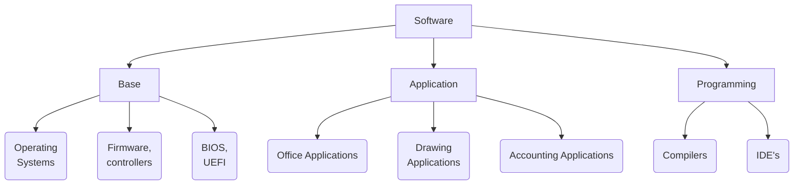
The logic element can be classified as **base**, **application** and **programming** software.

The **base software **is the set of essential programs to manage the hardware of the computer system. It includes the operating system, drivers, BIOS, UEFI, and so on.

The **Application Software **is made up of a set of programs designed in order for computers to carry out specific jobs, making it easier for the user to carry out their activities. These are applications such as office tools (Microsoft Office, LibreOffice), drawing programs (GIMP, Photoshop), payroll programs, or to keep company accounts (Contaplus, Contawin).

Finally, the **Developing software **are the programming tools for the different languages, necessary for the development of programs, compilers, development environments (IDE's).

# Programming languages

A **programming language **is a formal language (or artificial, that is, a language with well-defined grammar rules) that provides a person, in this case the programmer, the ability to write (or program) a series of instructions or sequences of orders in the form of algorithms in order to control the physical or logical behavior of a computer system, so that various kinds of data can be obtained or certain tasks can be carried out. This whole set of orders written using a programming language is called a computer program.

## According to its level of abstraction/generation

### Low level (1^st^ Generation)

There is only one first-generation language: machine code. Endless chains of sequences of 1's and 0's that make up operations that the machine can understand without any interpretation.

### Medium level (2^nd^ Generation)

Second-generation languages ​​have defined instructions to perform simple operations with simple data or memory locations. The key language of the second generation is undoubtedly assembly language.

### High level (3^rd^, 4^th^ and 5^th^ Generation)

High-level languages ​​are those that express their algorithms in a way that is understandable by human ability, rather than the ability of machines. They generate a simpler and more understandable code, allowing that in some cases it can be for different machines or operating systems. They allow the use of different programming paradigms. Examples: Java, Ada, Visual BASIC, VB .NET, C#, FORTRAN, Lisp, Pascal, Python, Perl, PHP, Ruby, SQL

**(3^rd^ Generation) **

The vast majority of programming languages ​​used today belong to this level of abstraction, mostly the languages ​​of the object-oriented programming paradigm,
They are general-purpose languages ​​that allow a high level of abstraction and a much more understandable and intuitive way of programming, where some instructions appear to be a direct translation of human language. For example, we could find a line of code like this: *IF counter = 10 THEN STOP *. It does not seem that this sentence is very far from how we would express in our own language *If the counter is 10, then stop*.

**(4^th^ Generation) **

They are languages ​​created with a specific purpose, being such a specific language allows us to reduce the number of lines of code that we would have to do with other third generation languages ​​through specific procedures. For example, if we were to solve an equation in a third-generation language, we would have to create various and complex methods to solve it, while a fourth-generation language dedicated to this type of problems already has those routines included in the language itself, with which we would only have to invoke the instruction that performs the operation we need.

**(5^th^ Generation) **

Also called natural languages, they aim to further abstract language by using a natural language with a knowledge base that produces a knowledge-based system. They can establish the problem to be solved and the premises and conditions that must be met for the machine to solve it. This type of language can be found frequently in artificial intelligence and logic.

## According to its form of execution

### Compiled Languages

They are those that generate a resulting code that will later be executed. This can be done by creating an executable file with the machine code, prepared for direct execution by the physical machine. But some current languages ​​also allow compiling their source code resulting in an intermediate code, stored in a file. This file is subsequently interpreted and executed directly step by step (converted step by step to machine code). Programs compiled to native code at compile time tend to be faster than those translated at run time. They generate the problem that the machine code created is dependent on the architecture of the platform on which they are compiled and for which they are executed. Examples: C, C ++, Visual Basic, Fortran, Pascal
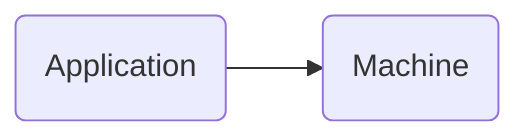
### Interpreted Languages
They are languages ​​whose instructions are translated to be **executed by the hardware machine at the same moment of execution **, without creating any intermediate code, or saving the result of said translation. They are slower than compiled languages ​​because of the need to translate the program into machine code, instruction by instruction, as it runs. Due to this real-time execution, the entire set of instructions is not translated, but is translated as each one of them is executed. They allow the interpreted program to be offered an environment **not **dependent on the machine where the interpreter is executed, but on the interpreter itself. Examples: Html, Php, Python, Ruby, Javascript
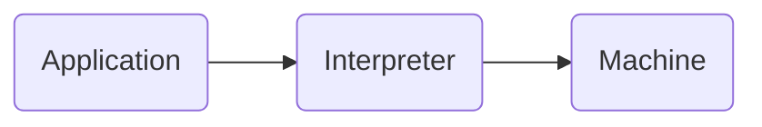
### Intermediate Language
We know under this concept the product of the compilation of some high-level languages ​​into a type of language ([bytecode](https://es.wikipedia.org/wiki/Bytecode)). To improve the optimization process or facilitate *portability*, some programming language implementations may compile the original source code in an intermediate form and then translate (interpret) that to machine code using a ([virtual machine](https: / /es.wikipedia.org/wiki/Máquina_virtual)). This happens with languages ​​like Java or C #.

## According to their paradigm
The programming paradigm is a particular approach to building software, a programming style that makes the programming task easier or adds more functionality to the program depending on the problem to be addressed. All programming paradigms belong to high-level languages, and it is common for a language to use more than one programming paradigm.

### Imperative
Describes programming as a sequence of instructions that change the state of the program, indicating how to perform a task. (C, Basic)

### Declarative
Specify or declare a set of premises and conditions to indicate what to do and not necessarily how to do it. (SQL)

### Procedural
The program is divided into smaller parts, called functions and procedures, that can communicate with each other. It allows to reuse code already programmed and solves the problem of spaghetti programming. (C, Cobol, Pacal)

### Object oriented
Encapsulates state and operations in objects, creating a structure of classes and objects that emulates a model of the real world, where objects perform actions and interact with other objects. It allows the inheritance and implementation of other classes, being able to establish types for the objects and leaving the code more similar to the real world with that conceptual abstraction. (C ++, Java, Smalltalk)

### Functional
Evaluate the problem by performing functions recursively, avoid declaring data by emphasizing the composition of functions and the interactions between them. (Lisp, Scheme)

### Logical
Defines a set of logical rules to be interpreted through logical inferences. Allows you to answer questions posed to the system to solve problems. (Prolog)

## According to their type system

In a less conventional and little consensual classification, but it is also an important characteristic of programming languages. The data types of each language represent the nature of the data that a program can use. For example: numeric values ​​(integers, decimals, natural numbers, etc.), logical values ​​(true or false), text values ​​(characters, fixed strings, variable strings), mathematical expressions, etc.

### Strongly typed

Strongly typed languages ​​(static typing): A programming language is strongly typed if data type violations are not allowed, that is, once the type of a variable is defined, it cannot be used as if it were a type other than unless a conversion is done. Each data type has a *domain of values ​​*(range, allowed values) and its data type controls that we cannot get out of its domain. To convert from one type to another we must use conversion statements. Examples: Java, C++, C, C#

### Weakly typed

Weakly typed languages ​​(dynamic typing): Non-typed or weakly typed programming languages ​​do not control the types of the variables they declare, thus, it is possible to use values ​​of any type in the same variable. For example, a function can indifferently receive as a parameter an integer value, character string, floating number, etc. A language that is not typed means that it is not strongly typed. They are languages ​​in which the type of a variable is not defined and can store different types of data: numbers, characters, etc. Example: Javascript, Python

## Characteristics of the most used languages

There are many different programming languages, to the point that many technologies have their own language. Each of these languages ​​has a series of peculiarities that make it different from the rest.

The most widespread programming languages ​​are those that are most used in each of the different areas of computing. In the educational field, for example, a very widespread programming language is considered one that is used in many universities or educational centers for teaching initiation to programming.

The most widespread programming languages ​​corresponding to different fields, different technologies or different types of programming have a series of characteristics in common that are what mark the similarities between them.

### Characteristics of structured programming

Structured programming was developed by the Dutch Edsger W. Dijkstra and is based on the so-called structure theorem. For this, it uses only three structures: sequence, selection and iteration, being unnecessary the use of the unconditional transfer instruction or instructions (`GOTO`, `EXIT FUNCTION`, `EXIT SUB` or multiple `RETURN`).

Thus, the characteristics of structured programming are clarity, the structure theorem, and top-down design.

#### Clarity 

There should be enough information to the code so that the program can be understood and verified: comments, understandable variable names and understandable procedures... Any structured program can be read from beginning to end without interruptions in the normal reading sequence.

#### Structure theorem

It shows that every program can be written using only the three basic control structures:

- **Sequence **: instructions executed successively, one after another.

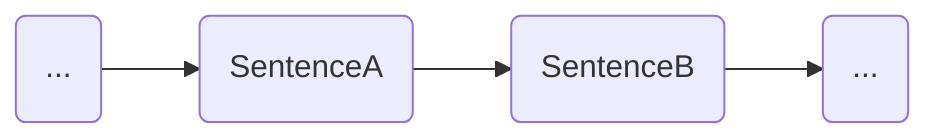

- **Selection **: the conditional instruction with double alternative, with the form "`if condition, then SentenceA, but SentenceB`". 

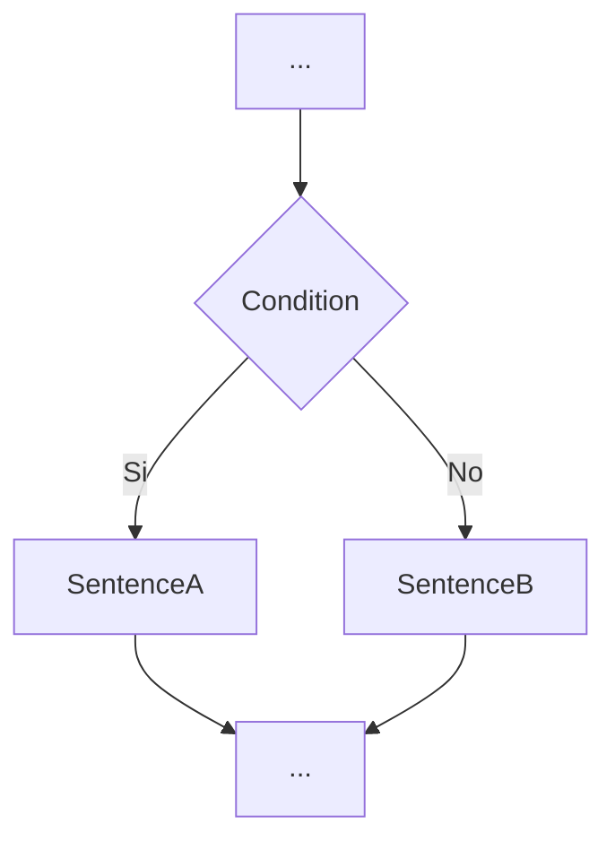

- **Iteration **: the conditional loop "`while condition, do statements`", which executes the statements repeatedly as long as the condition is met.

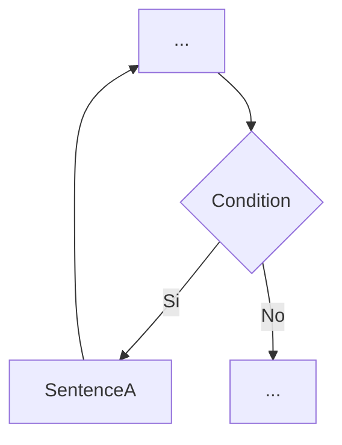

#### **Top-Down Design **

Top-down design is a "divide and conquer" technique to solve a programming problem. It is about solving the problem along different levels of abstraction, starting from a more abstract level and ending at a level of detail. The resolution of these subproblems will be much easier than the original problem in that the scope and size have been considerably reduced. In an iterative way, it can be observed how these subproblems are divided again, in turn, into other subproblems.
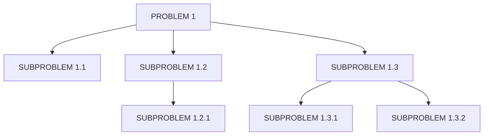
The modern view of structured programming introduces the features of modular programming and abstract data types (ADT).

#### Modular programming

Carrying out a program without following a modular programming technique often produces a huge set of statements, the execution of which is complex to follow, and to understand, making debugging and improvements almost impossible. . You may even have to abandon your existing code because it is easier to start over.

When we talk about modular programming, we mean dividing a program into more manageable and independent parts. A rule of thumb to accomplish this is to establish that each segment of the program does not exceed, in length, one span of coding.

In most languages, modules are translated into:

- **Procedures **: they are subprograms that carry out a specific task and return 0 or more than one value. They are used to structure a program and improve its clarity.

- **Functions **: they are subprograms that carry out a certain task and return a single result or value. They are used to create new operations that the language does not offer.

#### Abstract Data Types (ADT)

In programming, the data type of a variable is the set of values ​​that the variable can assume. For example, a Boolean variable can take only two possible values: true or false. Also, there is a limited but well-defined set of operations that make sense on the values ​​of a data type; thus, typical operations on the Boolean type are AND or OR.

Programming languages ​​assume a certain number of data types, which can vary from one language to another; thus, in Pascal we have the integers, the reals, the Booleans, the characters ... These data types are called basic data types in the context of programming languages.

Until a few years ago, all programming was based on this type concept and there were not a few problems that appeared, especially linked to the complexity of the data that had to be defined. The possibility of being able to define abstract types of data appeared, where the programmer can define a new type of data and its possible operations.

### Characteristics of object-oriented programming

One of the important concepts introduced by structured programming is the abstraction of functionality through functions and procedures. This abstraction allows a programmer to use a function or procedure knowing only what it does, but not knowing the details of how it does it.

This fact, however, has several drawbacks:

- The functions and procedures share program data, which causes changes in one of them to affect the rest.
- When designing an application it is very difficult to foresee in detail what functions and procedures we will need.
- Code reuse is difficult and ends up by copying and pasting certain pieces of code, and tweaking them. This is especially common when the code is not modular.

Object orientation, conceived in the 1970s and 1980s but extended from the 1990s on, made it possible to overcome these limitations.

Object orientation (hereinafter OO) is a program construction paradigm based on an abstraction of the real world.

In an object-oriented program, the abstraction is not the procedures or the functions, it is the objects. These objects are a direct representation of something in the real world, such as a book, a person, an organization, an order, an employee...

An object is a combination of data (called attributes) and methods (functions and procedures) that allow us to interact with it. In OO, then, programs are sets of objects that interact with each other through messages (method calls).

OOP (Object Oriented Programming) languages ​​are those that more or less faithfully implement the OO paradigm. Object-oriented programming is based on the integration of 5 concepts: abstraction, encapsulation, modularity, hierarchy and polymorphism, which must be fully understood and followed. Failure to follow them systematically or skip them promptly, for haste or other reasons, loses all the value and benefits of object orientation.

#### Abstraction

It is the process in which the most important properties of an object are separated from those that are not. That is, through abstraction, the essential characteristics of a real-world object, the attributes and behaviors that define it as such, are defined and then modeled in a software object.

In the abstraction process, the implementation of each method or attribute should not be worrying, it is enough to define them.

In object-oriented technology the main tool to support abstraction is class. A class can be defined as a generic description of a group of objects that share common characteristics, which are specified in their attributes and behaviors.

#### Encapsulation

It allows objects to choose what information is published and what information is hidden in the rest of the objects. That is why objects usually present their methods as public interfaces and their attributes as private or protected data, being inaccessible from other objects. The characteristics that can be granted are:

- **Public **: any class can access and use any attribute or method declared as public.
- **Protected **: any inherited class can access and use any attribute or method declared as protected by the parent class.
- **Private **: no class cannot access and use an attribute or method declared as private.

#### Modularity

It allows modifying the characteristics of each of the classes that define an object, independently of the rest of the classes in the application. In other words, if an application can be divided into separate modules, usually classes, and these modules can be compiled and modified without affecting the others, then this application has been implemented in a programming language that supports modularity.

#### Hierarchy

Allows the ordering of abstractions. The two most important hierarchies in a complex system are inheritance and aggregation.

**Inheritance **can also be seen as a way to share code, so when you use inheritance to define a new class you just have to add whatever is different, that is, it reuses the methods and variables, and specializes behavior.

For example, you can identify a parent class called worker and two child classes, that is, two subtypes of workers, administrative and teacher.

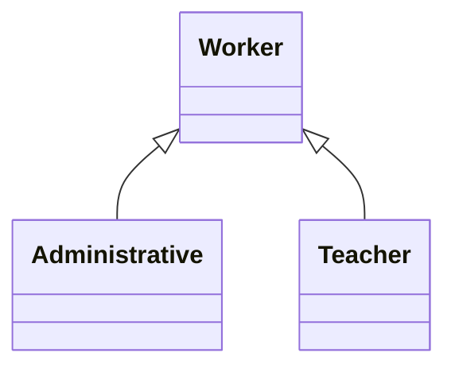

**Aggregation **is an object that is made up of combining other objects or components. Thus, a computer is made up of a CPU, a screen, a keyboard, and a mouse, and these components are meaningless without the computer.

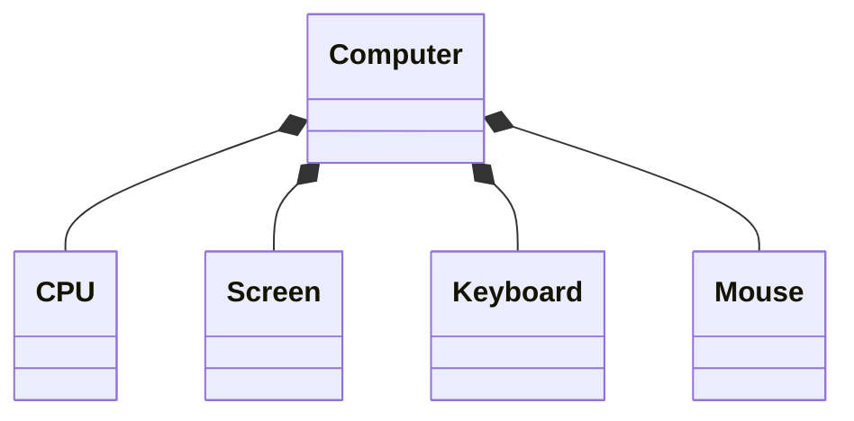
#### Polymorphism

It is a feature that allows you to give different forms to a method, either in the definition or in the implementation.

Method `overloading` consists of implementing the same method several times but with different parameters, so that, when invoking it, the compiler decides which of the methods should be executed, based on the parameters of the call.

An example of an overloaded method is one that calculates the salary of an employee in a company. Depending on the position that the worker occupies, he will have more or less items on his payroll (more or less incentives, for example).
The same method, which we could call `CalculateSalary`, will be implemented differently depending on whether the salary of an operator is calculated (with fewer items on his payroll, which causes the method to receive fewer variables) or if the salary of an operator is calculated. executive.

Method `override` consists of reimplementing a method inherited from a superclass with exactly the same definition (including method name, parameters, and return value).

An example of method overloading might be the `Area()` method. Starting with a `Shape` class that contains the `Area()` method, there is a derived class for some types of shapes (for example, `Rectangle` or `Square`).

The implementation of the `Area()` method will be different in each of the derived classes; These can be implemented differently (depending on how the area of ​​the figure is calculated in each case) or defined differently.

## Building a computer program

To see our program running, we must apply some intermediate processes through which our program changes from one state to another until we obtain an executable version. This concept is known as `Build`.

### Source code

It is the code written by programmers using a text editor or a development environment. This code is not directly executable by the computer.

### Object code

It is the code resulting from compiling the source code. It is not directly executable by the computer, but it is not understood by the human being either. It is a low-level intermediate code or representation.

### Executable

It is the result of linking the object code with a series of routines and libraries, obtaining the code that is directly executable by the machine.

### Virtual machine

In the event that our platform uses a virtual machine to execute our compiled code, the machine starts automatically when the program to be executed is launched and stops when it is finished. These types of virtual machines are known as process virtual machines, and are themselves just another normal process within the operating system. It is intended to provide a hardware platform and operating system independent runtime environment. The best known example is the *Java Virtual Machine*.

The java virtual machine is in charge of loading, verifying, linking and initializing the *.class* files obtained from the compilation process of the *.java* sources.

- The source code compilation process is the same as described in the previous point until an intermediate code is obtained. Unlike the previous one, the linking phase is carried out every time the program is executed.
- In the loading process, the binary files of the classes (.class files) are searched according to the identifiers and the class is created from those binary files.
- In the verification phase, it is verified that the received bytecodes do not contain instructions that are obviously harmful to the system. 
- Link phase, it is the moment in which the classes or interfaces are taken and combined in a state of execution of the virtual machine and they are translated by means of the interpreter (line by line) and the Java JIT compiler (Just In Time, compile the entire class file) to native code. This code is executed.

Unlike compiled languages, in this type of operation the linking of classes and libraries and translation into machine code *is performed every time we run the program*, so it is slower than other purely compiled languages.

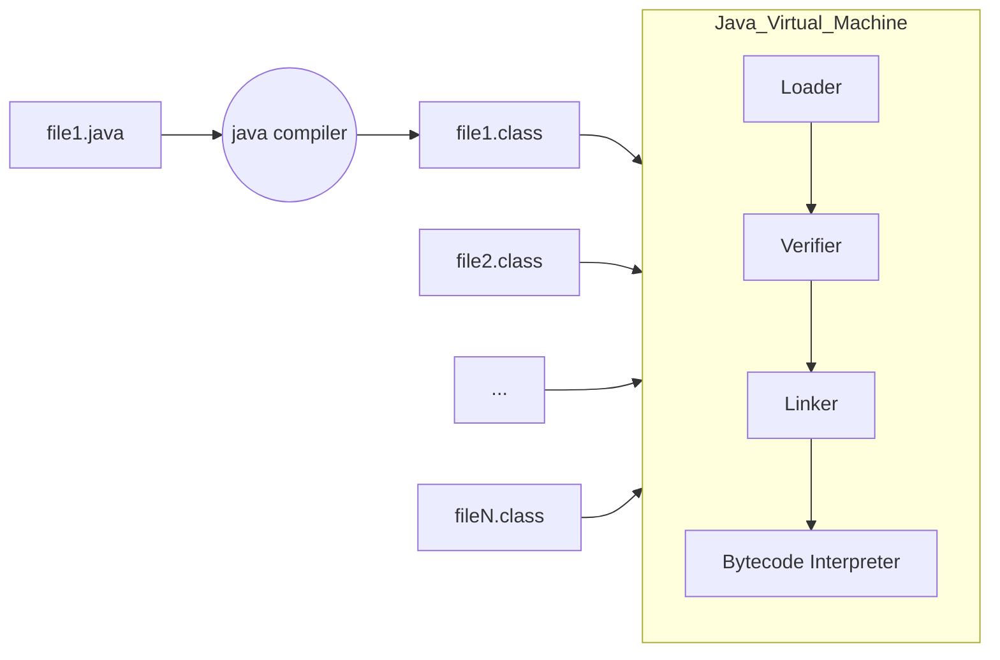

## Build process

Obtaining an executable program is carried out by two programs: the compiler and the linker. Although it differs depending on the technology or programming platform that we use.

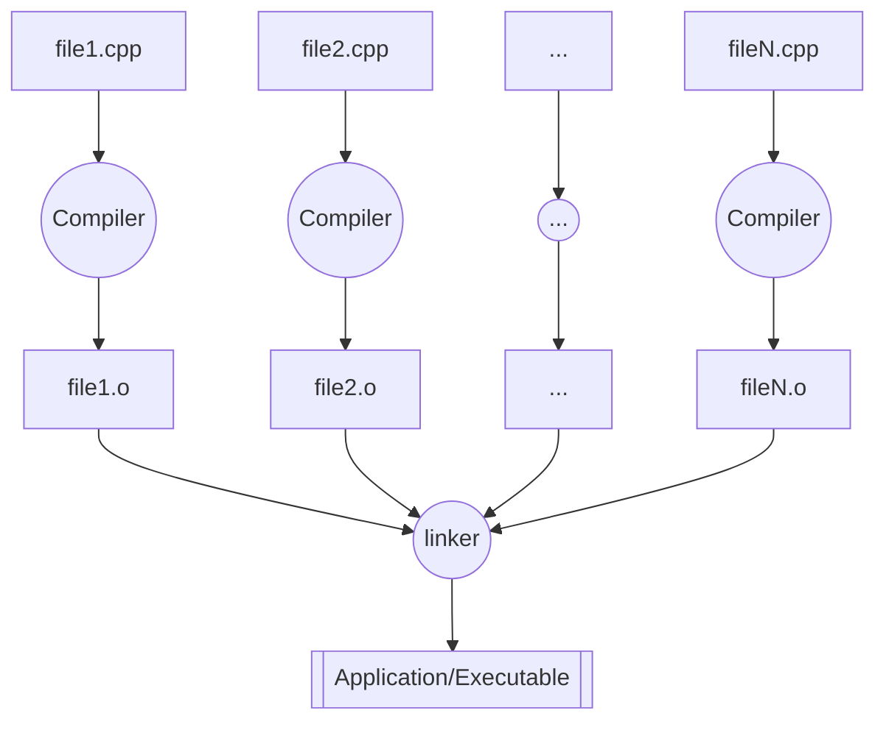

Even so, the compilation is internally composed of several stages:

### Lexical analysis

All source code is read sequentially by grouping it into significant units of characters (tokens). They are sequences of characters that have meaning (`int`, `=`, `void`, ...). All white spaces, blank lines, comments, etc., are removed from the source program.

### Syntactic Analyzer

You receive the source code in the form of tokens (lexical components) and they are grouped hierarchically into grammar phrases that the compiler uses to synthesize the output. It is checked if what is obtained from the previous phase is syntactically correct (it obeys the grammar of the language). In general, the grammar phrases in the source program are represented by a parse tree, which is similar to parsing a phrase in natural language.

### Semantic Analyzer

The declarations are checked for correctness, the types of all expressions are checked, if operations can be performed on those types, if the arrays are of the right size, etc. This information is added to the parse tree.

### Generation of intermediate code

After the analysis, an intermediate representation similar to machine code is generated in order to facilitate the task of translating to **object code **.

### Library linker

In *languages ​​compiled* completely to machine code, the linking phase (linker) joins all the object codes resulting from the compilation of all the source files that are part of a program. The code of the methods of the libraries used is also attached. All these object codes are translated into machine code by creating an executable program (eg an .exe file).

# Development processes

The development of a software or a set of applications goes through different stages (called the program life cycle) from when the need to create a software occurs until it is finalized and ready to be used by a user. Not in all programs nor in all occasions will the development process faithfully follow the same stages in the development process; however, they are highly recommended guidelines.

There is more than one model of development stages, which are frequently compatible and used with each other, however we are going to study one of the most widespread and complete models, the **waterfall model **.

## Steps

### Analysis

The analysis phase is the first phase of the project, it defines the requirements of the software to be developed.

It is the most important phase in the development of the project and everything else will depend on how well detailed it is. It is also the most complicated, since it is not automated and depends largely on the analyst who performs it.

Initially, this stage begins with an interview with the client, which will establish what they want or what they think they need, which will give us a good overall idea of ​​what they need, but not necessarily completely correct. Even if the customer thinks they know what the software has to do, it takes good skill and experience to recognize incomplete, ambiguous, contradictory or even necessary requirements.

It is important that at this stage of the development process a two-way communication is maintained, although it is common to find that the client wants such communication to be unilateral, a contrast and a consensus is necessary on both sides to get to define the true requirements of the software .

In this phase, the functional and non-functional requirements of the system are specified and analyzed.

- **Functional requirements **: What functions will the application have to perform. What response will the application give to all the inputs. How the application will behave in unexpected situations.

- **Non-functional requirements **: Response times of the program, applicable legislation, treatment of simultaneous requests, etc.

The fundamental thing is good communication between the analyst and the client so that the application to be developed meets their expectations.

The culmination of this phase is the SRS document (Software Requirements Specification), accompanied by the class or Entity/Relationship diagram.

This document specifies:

- Planning the meetings that are going to take place.
- List of the objectives of the client user and the system.
- List of functional and non-functional requirements of the system.
- List of priority objectives and timing.
- Recognition of poorly formulated requirements or that entail contradictions, etc.

As an example of functional requirements, in the application for our clients of cosmetic stores, we should consider:

- If they want the reading of the products to be done using barcodes.
- If they are going to detail the purchase invoices and in what way they want it.
- If the store workers work on commission, have information on the sales of each one.
- If they are going to operate with credit cards.
- If you want a control of the stock in warehouse.
- Etc.

### Design

In this phase it is intended to determine the overall operation of the system, without going into details. One of the main goals is to establish considerations for system resources, both physical and logical. Therefore, the environment that the system will require is defined, although it can also be set in the opposite direction, that is, design the system based on the resources available.

During this phase, where we already know what to do, the next step is how to do it?

You must divide the system into parts and establish what relationships there will be between them.

Decide what exactly each part will do.

In short, we must create a functional-structural model of the requirements of the global system, to be able to divide it and face the parts separately.

At this point, important decisions must be made, such as:

- Entities and relationships of the databases.
- Selection of the programming language to be used
- Selection of the Database Management System.
- Format of the input and output information.
- Etc.

In the design phase, use case and sequence diagrams will be created to define the functionality of the system. In addition, with all these diagrams and information, the loading notebook will be obtained.

### Coding

The most obvious phase in the software development process is undoubtedly coding. It is more than evident that once the software to be created has been defined, it must be programmed.
Thanks to the previous stages, the programmer will have a complete analysis of the system to be encoded and a specification of the basic structure that will be needed, so that initially it would only be necessary to translate the load book into the desired language for finish the coding stage, but this is not always the case, the difficulties are recurrent while modifying. Of course, the more thorough the analysis and design has been, the easier the task will be, but you are never exempt from needing a retest or redesign when you encounter a problem programming your software.
The programmer will have to choose a specific programming language, encode all the above information and take it to source code, exhaustively complying with all the requirements imposed on the analysis and design of the application.

The desirable characteristics of all code are:

1. Modularity: that is divided into smaller pieces.
2. Correction: do what is really asked.
3. Easy to read - to facilitate future development and maintenance.
4. Efficiency: make good use of resources.
5. Portability: that can be implemented on any computer.

### Testing

Once the software is obtained, the next phase of the life cycle is testing. The tests seek to confirm that the coding has been successful and the software does not contain errors, at the same time as it is verified that the software does what it should do, which is not necessarily the same.

It is not a static process, and it is usual to carry out tests after other stages, such as documentation. Generally, the tests carried out after the documentation are carried out by inexperienced personnel in the field of software tests, in order to verify that the documentation is of quality and satisfactory for the proper use of the application.

In general, the tests are carried out, preferably by personnel different from the one who coded the application, with extensive experience in programming, people capable of knowing under what conditions a software can fail beforehand without a previous analysis.

Normally, these are carried out on a set of test data, which consists of a selected and predefined set of limit data to which the application is subjected.

Among all the tests carried out on the software we can basically distinguish:

**Unit tests**

They consist of testing, one by one, the different pieces of software and checking their operation (separately, independently). `JUnit` is the sandbox for Java.

**Integration testing**

They are carried out once the unit tests have been successfully carried out and will consist of verifying the operation of the entire system: with all its interrelated parts.

The final test is commonly called Beta Test, it is carried out on the production environment where the software will be used by the client (if possible, on the client's computers and under normal operation of your company).

The trial period will normally be the one agreed with the client.

### Documentation

As a general rule, the documentation that is made of a software has two faces: the documentation available to the user and the documentation intended for the development team itself.

The user documentation must show complete and quality information that illustrates using the most appropriate resources how to handle the application. Good documentation should allow any user to understand the purpose and how to use the application without prior or additional information.

On the other hand, we have the technical documentation, intended for development teams, which explains the internal functioning of the program, with special emphasis on explaining the coding of the program. This is intended to allow any development team to understand the program and modify it if necessary. In cases where the software produced is a service that can interoperate with other applications, the technical documentation makes it possible for development teams to correctly carry out the software that will work with our application.

All stages in software development must be perfectly documented.

Why do you have to document all the phases of the project? , to give all the information to the users of our software and to be able to undertake future reviews of the project.

We have to document the project in all phases of it, to move from one to another in a clear and defined way. Correct documentation will allow the reuse of part of the programs in other applications, as long as they are developed with a modular design.

We distinguish three major documents in software development:

| | **TECHNICAL GUIDE ** | **USE GUIDE ** | **INSTALLATION GUIDE ** |
| ------------------------- | ------------------------------------------------------------ | ------------------------------------------------------------ | ------------------------------------------------------------ |
| **Are reflected: ** | • The design of the application. <br/> • The coding of the programs. <br/> • The tests carried out. | • Description of the application's functionality.<br/>• How to start running the application.<br/>• Examples of using the program.<br/>• Application software requirements.<br/>• Solution of possible problems that may arise. | All the necessary information for:<br/>• Commissioning.<br/>• Exploitation.<br/>• System security. |
| **Who is it for? ** | To the technical personnel in computer science (analysts and programmers). | To the users who are going to use the application (clients). | To the IT staff responsible for the installation, in collaboration with the users who are going to use the application (clients). |
| **What is your goal? ** | Facilitate a correct development, make corrections in the programs and allow future maintenance. | Give end users all the information they need to use the application. | Provide all the necessary information to ensure that the implementation of the application is carried out safely, reliably and accurately. |

### Exploitation

After all the previous phases, once the tests show us that the software is reliable, free of bugs and we have documented all the phases, the next step is exploitation.

Once we have our software, we must prepare it for distribution. For this, the software is implemented in the chosen system or it is prepared to be implemented automatically by itself.

It should be noted that if our software is a substitute version of a previous software, it is advisable to assess the coexistence of the two applications during an adaptation process.

Although various authors consider operation and maintenance as the same stage, we are going to differentiate them based on when they are carried out.

Exploitation is the phase when end users know about the application and start using it. The application is installed, tuned and operated on the client's final equipment. In the installation process, the programs are transferred to the client user's computer and later configured and verified.

It is recommended that future clients are present at this time and comment on how the installation is being planned.

At this time, the Beta Tests are usually carried out, which are the last tests that are carried out on the client's own computers and under normal workloads. 

Once installed, we go to the configuration phase. In it, we assign the normal operating parameters of the company and test that the application is operational. It can also happen that the configuration is carried out by the end users themselves, as long as we have previously given them the installation guide. And also, if the application is simpler, we can program the configuration so that it is done automatically after installing it. (If the software is "made to measure", the most advisable thing is that those who have manufactured it do it).

Once configured, the next and final step is the normal production phase. The application passes into the hands of the end users and the exploitation of the software begins.

It is very important to have everything prepared before presenting the product to the client: it will be the critical moment of the project.

### Maintenance
It would be logical to think that with the delivery of our application (the installation and configuration of our project on the client's computers) we have finished our work. In any other job sector this is the case, but the case of software construction is very different.

There are very few occasions in which a software is not going to need continuous maintenance. In this phase of software development, bugs or errors that occur when the program has already been implemented in a system are fixed and the necessary or required extensions are made.

The maintenance stage is the longest in the entire software life cycle.

By its nature, software is changeable and will need to update and evolve over time.

It will have to adapt in parallel with the hardware improvements on the market and face new situations that did not exist when the software was built.

In addition, there are always errors that will have to be corrected and new versions of the product are better than the previous ones.

Therefore, an application maintenance service is agreed with the client (which will also have a temporary and economic cost).

Maintenance is defined as the process of controlling, improving and optimizing the software.

Its duration is the longest in the entire life cycle of the software, as it also includes future updates and evolutions of the software.

The types of changes that require maintenance of the software are as follows:

- **Improvement**: To improve the functionality of the software.
- **Evolutional**: The client will have new needs in the future. Therefore, code modifications, expansions or deletions will be necessary.
- **Adaptive **: Modifications, updates ... to adapt to new market trends, new hardware components, etc.
- **Corrective **: The application will have errors in the future (it would be utopian to think otherwise).

## Lifecycles

We have already seen that the series of steps to follow to develop a program is what is known as the Software Lifecycle.

Various authors have proposed different lifecycle models, but the best known and most used are the following:

### Classic (predictive)

#### Waterfall

It is the classic software life model.

It is practically impossible that it can be used, since it requires knowing all the system requirements in advance. It is only applicable to small developments, since the stages pass from one to another with no possible return. (It is assumed that there will be no bugs or software variations). It is the one we have seen in the previous point of the Stages.

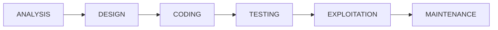

#### Waterfall with feedback

It is one of the most used models. It comes from the previous model, but a feedback is introduced between stages, so that we can go back at any time to correct, modify or debug some aspect. However, if many changes are expected during development, it is not the most suitable model.

It is the perfect model if the project is rigid (few changes, little evolutionary) and the requirements are clear.

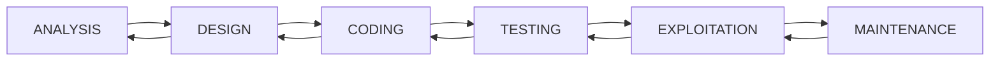

#### V Model


It is a model very similar to the waterfall model with a hierarchical vision with different levels. Higher levels indicate more abstraction and lower levels indicate higher level of detail. The result of a phase is the input of the next phase. There are different variants with more or less number of activities.

### Prototype construction

Often the requirements are not clearly specified, either because there is no previous experience or because of the omission or lack of specificity of the user / client.

Therefore, the following process is followed: A prototype is created during the __analysis phase__ and is tested by the user / client to refine the requirements of the software to be developed. The previous step is repeated as many times as necessary.


Types of prototypes:

- __Rapid prototypes__: The prototype may be developed using another language and / or tools. Finally the prototype is discarded.
- __Evolutionary prototypes__: The prototype is designed in the same language and tools of the project. The prototype is used as the basis for developing the project.

### Evolutionary or incremental

They are more modern than the previous ones. They take into account the changing and evolving nature of software.

#### Spiral (iterative)

It is based on the cascade model with feedback, where the phases are repeated and refined, and their improvement is propagated to the following phases.

It is a combination of the previous model with the cascade model. In it, the software is built repeatedly in the form of versions that are getting better and better, because they increase the functionality in each version. It is a fairly complex model.


#### Agile (adaptive)

They are software engineering methods based on iterative and incremental development. Requirements and solutions evolve over time according to the need of the project. The work is carried out through the collaboration of self-organized and multidisciplinary teams, immersed in a shared process of short-term decision-making. They follow the guidelines of the [Manifesto for Agile Development](https://en.wikipedia.org/wiki/Agile_software_development#The_Agile_Manifesto) which is based on these four values:

- Value individuals and their interactions more than processes and tools.
- Value the software in operation more than the exhaustive documentation.
- Value collaboration with the client more than contractual negotiation.
- Value the response to change more than following a plan.

The best known methodologies are:

##### Kanban

Also called the "card system", it was initially developed by Toyota for the product manufacturing industry. Focused on delivering maximum value for clients, using fair resources.

**Kanban board **


##### Scrum

Incremental development model. Regular Iterations (__sprint__) are performed every 2 to 4 weeks. At the beginning of each iteration your __prioritized goals__ (__sprint backlog__) are set. At the end of each iteration a __partial delivery usable by the client__ is obtained. There are daily meetings to discuss the progress of the _sprint_.


##### XP (Extreme Programming)

It is based on the values ​​of: Simplicity, Communication, Feedback, Courage or courage and Respect or humility.

Features: Simple Design, Small Continuous Improvements, Testing and Refactoring, Continuous Integration, Pair Programming, Customer Joins Development Team, Shared Code Ownership, Coding Standards, 40 Hours Per Week.

## Roles involved

Throughout the software development process we will have to carry out, as we have seen previously, different and diverse tasks. That is why the personnel involved in the development of software is as diverse as the different tasks to be carried out.
The roles are not necessarily rigid and it is common for them to participate in various stages of the development process.

### Systems analyst

One of the oldest roles in software development. Its objective is to carry out a study of the system to direct the project in a direction that guarantees customer expectations by determining the behavior of the software.
Participate in the analysis stage.

### Software designer

It was born as an evolution of the analyst and carried out, based on the analysis of a software, the design of the solution to be developed.
Participate in the design stage.

### Programmer Analyst

Commonly called "developer", he masters a broader vision of programming, provides a detailed overview of the project by designing a more friendly solution for coding and actively participating in it.
Participate in the design and coding stages.

### Programmer

It is exclusively in charge of creating the result of the study carried out by analysts and designers. Write the source code for the software.
Participate in the coding stage.

### Software architect

It is the mortar that unites the development process. Know and investigate the frameworks and technologies, checking that the entire procedure is carried out in the best way and with the most appropriate resources.
Participate in the analysis, design, documentation and exploitation stages.

## Support tools

In practice, to carry out several of the stages seen in the previous point, we have computer tools, whose main purpose is to automate tasks and gain reliability and time.
This will allow us to focus on system requirements and system analysis, which are the main causes of software failures.

**CASE **tools are a set of applications used in software development with the aim of reducing costs and process time, thereby improving process productivity.

These tools can be useful in project design, in coding our design based on its visual appearance, error detection ...

Rapid Application Development or RAD is a software development process that involves iterative development, prototyping, and the use of CASE utilities.
Today it is often used to refer to the rapid development of graphical user interfaces or complete integrated development environments.

CASE technology tries to automate the phases of software development to improve the quality of the process and the final result.

Specifically, these tools allow:

- Improve project planning.
- Give agility to the process.
- To be able to reuse parts of the software in future projects.
- Make applications conform to standards.
- Improve the task of maintaining the programs.
- Improve the development process, by allowing the phases to be displayed graphically.

**Classification**
CASE tools are typically classified based on lifecycle phase of the software in which they offer help:

- **U-CASE: **offers help in the planning and requirements analysis phases.
- **M-CASE: **offers help in analysis and design.
- **L-CASE: **helps in the programming of the software, detection of errors in the code, debugging of programs and tests and in the generation of the project documentation.

Examples of free CASE tools are: `ArgoUML`, `Use Case Maker`, `ObjectBuilder` ...

# Sources of Information

- [Wikipedia](https://es.wikipedia.org)
- [Code&Coke (Fernando Valdeón)](http://entornos.codeandcoke.com/doku.php?id=start)
- Apuntes IES El Grao (Mª Isabel Barquilla?)
- [Apuntes IOC (Marcel García)](https://ioc.xtec.cat/materials/FP/Recursos/fp_dam_m05_/web/fp_dam_m05_htmlindex/index.html)
- [Apuntes José Luis Comesaña](https://www.sitiolibre.com/)
- [Apuntes IES Luis Vélez de Guevara 17-18 (José Antonio Muñoz Jiménez)](http://jamj2000.github.io/slides/2017/09/05/entornosdesarrollo/)

