<!--
theme: gaia
size: 16:9
_class: lead
paginate: true
marp: false
backgroundColor: #000
backgroundImage: url('assets/hero-backgroundIES.jpg')
-->
<style>
section::after {
  content: attr(data-marpit-pagination) '/' attr(data-marpit-pagination-total);}
img[alt~="center"] {
  display: block;
  margin: 0 auto;
}
table {
  margin-left: auto;
  margin-right: auto;
}
footer {
  font-size: 20px;
 }
header {
  font-size: 16px;
 }
</style>

# **UD01: Software Development**
#### Development environments
###### version: 1.0
___
<!-- footer: Author: www.martinezpenya.es | iesmre.es -->
<!-- header: UD01: Software Development | Development environments | version:1.0-->
<style scoped>
section {
  @extend .markdown-body;
  font-size: 32px;
  justify-content: top;
 }
</style>
# TOC
## 1. Computer program
## 2. Programming languages
## 3. Development processes
## 4. Sources of Information
___
<style scoped>
section {
  @extend .markdown-body;
  font-size: 31px;
  justify-content: top;
 }
</style>
# 1. Computer program
> A **computer program** is a sequence of instructions, written to perform a specific task on a computer
- Involves:
  -Physical elements
  -Logical elements
<!-- A computer program is created by a programmer in a certain language and will be compiled and executed by a system. When a program is executed, the processor executes the compiled code of the program instruction by instruction.-->
___
## 1.1 Physical element (1)

___
## 1.1 Physical element (2)
- We will see single instruction in a von Newmann simulator.
```java
c = a + b;
```
- processor execute instructions one by one.
- the variables "a", "b" and "c" will have defined memory locations
- The processor cannot execute that instruction in one fell swoop, the ALU (Aritmetic Logic Unit) has a limited number of operations (SUM, SUBTRACT, AND, OR, NOT ...)
___
## 1.1 Physical element (3)
- The rules of the system are:
  - The ALU can only perform one operation at a time.
  - The temporary register of the ALU, the bus and the registers only store one data at a time.
- we assume that variables "a", "b" and "c" correspond to the registers R1, R2 and R3, the microinstructions will be:
```
R1–Bus; Bus-ALU_Temp; R2-Bus; ALU_ADD; ALU-Bus; Bus-R3
```
___
<style scoped>
section {
  @extend .markdown-body;
  font-size: 28px;
  justify-content: top;
 }
</style>
## 1.1 Physical element (4)
Let's look at other parts of the von Newmann machine:
- **Central Process Unit**
  - **ALU**
  - **CU**
  - **Microprocessor registers**
<!--
 ALU has general-purpose registers,  accumulation, loop index counting, data transfers, or bit manipulation.
 The CU also has registers: Program counter (PC), Status Register (SR), Instruction register (IR).
-->
- **Memory**.
<!--
The computer needs to obtain the information with which it will work from somewhere and, in addition, to be able to communicate the results of its operations. For this, it has **Input / Output Units**, to which all other devices that transmit information between the computer and its environment are connected.
-->
- **Input devices or peripherals**.
<!--
They are the hardware components in charge of introducing the information from the outside for its subsequent processing. An example of a device used for input is the keyboard, commonly known as a standard input device.
**Output devices or peripherals. **They are the hardware components in charge of sending the results from the processes carried out in the computer system to the outside. An example of a device used for output is the monitor, commonly known as a standard output device.
There are also devices that allow communication in both directions, and known as **input and output devices**, for example the modem.
Auxiliary storage device, sometimes called secondary storage device or auxiliary memory. They are mass storage units of information much slower than central memory and with a greater capacity. These memories are used to store data and programs permanently unlike RAM memory, which is erased when the computer is turned off. When the CPU requires this data, it must be transferred from the auxiliary storage device to the central memory for processing. The main auxiliary information storage element is the hard disk.
-->
>Check the Von Neumann machine simulator at http://vnsimulator.altervista.org/ load "ADDITION", 2000ms and execute step by step.
___
## 1.2 Logical element (1)

The software of a computer system is the set of logical elements, programs, data, information, etc. that make the use and operation of computers possible.
It can be said that the basic elements of the software are the data and the orders or instructions. If the software is part of the computer system, it must be stored on a physical medium such as central memory or secondary memory.

