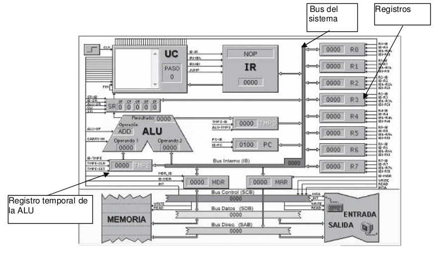
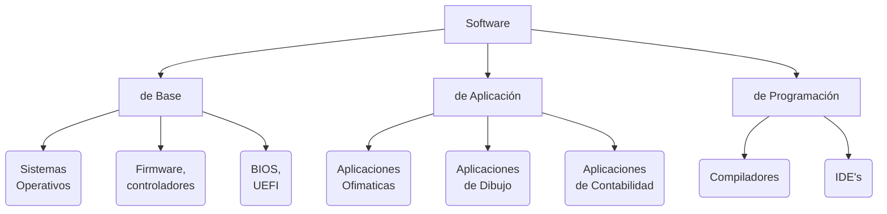
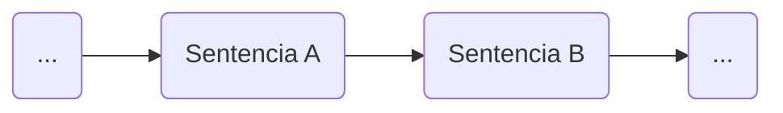
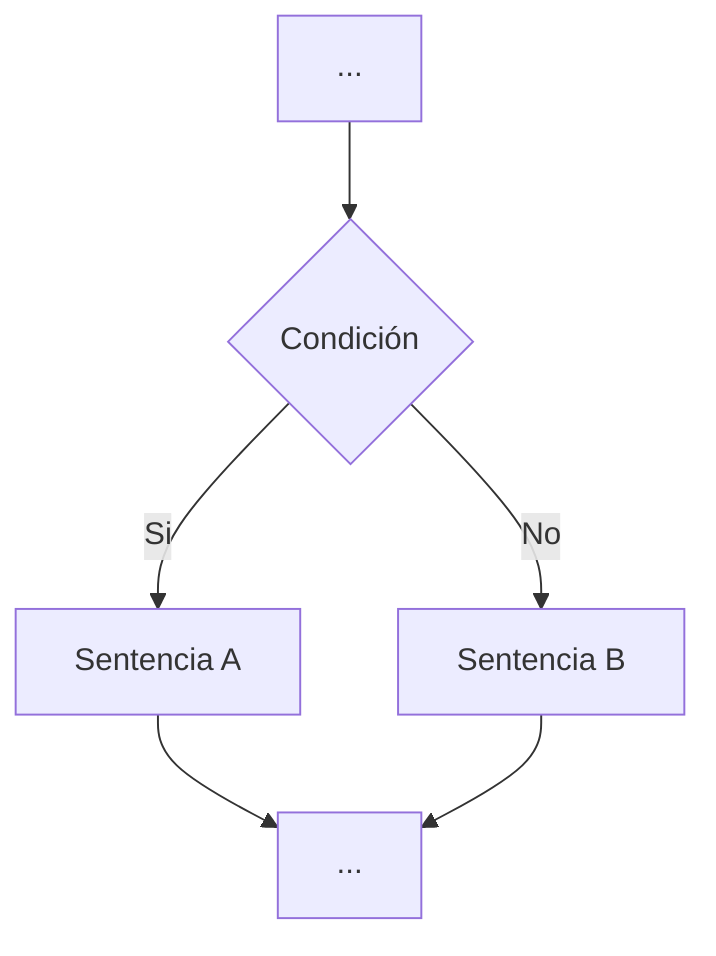
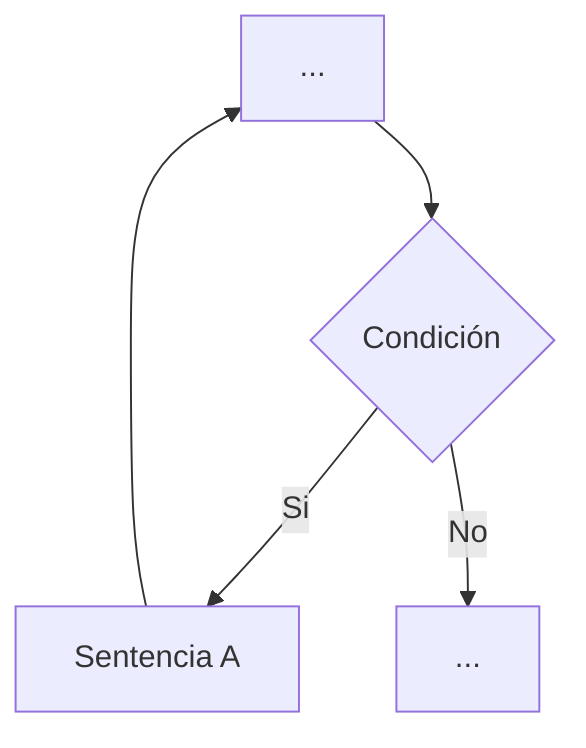
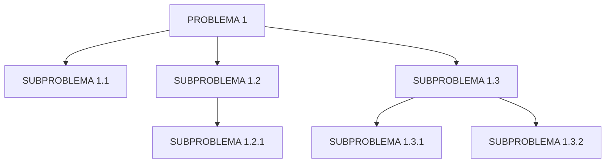
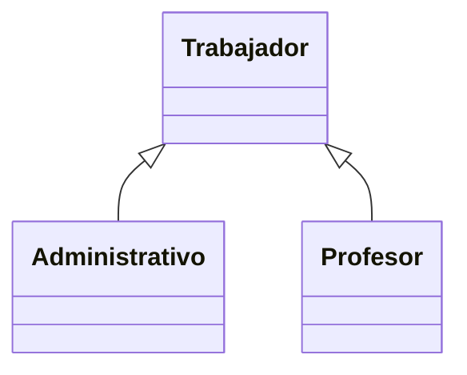
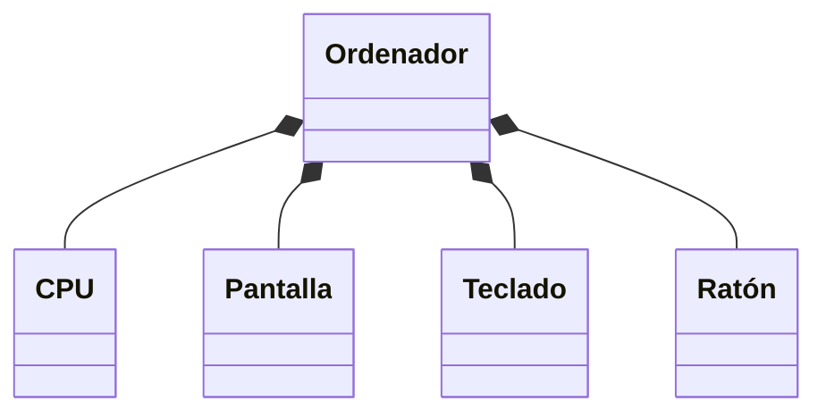
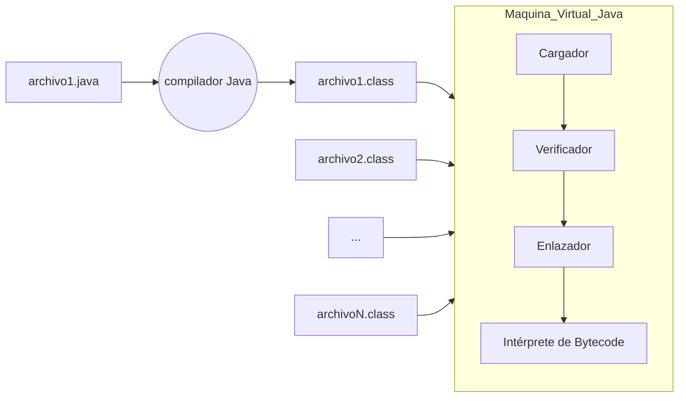
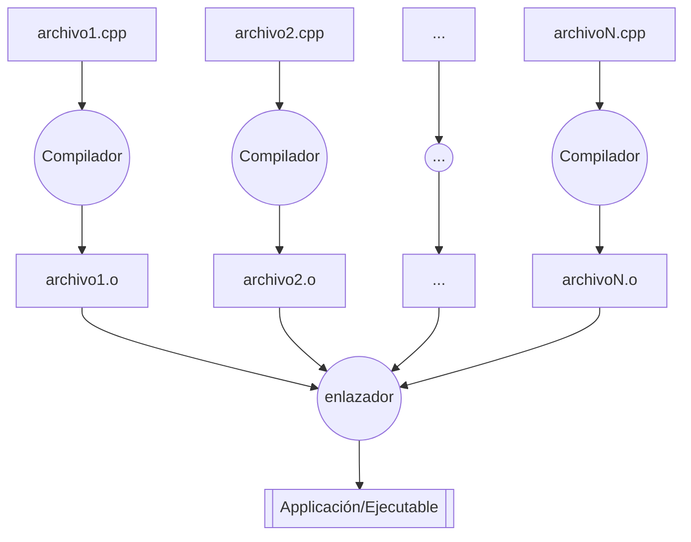

---
    title: UD01: Desarrollo de Software
    language: ES
    author: David Martínez Peña [www.martinezpenya.es]
    subject: Entornos de desarrollo
    keywords: [EED, 2021, Entornos, Desarrollo]
    IES: IES Mestre Ramón Esteve (Catadau) [iesmre.es]
    header: ${title} - ${subject} (ver: ${today}) 
    footer:${currentFileName}.pdf - ${author} - ${IES} - ${pageNo}/${pageCount}
    typora-root-url:${filename}/../
    typora-copy-images-to:${filename}/../assets
    imgcover:/media/DADES/NextCloud/DOCENCIA/ED_2122/ED-CFGS-2122/UD01/assets/cover.png
---

[toc]
# Programa informático

Definición de programa informático:

> Un **programa informático** o **programa de computadora** es una secuencia de instrucciones, escritas para realizar una tarea específica en un computador

Un programa informático es creado por un programador en un lenguaje determinado y será compilado y ejecutado por un sistema. Cuando un programa es ejecutado, el procesador ejecuta el código compilado del programa instrucción a instrucción.

## Elemento físico

Para entender como un programa informático interactúa con un sistema, veremos el funcionamiento de una única instrucción en una máquina conocida como es el simulador de von Newmann.

El procesador ejecutará las instrucciones una a una y cada instrucción se realizará mediante una serie de microinstrucciones.



Hagamos un recorrido que efectúa una instrucción de modo conceptual, más adelante profundizaremos en la interpretación que hace el sistema. Imaginemos que nuestro programa pide por teclado dos números y los suma. La instrucción que realizará nuestro programa será:

```java
c = a + b;
```

El ordenador tendrá reservada una cantidad de posiciones de memoria definidas por el tipo de variable que se corresponden con las variables de nuestra instrucción. Es decir, las variables “a”, “b” y “c” tendrán unas posiciones de memoria definidas que es donde el sistema almacenará el valor de las variables.
El procesador no puede ejecutar esa instrucción de un solo golpe, la ALU (Aritmetic Logic Unit) tiene un número limitado de operaciones (SUMA, RESTA, AND, OR, NOT...)
Las reglas del sistema son:

- La ALU solo puede realizar una operación a la vez.

- El registro temporal de la ALU, el bus y los registros solo almacenan un dato a la vez.

Si suponemos que las posiciones de las variables “a”, “b” y “c” se corresponden con los registros R1, R2 y R3, las microinstrucciones que tendrá que realizar nuestra máquina serán las siguientes:

```
R1–Bus; Bus-ALU_Temp; R2-Bus; ALU_SUMAR; ALU-Bus; Bus-R3
```

Hoy en día, con los procesadores modernos, el funcionamiento, aunque muy similar en esencia, puede variar sobre todo en lo que se refiere a las reglas. Sin embargo, hay cosas que no varían: el programa se sigue almacenando en memoria no volátil y se sigue ejecutando en memoria de acceso aleatorio, al igual que todas las variables utilizadas. 

Veamos otras partes de la máquina de von Newmann:
**Unidad Central de Proceso**, conocida como **CPU** (**Central Process Unit**) o procesador. Es el principal elemento del ordenador, su trabajo consiste en coordinar y ejecutar todas las instrucciones que se leen de la memoria RAM.

Sus elementos principales son:

- **UAL** (**Unidad Aritmético-Lógica**) o **ALU** (**Arithmetic-Logical Unit**). Componente de la CPU que realiza todas las operaciones aritméticas elementales (suma, resta, multiplicación, división) y las operaciones lógicas (por ejemplo, la comparación de dos valores).
  
- **UC** (**Unidad de Control**). Componente de la **CPU** encargado de controlar las acciones del resto de las unidades, interpretando y ejecutando las instrucciones en la secuencia adecuada.

- **Registros del microprocesador**. Son bancos de memoria de alta velocidad muy especializados, donde se almacenan algunos datos e instrucciones de un programa mientras se ejecuta. 

Generalmente, la ALU dispone de los registros de propósito general, que sirven para tareas como procesos de acumulación, contador de índices de bucles, transferencias de datos, o manipulación de bits.

La UC también dispone de registros como: Contador de programa (PC) que contiene la dirección de la siguiente instrucción que debe ejecutarse, Registro de Estado (SR) que guarda información sobre el estado actual de las operaciones que se están realizando, Registro de instrucción (IR) que contiene la instrucción que se está ejecutando y Registro de puntero de pila que mantiene la dirección necesaria para las operaciones de pila.

**Memoria Central**, también llamada **memoria principal** o **memoria interna**. Es un dispositivo de almacenamiento de información. Existen dos tipos principales de memoria central: la memoria ROM, de sólo lectura, donde se almacena software del sistema de forma permanente y la memoria RAM para almacenamiento temporal de información. Desde el punto de vista del programador, esta última es la más interesante. En ella se guardan todos los datos, tanto de entrada como resultados intermedios y definitivos de las operaciones realizadas durante la ejecución de los programas, así como las instrucciones que forman los propios programas, utilizando para ello los distintos segmentos ya nombrados.

El ordenador necesita obtener la información con la que trabajará de algún sitio y, además, poder comunicar los resultados de sus operaciones. Para ello dispone de las **Unidades de Entrada/Salida**, a las que se conectan todos los demás aparatos que transmiten la información entre el ordenador y su entorno.

**Dispositivos o periféricos de entrada**. Son los componentes hardware encargados de introducir la información desde el exterior para su posterior proceso. Un ejemplo de dispositivo que se utiliza para la entrada es el teclado, conocido comúnmente como dispositivo estándar de entrada.

**Dispositivos o periféricos de salida.** Son los componentes hardware encargados de hacer llegar al exterior los resultados procedentes de los procesos realizados en el sistema informático. Un ejemplo de dispositivo utilizado para la salida es el monitor, conocido comúnmente como dispositivo estándar de salida.

Existen, además, dispositivos que permiten la comunicación en ambos sentidos, y conocidos como **dispositivos de entrada y salida**, por ejemplo el módem.

Dispositivo de almacenamiento auxiliar, a veces llamado dispositivo de almacenamiento secundario o memoria auxiliar. Son unidades de almacenamiento masivo de información mucho más lentas que la memoria central y con una capacidad mayor. Estas memorias son utilizadas para guardar datos y programas de forma permanente a diferencia de la memoria RAM, que se borra cuando se apaga el ordenador. Cuando la CPU requiera estos datos, deberán transferirse desde el dispositivo de almacenamiento auxiliar a la memoria central para su proceso. El principal elemento de almacenamiento auxiliar de información es el disco duro.

> Puedes comprobar el simulador de la máquina de Von Neumann en el enlace http://vnsimulator.altervista.org/ cargar la muestra "ADDITION", incrementar el tiempo a 2000ms y ejecutar paso a paso las instrucciones.

## Elemento lógico

El software de un sistema informático es el conjunto de elementos lógicos, programas, datos, información, etc. que hacen posible el uso y funcionamiento de los ordenadores.

Se puede decir que los elementos básicos del software son los datos y las órdenes o instrucciones. Si el software forma parte del sistema informático, deberá almacenarse en un soporte físico como la memoria central o la memoria secundaria.


Se puede clasificar el elemento lógico como software de base, de aplicación y de Programación.

El **software de base** es el conjunto de programas imprescindibles para gestionar el hardware del sistema informático. Incluye el sistema operativo, los controladores, BIOS, UEFI, etcétera.

El **Software de Aplicación** está formado por un conjunto de programas diseñados con el objetivo de que los ordenadores realicen trabajos específicos, facilitando al usuario la realización de sus actividades. Son aplicaciones tales como herramientas ofimáticas (Microsoft Office, LibreOffice), programas de dibujo (GIMP, Photoshop), programas para la realización de nóminas, o para llevar la contabilidad de la empresa (Contaplus, Contawin).

Por último el **software de Programación** son las herramientas de programación para los distintos lenguajes, necesarias para la realización de programas, los compiladores, entornos de desarrollo (IDE's).

# Lenguajes de Programación

Un **lenguaje de programación** es un lenguaje formal (o artificial, es decir, un lenguaje con reglas gramaticales bien definidas) que le proporciona a una persona, en este caso el programador, la capacidad de escribir (o programar) una serie de instrucciones o secuencias de órdenes en forma de algoritmos con el fin de controlar el comportamiento físico o lógico de un sistema informático, de manera que se puedan obtener diversas clases de datos o ejecutar determinadas tareas. A todo este conjunto de órdenes escritas mediante un lenguaje de programación se le denomina programa informático.

## Según su nivel de abstracción/generación

### Bajo nivel (1ª Generación)

Solo hay un lenguaje de primera generación: el código máquina. Cadenas interminables de secuencias de 1s y 0s que conforman operaciones que la máquina puede entender sin interpretación alguna.

### Nivel medio (2ª Generación)

Los lenguajes de segunda generación tienen definidas unas instrucciones para realizar operaciones sencillas con datos simples o posiciones de memoria. El lenguaje clave de la segunda generación es sin duda el lenguaje ensamblador.

### Alto nivel (3ª, 4ª y 5ª Generación)

Los lenguajes de alto nivel son aquellos que expresan sus algoritmos de forma comprensible por la capacidad humana, en lugar de la capacidad de las máquinas. Generan un código más sencillo y comprensible, permitiendo que en algunos casos pueda ser para diferentes máquinas o sistemas operativos. Permiten utilizar diferentes paradigmas de programación. Ejemplos: Java, Ada, Visual BASIC, VB .NET, C#, FORTRAN, Lisp, Pascal, Python, Perl, PHP, Ruby, SQL

**(3ª Generación)**

La gran mayoría de los lenguajes de programación que se utilizan hoy en día pertenecen a este nivel de abstracción, en su mayoría, los lenguajes del paradigma de programación orientada a objetos,
son lenguajes de propósito general que permiten un alto nivel de abstracción y una forma de programar mucho más entendible e intuitiva, donde algunas instrucciones parecen ser una traducción directa del lenguaje humano. Por ejemplo, nos podríamos encontrar una línea de código como ésta: *IF contador = 10 THEN STOP*. No parece que esta sentencia esté muy alejada de cómo expresaríamos en nuestro propio lenguaje *Si el contador es 10, entonces para*.

**(4ª Generación)**

Son lenguajes creados con un propósito específico, al ser un lenguaje tan específico permite reducir la cantidad de líneas de código que tendríamos que hacer con otros lenguajes de tercera generación mediante procedimientos específicos. Por ejemplo, si tuviésemos que resolver una ecuación en un lenguaje de tercera generación, tendríamos que crear diversos y complejos métodos para poder resolverla, mientras que un lenguaje de cuarta generación dedicado a este tipo de problemas ya tiene esas rutinas incluidas en el propio lenguaje, con lo que solo tendríamos que invocar la instrucción que realiza la operación que necesitamos.

**(5ª Generación)**

También llamados lenguajes naturales, pretenden abstraer más aún el lenguaje utilizando un lenguaje natural con una base de conocimientos que produce un sistema basado en el conocimiento. Pueden establecer el problema que hay que resolver y las premisas y condiciones que hay que reunir para que la máquina lo resuelva. Este tipo de lenguajes los podemos encontrar frecuentemente en inteligencia artificial y lógica.

## Según su forma de ejecución

### Lenguajes Compilados

Son aquellos que generan un código resultante que posteriormente será ejecutado. Esto puede darse, creando un archivo ejecutable con el código máquina, preparado para su ejecución directa por la máquina física. Pero algunos lenguajes actuales también permiten compilar su código fuente dando como resultado un código intermedio, almacenado en un fichero. Este fichero es interpretado posteriormente y ejecutado directamente paso a paso (convertido paso a paso a código máquina). Los programas compilados a código nativo en tiempo de compilación, suelen ser más rápidos que los traducidos en tiempo de ejecución. Generan el problema de que el código máquina creado es dependiente de la arquitectura de la plataforma en la que se compilan y para la que se ejecutan. Ejemplos: C, C++, Visual Basic, Fortran, Pascal

### Lenguajes Interpretados
Son lenguajes cuyas instrucciones se traducen para ser **ejecutadas por la máquina hardware en el mismo momento de la ejecución**, sin crear ningún código intermedio, ni guardar el resultado de dicha traducción. Son más lentos que los lenguajes compilados debido a la necesidad de traducir a código máquina el programa, instrucción a instrucción, mientras se ejecuta. Debido a esta ejecución en tiempo real, no se traduce la totalidad del conjunto de instrucciones, sino se va traduciendo a medida que se van ejecutando cada una de ellas. Permiten ofrecer al programa interpretado un entorno **no** dependiente de la máquina donde se ejecuta el interprete, sino del propio interprete. Ejemplos: Html, Php, Python, Ruby, Javascript

### Lenguaje Intermedio
Conocemos bajo este concepto el producto de la compilación de algunos lenguajes de alto nivel en un tipo de lenguaje ([bytecode](https://es.wikipedia.org/wiki/Bytecode)). Para mejorar el proceso de optimización o facilitar la *portabilidad*, algunas implementaciones de lenguajes de programación pueden compilar el código fuente original en una forma intermedia y después traducir (interpretar) ese al código máquina mediante una ([máquina virtual](https://es.wikipedia.org/wiki/Máquina_virtual)). Esto ocurre con lenguajes como Java o C#. 

## Según su paradigma
El paradigma de programación es un enfoque particular para la construcción de software, un estilo de programación que facilita la tarea de programación o añade mayor funcionalidad al programa dependiendo del problema que haya que abordar. Todos los paradigmas de programación pertenecen a lenguajes de alto nivel, y es común que un lenguaje pueda usar más de un paradigma de programación.

### Imperativo
Describe la programación como una secuencia de instrucciones que cambian el estado del programa, indicando cómo realizar una tarea. (C, Basic)

### Declarativo
Especifica o declara un conjunto de premisas y condiciones para indicar qué es lo que hay que hacer y no necesariamente cómo hay que hacerlo. (SQL)

### Procedimental
El programa se divide en partes más pequeñas, llamadas funciones y procedimientos, que pueden comunicarse entre sí. Permite reutilizar código ya programado y solventa el problema de la programación spaghetti. (C, Cobol, Pacal)

### Orientado a objetos
Encapsula el estado y las operaciones en objetos, creando una estructura de clases y objetos que emula un modelo del mundo real, donde los objetos realizan acciones e interactúan con otros objetos. Permite la herencia e implementación de otras clases, pudiendo establecer tipos para los objetos y dejando el código más parecido al mundo real con esa abstracción conceptual. (C++, Java, Smalltalk)

### Funcional
Evalúa el problema realizando funciones de manera recursiva, evita declarar datos haciendo hincapié en la composición de las funciones y en las interacciones entre ellas. (Lisp, Scheme)

### Lógico
Define un conjunto de reglas lógicas para ser interpretadas mediante inferencias lógicas. Permite responder preguntas planteadas al sistema para resolver problemas. (Prolog)

## Según su sistema de tipos

En una clasificación menos convencional y poco consensuada, pero también es una característica importante de los lenguajes de programación. Los tipos de datos de cada lenguaje, representan la naturaleza de los datos que un programa puede emplear. Por ejemplo: valores numéricos (números enteros, decimales, naturales, etc), valores lógicos (verdadero o falso), valores de texto (caracteres, cadenas fijas, cadenas variables), expresiones matemáticas, etc.

### Fuertemente tipados

Lenguajes fuertemente tipados (tipado estático): Un lenguaje de programación es fuertemente tipado si no se permiten violaciones de los tipos de datos, es decir, una vez definido el tipo de una variable, no se puede usar como si fuera de otro tipo distinto a menos que se haga una conversión. Cada tipo de datos tiene un *dominio de valores* (rango, valores permitidos) y su tipo de datos controla que no podamos salirnos de su dominio. Para convertir de unos tipos a otros debemos usar sentencias de conversión. Ejemplos: Java, C++, C, C#

### Débilmente tipados

Lenguajes débilmente tipados (tipado dinámico): Los lenguajes de programación no tipados o débilmente tipados no controlan los tipos de las variables que declaran, de este modo, es posible usar valores de cualquier tipo en una misma variable. Por ejemplo, una función puede recibir indiferentemente como parámetro un valor entero, cadena de caracteres, número flotante, etc. Un lenguaje que no está tipado se refiere a que no está fuertemente tipado. Son lenguajes en los que no se define el tipo de una variable y puede almacenar distintos tipos de datos: números, caracteres, etc. Ejemplo: Javascript, Python

## Características de los lenguajes más usados

Existen muchos lenguajes de programación diferentes, hasta el punto de que muchas tecnologías tienen su lenguaje propio. Cada uno de estos lenguajes tiene una serie de particularidades que lo hacen diferente del resto.

Los lenguajes de programación más difundidos son aquellos que más se utilizan en cada uno de los diferentes ámbitos de la informática. En el ámbito educativo, por ejemplo, se considera un lenguaje de programación muy difundido aquel que se utiliza en muchas universidades o centros educativos para la docencia de la iniciación a la programación.

Los lenguajes de programación más difundidos correspondientes a diferentes ámbitos, a diferentes tecnologías o diferentes tipos de programación tienen una serie de características en común que son las que marcan las similitudes entre ellos.

### Características de la programación estructurada

La programación estructurada fue desarrollada por el neerlandés Edsger W. Dijkstra y se basa en el denominado teorema de la estructura. Para ello utiliza únicamente tres estructuras: secuencia, selección e iteración, siendo innecesario el uso de la instrucción o instrucciones de transferencia incondicional (`GOTO`, `EXIT FUNCTION`, `EXIT SUB` o múltiples `RETURN`).

De esta forma las características de la programación estructurada son la claridad, el teorema de la estructura y el diseño descendente.

#### Claridad 

Deberá haber suficiente información al código para que el programa pueda ser entendido y verificado: comentarios, nombres de variables comprensibles y procedimientos comprensibles... Todo programa estructurado puede ser leído desde el principio al fin sin interrupciones en la secuencia normal de lectura.

#### Teorema de la estructura

Demuestra que todo programa se puede escribir utilizando únicamente las tres estructuras básicas de control:

- **Secuencia**: instrucciones ejecutadas sucesivamente, una tras otra.



- **Selección**: la instrucción condicional con doble alternativa, de la forma "si condición, entonces SentenciaA, sino SentenciaB". 



- **Iteración**: el bucle condicional "mientras condición, haz sentencias", que ejecuta las instrucciones repetidamente mientras la condición se cumpla.



#### **Diseño descendente**

El diseño descendente es una técnica que se basa en el concepto de "divide y vencerás" para resolver un problema en el ámbito de la programación. Se trata de la resolución del problema a lo largo de diferentes niveles de abstracción partiendo de un nivel más abstracto y finalizando en un nivel de detalle. La resolución de estos subproblemas será mucho más sencilla que la del problema original por cuanto se ha reducido considerablemente el alcance y el tamaño. De forma iterativa se puede observar como estos subproblemas se vuelven a dividir, a su vez, en otros subproblemas.

La visión moderna de la programación estructurada introduce las características de programación modular y tipos abstractos de datos (TAD).

#### Programación modular

La realización de un programa sin seguir una técnica de programación modular produce a menudo un conjunto enorme de sentencias la ejecución de las que es compleja de seguir, y de entender, con lo cual se hace casi imposible la depuración de errores y la introducción de mejoras. Incluso, puede darse el caso de tener que abandonar el código preexistente porque resulta más fácil empezar de nuevo.

Cuando se habla de programación modular, nos referimos a la división de un programa en partes más manejables e independientes. Una regla práctica para lograr este propósito es establecer que cada segmento del programa no exceda, en longitud, de un palmo de codificación.

En la mayoría de lenguajes, los módulos se traducen en:

- **Procedimientos**: son subprogramas que llevan a cabo una tarea determinada y devuelven 0 o más de un valor. Se utilizan para estructurar un programa y mejorar su claridad.

- **Funciones**: son subprogramas que llevan a cabo una determinada tarea y devuelven un único resultado o valor. Se utilizan para crear operaciones nuevas que no ofrece el lenguaje.

#### Tipos abstractos de datos (TAD)

En programación, el tipo de datos de una variable es el conjunto de valores que la variable puede asumir. Por ejemplo, una variable de tipo booleano puede adoptar sólo dos valores posibles: verdadero o falso. Además, hay un conjunto limitado pero bien definido de operaciones que tienen sentido sobre los valores de un tipo de datos; así, operaciones típicas sobre el tipo booleano son AND o OR.

Los lenguajes de programación asumen un número determinado de tipos de datos, que puede variar de un lenguaje a otro; así, en Pascal tenemos los enteros, los reales, los booleanos, los caracteres ... Estos tipos de datos son llamados tipos de datos básicos en el contexto de los lenguajes de programación.

Hasta hace unos años, toda la programación se basaba en este concepto de tipo y no eran pocos los problemas que aparecían, ligados muy especialmente a la complejidad de los datos que se tenían que definir. Apareció la posibilidad de poder definir tipos abstractos de datos, donde el programador puede definir un nuevo tipo de datos y sus posibles operaciones.

### Características de la programación orientada a objetos

Uno de los conceptos importantes introducidos por la programación estructurada es la abstracción de funcionalidades a través de funciones y procedimientos. Esta abstracción permite a un programador utilizar una función o procedimiento conociendo sólo que hace, pero desconociendo el detalle de cómo lo hace.

Este hecho, sin embargo, tiene varios inconvenientes:

- Las funciones y procedimientos comparten datos del programa, lo que provoca que cambios en uno de ellos afecten al resto.
- Al momento de diseñar una aplicación es muy difícil prever detalladamente qué funciones y procedimientos necesitaremos.
- La reutilización del código es difícil y acaba consistiendo a copiar y pegar determinados trozos de código, y retocarlos. Esto es especialmente habitual cuando el código no es modular.

La orientación a objetos, concebido en los años setenta y ochenta pero extendida a partir de los noventa, permitió superar estas limitaciones.

La orientación a objetos (en adelante, OO) es un paradigma de construcción de programas basado en una abstracción del mundo real.

En un programa orientado a objetos, la abstracción no son los procedimientos ni las funciones, son los objetos. Estos objetos son una representación directa de algo del mundo real, como un libro, una persona, una organización, un pedido, un empleado...

Un objeto es una combinación de datos (llamadas atributos) y métodos (funciones y procedimientos) que nos permiten interactuar con él. En OO, pues, los programas son conjuntos de objetos que interactúan entre ellos a través de mensajes (llamadas a métodos).

Los lenguajes de POO (programación orientada a objetos) son aquellos que implementan más o menos fielmente el paradigma OO. La programación orientada a objetos se basa en la integración de 5 conceptos: abstracción, encapsulación, modularidad, jerarquía y polimorfismo, que es necesario comprender y seguir de manera absolutamente rigurosa. No seguirlos sistemáticamente o omitirlos puntualmente, por prisa u otras razones, hace perder todo el valor y los beneficios que aporta la orientación a objetos.

#### Abstracción

Es el proceso en el que se separan las propiedades más importantes de un objeto de las que no lo son. Es decir, por medio de la abstracción se definen las características esenciales de un objeto del mundo real, los atributos y comportamientos que lo definen como tal, para luego modelar en un objeto de software.
En el proceso de abstracción no debe ser preocupante la implementación de cada método o atributo, basta definirlos.

En la tecnología orientada a objetos la herramienta principal para soportar la abstracción es la clase. Se puede definir una clase como una descripción genérica de un grupo de objetos que comparten características comunes, las cuales son especificadas en sus atributos y comportamientos.

#### Encapsulación

Permite a los objetos elegir qué información es publicada y qué información es escondida en el resto de los objetos. Por eso los objetos suelen presentar sus métodos como interfaces públicas y sus atributos como datos privados o protegidas, siendo inaccesibles desde otros objetos. Las características que se pueden otorgar son:

- **Público**: cualquier clase puede acceder a cualquier atributo o método declarado como público y utilizarlo.
- **Protegido**: cualquier clase heredada puede acceder a cualquier atributo o método declarado como protegido a la clase madre y utilizarlo.
- **Privado**: ninguna clase no puede acceder a un atributo o método declarado como privado y utilizarlo.

#### Modularidad

Permite modificar las características de cada una de las clases que definen un objeto, de forma independiente del resto de clases en la aplicación. En otras palabras, si una aplicación se puede dividir en módulos separados, normalmente clases, y estos módulos se pueden compilar y modificar sin afectar a los demás, entonces esta aplicación ha sido implementada en un lenguaje de programación que soporta la modularidad.

#### Jerarquía

Permite la ordenación de las abstracciones. Las dos jerarquías más importantes de un sistema complejo son la herencia y la agregación.

**La herencia** también se puede ver como una forma de compartir código, por lo que cuando se utiliza la herencia para definir una nueva clase sólo tiene que añadir lo que sea diferente, es decir, reaprovecha los métodos y variables, y especializa el comportamiento.

Por ejemplo, se puede identificar una clase padre llamada trabajador y dos clases hijas, es decir dos subtipos de trabajadores, administrativo y profesor.



**La agregación** es un objeto que está formado de la combinación de otros objetos o componentes. Así, un ordenador se compone de una CPU, una pantalla, un teclado y un ratón, y estos componentes no tienen sentido sin el ordenador. 


#### El polimorfismo

Es una característica que permite dar diferentes formas a un método, ya sea en la definición como en la implementación.

La sobrecarga (`overload`) de métodos consiste en implementar varias veces un mismo método pero con parámetros diferentes, de modo que, en invocarlo, el compilador decide cuál de los métodos se debe ejecutar, en función de los parámetros de la llamada.

Un ejemplo de método sobrecargado es aquel que calcula el salario de un trabajador en una empresa. En función de la posición que ocupa el trabajador tendrá más o menos conceptos a su nómina (más o menos incentivos, por ejemplo).

El mismo método, que podríamos llamar `CalculaSalario` quedará implementado de forma diferente en función de si se calcula el salario de un operario (con menos conceptos en su nómina, lo que provoca que el método reciba menos variables) o si se calcula el salario de un directivo.

La sobreescritura (`override`) de métodos consiste en reimplementar un método heredado de una superclase exactamente con la misma definición (incluyendo nombre de método, parámetros y valor de retorno).

Un ejemplo de sobrecarga de métodos podría ser el del método `Area()`. A partir de una clase `Figura` que contiene el método `Area()`, existe una clase derivada para algunos tipos de figuras (por ejemplo, `Rectángulo` o `Cuadrado`).

La implementación del método `Area()` será diferente en cada una de las clases derivadas; éstas pueden implementarse de forma diferente (en función de cómo se calcule en cada caso el área de la figura) o definirse de forma diferente.

## Construcción de un programa informático

Para ver nuestro programa en ejecución, debemos aplicar unos procesos intermedios mediante los cuales nuestro programa cambia de un estado a otro hasta que obtenemos una versión ejecutable. Este concepto se conoce como `Build`.

### Código Fuente

Es el código escrito por los programadores utilizando algún editor de texto o algun entorno de desarrollo. Este código no es directamente ejecutable por el ordenador.

### Código Objeto

Es el código resultante de compilar el código fuente. No es directamente ejecutable por el ordenador, pero tampoco es entendido por el ser humano. Es un código o representación intermedia de bajo nivel.

### Código Ejecutable

Es el resultado de enlazar el código objeto con una serie de rutinas y librerías, obteniendo el código que es directamente ejecutable por la máquina.

### Máquina virtual

En el caso de que nuestra plataforma use una máquina virtual para ejecutar nuestro código compilado, la máquina se inicia automáticamente cuando se lanza el programa que se desea ejecutar y se detiene cuando se finaliza. Este tipo de máquinas virtuales se conocen como máquinas virtuales de proceso, y son en sí un proceso normal más dentro del sistema operativo. Su objetivo es el de proporcionar un entorno de ejecución independiente de la plataforma de hardware y del sistema operativo. El ejemplo más conocido es la *Java Virtual Machine*.

La máquina virtual de java se encarga de cargar, verificar, enlazar e inicializar los ficheros *.class* obtenidos del proceso de compilación de los fuentes *.java*.

-  El proceso de compilación del código fuente, es el mismo descrito en el punto anterior hasta obtener un código intermedio. A diferencia del anterior, la fase de enlazado se realiza cada vez que se ejecuta el programa.
-  En el proceso de carga se buscan los ficheros binarios de las clases (ficheros .class) atendiendo a los identificadores y se crea la clase a partir de esos ficheros binarios.
-  En la fase de verificación se comprueban que los bytecodes recibidos no contienen instrucciones que son obviamente dañinas para el sistema. 
-  Fase de enlace, es el momento en el que se cogen las clases o interfaces y se combinan en un estado de ejecución de la máquina virtual y se van traduciendo mediante el interprete (linea a linea) y el compilador JIT de Java (Just In Time, compila el fichero class completo) a código nativo. Este código es ejecutado.

A diferencia de los lenguajes compilados, en este tipo de funcionamiento el enlazado de las clases y las librerías y la traducción a código máquina *se realiza cada vez que ejecutamos el programa*, por lo que es más lento que otros lenguajes puramente compilados.



## Proceso de compilación

La obtención de un programa ejecutable se lleva a cabo mediante dos programas: el compilador (compiler) y el enlazador (linker). Aunque difiere dependiendo de la tecnología o plataforma de programación que usemos. 



Aun así, la compilación se compone internamente de varias etapas:

### Análisis léxico

Se lee secuencialmente todo el código fuente agrupándolo en unidades significativas de caracteres (tokens). Son secuencias de caracteres que tienen significado (`int`, `=`, `void`, …). Todos los espacios en blanco, lineas en blanco, comentarios, etc, se eliminan del programa fuente.

### Analizador sintáctico

Recibe el código fuente en forma de tokens (componentes léxicos) y se agrupan jerárquicamente en frases gramaticales que el compilador utiliza para sintetizar la salida. Se comprueba si lo obtenido de la fase anterior es sintácticamente correcto (obedece a la gramática del lenguaje). Por lo general, las frases gramaticales del programa fuente se representan mediante un árbol de análisis sintáctico.El proceso es semejante al análisis gramatical de una frase en lenguaje natural. 

### Analizador semántico

Se comprueban que las declaraciones son correctas, se verifican los tipos de todas las expresiones, si las operaciones se pueden realizar sobre esos tipos, si los arrays tienen el tamaño adecuado, etc. Esta información se añade al árbol de análisis sintáctico. 

### Generación del código intermedio

Después del análisis se genera una representación intermedia similar al código máquina con el fin de facilitar la tarea de traducir al **código objeto**.

### Enlazador de librerías

En los *lenguajes compilados* completamente a código máquina, la fase de enlazado (linker) une todos los códigos objetos resultados de la compilación de todos los ficheros fuentes que forman parte de un programa. También se une el código de los métodos de las librerías usadas. Todos estos códigos objetos se traducen a código máquina creando un programa ejecutable (p.e. un fichero .exe).

# Procesos de desarrollo

El desarrollo de un software o de un conjunto de aplicaciones pasa por diferentes etapas (llamadas ciclo de vida del programa) desde que se produce la necesidad de crear un software hasta que se finaliza y está listo para ser usado por un usuario. No en todos los programas ni en todas las ocasiones el proceso de desarrollo llevará fielmente las mismas etapas en el proceso de desarrollo; no obstante, son unas directrices muy recomendadas.

Hay más de un modelo de etapas de desarrollo, que de modo recurrente suelen ser compatibles y usadas entre sí, sin embargo vamos a estudiar uno de los modelos más extendidos y completos, el **modelo en cascada**.

## Etapas

### Análisis

La fase de análisis es la primera fase del proyecto, define los requisitos del software que hay que desarrollar.
Es la fase de mayor importancia en el desarrollo del proyecto y todo lo demás dependerá de lo bien detallada que esté. También es la más complicada, ya que no está automatizada y depende en gran medida del analista que la realice.

Inicialmente, esta etapa comienza con una entrevista al cliente, que establecerá lo que quiere o lo que cree que necesita, lo cual nos dará una buena idea global de lo que necesita, pero no necesariamente del todo acertada. Aunque el cliente crea que sabe lo que el software tiene que hacer, es necesaria una buena habilidad y experiencia para reconocer requisitos incompletos, ambiguos, contradictorios o incluso necesarios.

Es importante que en esta etapa del proceso de desarrollo se mantenga una comunicación bilateral, aunque es frecuente encontrarse con que el cliente pretenda que dicha comunicación sea unilateral, es necesario un contraste y un consenso por ambas partes para llegar a definir los requisitos verdaderos del software.

En esta fase se especifican y analizan los requisitos funcionales y no funcionales del sistema.

- **Requisitos funcionales**: Qué funciones tendrá que realizar la aplicación. Qué respuesta dará la aplicación ante todas las entradas. Cómo se comportará la aplicación en situaciones inesperadas.

- **Requisitos no funcionales**: Tiempos de respuesta del programa, legislación aplicable, tratamiento ante la simultaneidad de peticiones, etc.

Lo fundamental es la buena comunicación entre el analista y el cliente para que la aplicación que se va a desarrollar cumpla con sus expectativas.

La culminación de esta fase es el documento ERS (Especificación de Requisitos Software), acompañado del diagrama de clases o de Entidad/Relación.

En este documento quedan especificados:

- La planificación de las reuniones que van a tener lugar.
- Relación de los objetivos del usuario cliente y del sistema.
- Relación de los requisitos funcionales y no funcionales del sistema.
- Relación de objetivos prioritarios y temporización.
- Reconocimiento de requisitos mal planteados o que conllevan contradicciones, etc.

Como ejemplo de requisitos funcionales, en la aplicación para nuestros clientes de las tiendas de cosmética, habría que considerar:

- Si desean que la lectura de los productos se realice mediante códigos de barras.
- Si van a detallar las facturas de compra y de qué manera la desean.
- Si los trabajadores de las tiendas trabajan a comisión, tener información de las ventas de cada uno.
- Si van a operar con tarjetas de crédito.
- Si desean un control del stock en almacén.
- Etc.

### Diseño

En esta fase se pretende determinar el funcionamiento de una forma global del sistema, sin entrar en detalles. Uno de los objetivos principales es establecer las consideraciones de los recursos del sistema, tanto físicos como lógicos. Se define por tanto el entorno que requerirá el sistema, aunque también se puede establecer en sentido contrario, es decir, diseñar el sistema en función de los recursos de los que se dispone.
Durante esta fase, donde ya sabemos lo que hay que hacer, el siguiente paso es ¿Cómo hacerlo?

Se debe dividir el sistema en partes y establecer qué relaciones habrá entre ellas.

Decidir qué hará exactamente cada parte.

En definitiva, debemos crear un modelo funcional-estructural de los requerimientos del sistema global, para poder dividirlo y afrontar las partes por separado.

En este punto, se deben tomar decisiones importantes, tales como:

- Entidades y relaciones de las bases de datos.
- Selección del lenguaje de programación que se va a utilizar
- Selección del Sistema Gestor de Base de Datos.
- Formato de la información de entrada y salida.
- Etc.

En la fase de diseño se crearán los diagramas de casos de uso y de secuencia para definir la funcionalidad del sistema. Además con todos esos diagramas e información se obtendrá el cuaderno de carga.

### Codificación

La fase más obvia en el proceso de desarrollo de software es sin duda la codificación. Es más que evidente que una vez definido el software que hay que crear haya que programarlo.

Gracias a las etapas anteriores, el programador contará con un análisis completo del sistema que hay que codificar y con una especificación de la estructura básica que se necesitará, por lo que en un principio solo habría que traducir el cuaderno de carga en el lenguaje deseado para culminar la etapa de codificación, pero esto no es siempre así, las dificultades son recurrentes mientras se modifica. Por supuesto que cuanto más exhaustivo haya sido el análisis y el diseño, la tarea será más sencilla, pero nunca está exento de necesitar un reanálisis o un rediseño al encontrar un problema al programar el software.

El programador tendrá que elegir un determinado lenguaje de programación, codificar toda la información anterior y llevarlo a código fuente, cumpliendo exhaustivamente con todos los requisitos impuestos en el análisis y en el diseño de la aplicación.

Las características deseables de todo código son:

1. Modularidad: que esté dividido en trozos más pequeños.
2. Corrección: que haga lo que se le pide realmente.
3. Fácil de leer: para facilitar su desarrollo y mantenimiento futuro.
4. Eficiencia: que haga un buen uso de los recursos.
5. Portabilidad: que se pueda implementar en cualquier equipo.

### Pruebas

Una vez obtenido el software, la siguiente fase del ciclo de vida es la realización de pruebas. Las pruebas buscan confirmar que la codificación ha sido exitosa y el software no contiene errores, a la vez que se comprueba que el software hace lo que debe hacer, que no necesariamente es lo mismo.

No es un proceso estático, y es usual realizar pruebas después de otras etapas, como la documentación. Generalmente, las pruebas realizadas posteriormente a la documentación se realizan por personal inexperto en el ámbito de las pruebas de software, con el objetivo de corroborar que la documentación sea de calidad y satisfactoria para el buen uso de la aplicación.

En general, las pruebas las realiza, preferentemente personal diferente al que codificó la aplicación, con una amplia experiencia en programación, personas capaces de saber en qué condiciones un software puede fallar de antemano sin un análisis previo.

Normalmente, éstas se realizan sobre un conjunto de datos de prueba, que consisten en un conjunto seleccionado y predefinido de datos límite a los que la aplicación es sometida.

Entre todas las pruebas que se efectúan sobre el software podemos distinguir básicamente:

**Pruebas unitarias**

Consisten en probar, una a una, las diferentes partes de software y comprobar su funcionamiento (por separado, de manera independiente). `JUnit` es el entorno de pruebas para Java.

**Pruebas de integración**

Se realizan una vez que se han realizado con éxito las pruebas unitarias y consistirán en comprobar el funcionamiento del sistema completo: con todas sus partes interrelacionadas.

La prueba final se denomina comúnmente Beta Test, ésta se realiza sobre el entorno de producción donde el software va a ser utilizado por el cliente (a ser posible, en los equipos del cliente y bajo un funcionamiento normal de su empresa).

El período de prueba será normalmente el pactado con el cliente.

### Documentación

Por norma general, la documentación que se realiza de un software tiene dos caras: la documentación disponible para el usuario y la documentación destinada al propio equipo de desarrollo.

La documentación para el usuario debe mostrar una información completa y de calidad que ilustre mediante los recursos más adecuados cómo manejar la aplicación. Una buena documentación debería permitir a un usuario cualquiera comprender el propósito y el modo de uso de la aplicación sin información previa o adicional.

Por otro lado, tenemos la documentación técnica, destinada a equipos de desarrollo, que explica el funcionamiento interno del programa, haciendo especial hincapié en explicar la codificación del programa. Se pretende con ello permitir a un equipo de desarrollo cualquiera poder entender el programa y modificarlo si fuera necesario. En casos donde el software realizado sea un servicio que pueda interoperar con otras aplicaciones, la documentación técnica hace posible que los equipos de desarrollo puedan realizar correctamente el software que trabajará con nuestra aplicación.

Todas las etapas en el desarrollo de software deben quedar perfectamente documentadas.

¿Por qué hay que documentar todas las fases del proyecto? , para dar toda la información a los usuarios de nuestro software y poder acometer futuras revisiones del proyecto.

Tenemos que ir documentando el proyecto en todas las fases del mismo, para pasar de una a otra de forma clara y definida. Una correcta documentación permitirá la reutilización de parte de los programas en otras aplicaciones, siempre y cuando se desarrollen con diseño modular.

Distinguimos tres grandes documentos en el desarrollo del software:

|                           | **GUÍA TÉCNICA**                                             | **GUÍA DE USO**                                              | **GUÍA DE INSTALACIÓN**                                      |
| ------------------------- | ------------------------------------------------------------ | ------------------------------------------------------------ | ------------------------------------------------------------ |
| **Quedan reflejados:**    | • El diseño de la aplicación. <br />• La codificación de los programas. <br />• Las pruebas realizadas. | • Descripción de la funcionalidad de la aplicación.<br />• Forma de comenzar a ejecutar la aplicación.<br /> • Ejemplos de uso del programa. <br />• Requerimientos software de la aplicación. <br />• Solución de los posibles problemas que se pueden presentar. | Toda la información necesaria para: <br />• Puesta en marcha. <br />• Explotación. <br />• Seguridad del sistema. |
| **¿A quién va dirigido?** | Al personal técnico en informática (analistas y programadores). | A los usuarios que van a usar la aplicación (clientes).      | Al personal informático responsable de la instalación, en colaboración con los usuarios que van a usar la aplicación (clientes). |
| **¿Cuál es su objetivo?** | Facilitar un correcto desarrollo, realizar correcciones en los programas y permitir un mantenimiento futuro. | Dar a los usuarios finales toda la información necesaria para utilizar la aplicación. | Dar toda la información necesaria para garantizar que la implantación de la aplicación se realice de forma segura, confiable y precisa. |

### Explotación

Después de todas las fases anteriores, una vez que las pruebas nos demuestran que el software es fiable, carece de errores y hemos documentado todas las fases, el siguiente paso es la explotación.

Una vez que tenemos nuestro software, hay que prepararlo para su distribución. Para ello se implementa el software en el sistema elegido o se prepara para que se implemente por sí solo de manera automática.
Cabe destacar que en caso de que nuestro software sea una versión sustitutiva de un software anterior es recomendable valorar la convivencia de sendas aplicaciones durante un proceso de adaptación.

Aunque diversos autores consideran la explotación y el mantenimiento como la misma etapa, nosotros vamos a diferenciarlas en base al momento en que se realizan.

La explotación es la fase en que los usuarios finales conocen la aplicación y comienzan a utilizarla. Se procede a la instalación, puesta a punto y funcionamiento de la aplicación en el equipo final del cliente. En el proceso de instalación, los programas son transferidos al computador del usuario cliente y posteriormente configurados y verificados.

Es recomendable que los futuros clientes estén presentes en este momento e irles comentando cómo se va planteando la instalación.

En este momento, se suelen llevan a cabo las Beta Test, que son las últimas pruebas que se realizan en los propios equipos del cliente y bajo cargas normales de trabajo. 

Una vez instalada, pasamos a la fase de configuración. En ella, asignamos los parámetros de funcionamiento normal de la empresa y probamos que la aplicación es operativa. También puede ocurrir que la configuración la realicen los propios usuarios finales, siempre y cuando les hayamos dado previamente la guía de instalación. Y también, si la aplicación es más sencilla, podemos programar la configuración de manera que se realice automáticamente tras instalarla. (Si el software es "a medida", lo más aconsejable es que la hagan aquellos que la han fabricado).

Una vez se ha configurado, el siguiente y último paso es la fase de producción normal. La aplicación pasa a manos de los usuarios finales y se da comienzo a la explotación del software.

Es muy importante tenerlo todo preparado antes de presentarle el producto al cliente: será el momento crítico del proyecto.

### Mantenimiento
Sería lógico pensar que con la entrega de nuestra aplicación (la instalación y configuración de nuestro proyecto en los equipos del cliente) hemos terminado nuestro trabajo. En cualquier otro sector laboral esto es así, pero el caso de la construcción de software es muy diferente.

Son muy escasas las ocasiones en las que un software no vaya a necesitar de un mantenimiento continuado. En esta fase del desarrollo de un software se arreglan los fallos o errores que suceden cuando el programa ya ha sido implementado en un sistema y se realizan las ampliaciones necesitadas o requeridas.
La etapa de mantenimiento es la más larga de todo el ciclo de vida del software.

Por su naturaleza, el software es cambiante y deberá actualizarse y evolucionar con el tiempo.

Deberá ir adaptándose de forma paralela a las mejoras del hardware en el mercado y afrontar situaciones nuevas que no existían cuando el software se construyó.

Además, siempre surgen errores que habrá que ir corrigiendo y nuevas versiones del producto mejores que las anteriores.

Por todo ello, se pacta con el cliente un servicio de mantenimiento de la aplicación (que también tendrá un coste temporal y económico).

El mantenimiento se define como el proceso de control, mejora y optimización del software.

Su duración es la mayor en todo el ciclo de vida del software, ya que también comprende las actualizaciones y evoluciones futuras del mismo.

Los tipos de cambios que hacen necesario el mantenimiento del software son los siguientes:

- **Perfeccionamiento**: Para mejorar la funcionalidad del software.
- **Evolutivos**: El cliente tendrá en el futuro nuevas necesidades. Por tanto, serán necesarias modificaciones, expansiones o eliminaciones de código.
- **Adaptativos**: Modificaciones, actualizaciones... para adaptarse a las nuevas tendencias del mercado, a nuevos componentes hardware, etc.
- **Correctivos**: La aplicación tendrá errores en el futuro (sería utópico pensar lo contrario).

## Ciclos de vida

Ya hemos visto que la a serie de pasos a seguir para desarrollar un programa es lo que se conoce como Ciclo de e Vida del Software.

Diversos autores han planteado distintos modelos de ciclos de vida, pero los más conocidos y utilizados son los que aparecen a continuación:

### Clásicos (predictivos)

#### Cascada

Es el modelo de vida clásico del software.

Es prácticamente imposible que se pueda utilizar, ya que requiere conocer de antemano todos los requisitos del sistema. Sólo es aplicable a pequeños desarrollos, ya que las etapas pasan de una a otra sin retorno posible. (Se presupone que no habrá errores ni variaciones del software). Es el que hemos visto en el punto anterior de las Etapas.


#### Cascada con retroalimentación

Es uno de los modelos más utilizados. Proviene del modelo anterior, pero se introduce una realimentación entre etapas, de forma que podamos volver atrás en cualquier momento para corregir, modificar o depurar algún aspecto. No obstante, si se prevén muchos cambios durante el desarrollo no es el modelo más idóneo. 

Es el modelo perfecto si el proyecto es rígido (pocos cambios, poco evolutivo) y los requisitos están claros.


#### Modelo en V


Es un modelo muy parecido al modelo en cascada con una visión jerarquizada con distintos niveles. Los niveles superiores indican mayor abstracción y los inferiores indican mayor nivel de detalle. El resultado de una fase es la entrada de la siguiente fase. Existen diferentes variantes con mayor o menor cantidad de actividades.

### Construcción de prototipos

A menudo los requisitos no están especificados claramente, bien por no existir experiencia previa o por omisión o falta de concreción del usuario/cliente.

Por tanto se sigue el siguiente proceso: Se crea un prototipo durante la __fase de análisis__ y es probado por el usuario/cliente para refinar los requisitos del software a desarrollar.Se repite el paso anterior las veces necesarias.


Tipos de prototipos:

- __Prototipos rápidos__: El prototipo puede estar desarrollado usando otro lenguaje y/o herramientas. Finalmente el prototipo se desecha.
- __Prototipos evolutivos__: El prototipo está diseñado en el mismo lenguaje y herramientas del proyecto. El prototipo se usa como base para desarrollar el proyecto.

### Evolutivos o incrementales

Son más modernos que los anteriores. Tienen en cuenta la naturaleza cambiante y evolutiva del software.

#### Espiral (iterativos)

Está basado en el modelo en cascada con realimentación, donde las fases se repiten y refinan, y van propagando su mejora a las fases siguientes.

Es una combinación del modelo anterior con el modelo en cascada. En él, el software se va construyendo repetidamente en forma de versiones que son cada vez mejores, debido a que incrementan la funcionalidad en cada versión. Es un modelo bastante complejo.


#### Ágiles (adaptativos)

Son métodos de ingeniería del software basados en el desarrollo iterativo e incremental. Los requisitos y soluciones evolucionan con el tiempo según la necesidad del proyecto. El trabajo es realizado mediante la colaboración de equipos auto-organizados y multidisciplinares, inmersos en un proceso compartido de toma de decisiones a corto plazo. Siguen las directrices del [Manifiesto por el Desarrollo Ágil](https://es.wikipedia.org/wiki/Manifiesto_%C3%A1gil) que se fundamenta en estos cuatro valores:

- Valorar más a los individuos y sus interacciones que a los procesos y las herramientas.
- Valorar más el software funcionando que la documentación exhaustiva.
- Valorar más la colaboración con el cliente que la negociación contractual.
- Valorar más la respuesta ante el cambio que seguir un plan.

Las metodologías más conocidas son:

##### Kanban

También se denomina "sistema de tarjetas", fué desarrollado inicialmente por Toyota para la industria de fabricación de productos. Enfocado a entregar el máximo valor para los clientes, utilizando los recursos justos.

**Pizarra kanban**


##### Scrum

Modelo de desarrollo incremental. Se realizan Iteraciones (__sprint__) regulares cada 2 a 4 semanas. Al principio de cada iteración se establecen sus __objetivos priorizados__ (__sprint backlog__). Al finalizar cada iteración se obtiene una __entrega parcial utilizable por el cliente__. Existen reuniones diarias para tratar la marcha del _sprint_.


##### XP (Programación extrema)

Se fundamenta en los valores de: Simplicidad, Comunicación, Retroalimentación, Valentía o coraje y Respeto o humildad .

Tiene las siguientes características: Diseño sencillo, Pequeñas mejoras continuas, Pruebas y refactorización, Integración continua, Programación por parejas, El cliente se integra en el equipo de desarrollo, Propiedad del código compartida, Estándares de codificación, 40 horas semanales.

## Roles que intervienen

A lo largo del proceso de desarrollo de un software deberemos realizar, como ya hemos visto anteriormente, diferentes y diversas tareas. Es por ello que el personal que interviene en el desarrollo de un software es tan diverso como las diferentes tareas que se van a realizar.

Los roles no son necesariamente rígidos y es habitual que participen en varias etapas del proceso de desarrollo.

### Analista de sistemas

Uno de los roles más antiguos en el desarrollo del software. Su objetivo consiste en realizar un estudio del sistema para dirigir el proyecto en una dirección que garantice las expectativas del cliente determinando el comportamiento del software.

Participa en la etapa de análisis.

### Diseñador de software

Nace como una evolución del analista y realiza, en función del análisis de un software, el diseño de la solución que hay que desarrollar.

Participa en la etapa de diseño.

### Analista programador

Comúnmente llamado “desarrollador”, domina una visión más amplia de la programación, aporta una visión general detallada del proyecto diseñando una solución más amigable para la codificación y participando activamente en ella.

Participa en las etapas de diseño y codificación.

### Programador

Se encarga de manera exclusiva de crear el resultado del estudio realizado por analistas y diseñadores. Escribe el código fuente del software.

Participa en la etapa de codificación.

### Arquitecto de software

Es la argamasa que cohesiona el proceso de desarrollo. Conoce e investiga los frameworks y tecnologías revisando que todo el procedimiento se lleva a cabo de la mejor forma y con los recursos más apropiados.

Participa en las etapas de análisis, diseño, documentación y explotación.

## Herramientas de apoyo

En la práctica, para llevar a cabo varias de las etapas vistas en el punto anterior contamos con herramientas informáticas, cuya finalidad principal es automatizar las tareas y ganar fiabilidad y tiempo.

Esto nos va a permitir centrarnos en los requerimientos del sistema y el análisis del mismo, que son las causas principales de los fallos del software.

Las herramientas **CASE** son un conjunto de aplicaciones que se utilizan en el desarrollo de software con el objetivo de reducir costes y tiempo del proceso, mejorando por tanto la productividad del proceso.

Estas herramientas pueden ser útiles en el diseño del proyecto, en la codificación de nuestro diseño a partir de su apariencia visual, detección de errores...

El Desarrollo Rápido de Aplicaciones o DRA es un proceso de desarrollo de software que comprende el desarrollo iterativo, la construcción de prototipos y el uso de utilidades CASE.

Hoy en día se suele utilizar para referirnos al desarrollo rápido de interfaces gráficas de usuario o entornos de desarrollo integrado completos.

La tecnología CASE trata de automatizar las fases del desarrollo de software para que mejore la calidad del proceso y del resultado final.

En concreto, estas herramientas permiten:

- Mejorar la planificación del proyecto.
- Darle agilidad al proceso.
- Poder reutilizar partes del software en proyectos futuros.
- Hacer que las aplicaciones respondan a estándares.
- Mejorar la tarea del mantenimiento de los programas.
- Mejorar el proceso de desarrollo, al permitir visualizar las fases de forma gráfica.

**Clasificación**
Normalmente, las herramientas CASE se clasifican en función de las fases del ciclo de vida del software en la que ofrecen ayuda:

- **U-CASE:** ofrece ayuda en las fases de planificación y análisis de requisitos.
- **M-CASE:** ofrece ayuda en análisis y diseño.
- **L-CASE:** ayuda en la programación del software, detección de errores del código, depuración de programas y pruebas y en la generación de la documentación del proyecto.

Ejemplos de herramientas CASE libres son: `ArgoUML`, `Use Case Maker`, `ObjectBuilder`...

# Fuentes de información

- [Wikipedia](https://es.wikipedia.org)
- [Code&Coke (Fernando Valdeón)](http://entornos.codeandcoke.com/doku.php?id=start)
- Apuntes IES El Grao (Mª Isabel Barquilla?)
- [Apuntes IOC (Marcel García)](https://ioc.xtec.cat/materials/FP/Recursos/fp_dam_m05_/web/fp_dam_m05_htmlindex/index.html)
- [Apuntes José Luis Comesaña](https://www.sitiolibre.com/)
- [Apuntes IES Luis Vélez de Guevara 17-18 (José Antonio Muñoz Jiménez)](http://jamj2000.github.io/slides/2017/09/05/entornosdesarrollo/)

