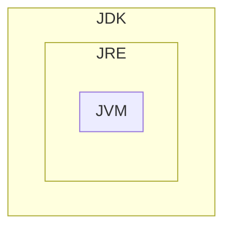

[toc]
# Evolución histórica

En la unidad anterior hablábamos de las fases en el proceso de desarrollo de software.
Una de ellas era la fase de codificación, en la cual se hacía uso de algún lenguaje de programación para pasar todas las acciones que debía llevar a cabo la aplicación a algún lenguaje que la máquina fuera capaz de entender y ejecutar.
También se hizo alusión a herramientas de apoyo al proceso de programación.
En esta unidad vamos a analizar, instalar y ejecutar estas herramientas para entender su acción y efecto.
Muchas personas aprenden a programar utilizando un editor de texto simple, compilador y depurador. Pero la mayoría, finalmente, terminan haciendo uso de algún entorno de desarrollo integrado (IDE) para crear aplicaciones.
Los primeros entornos de desarrollo integrados nacen a principios de los años 70, y se popularizan en la década de los 90. Tienen el objetivo de ganar fiabilidad y tiempo en los proyectos de software.
Proporcionan al programador una serie de componentes con la misma interfaz gráfica, con la consiguiente comodidad, aumento de eficiencia y reducción de tiempo de codificación.
Normalmente, un IDE está dedicado a un determinado lenguaje de programación. No obstante, las últimas versiones de los IDEs tienden a ser compatibles con varios lenguajes (por ejemplo, Eclipse, NetBeans, Microsoft Visual Studio...) mediante la instalación de plugins adicionales.
En las décadas de utilización de la tarjeta perforada como sistema de almacenamiento el concepto de Entorno de Desarrollo Integrado sencillamente no tenía sentido.
Los programas estaban escritos con diagramas de flujo y entraban al sistema a través de las tarjetas perforadas. Posteriormente, eran compilados.
El primer lenguaje de programación que utiliza un IDE fue el BASIC (que fue el primero en abandonar también las tarjetas perforadas o las cintas de papel).
Éste primer IDE estaba basado en consola de comandos exclusivamente (normal por otro lado, si tenemos en cuenta que hasta la década de los 90 no entran en el mercado los sistemas operativos con interfaz gráfica). Sin embargo, el uso que hace de la gestión de archivos, compilación, depuración... es perfectamente compatible con los IDE actuales.
A nivel popular, el primer IDE puede considerarse que fue el IDE llamado Maestro. Nació a principios de los 70 y fue instalado por unos 22000 programadores en todo el mundo. Lideró el campo durante los años 70 y 80.
El uso de los entornos integrados de desarrollo se ratifica y afianza en los 90 y hoy en día contamos con infinidad de IDEs, tanto de licencia libre como propietaria.

# Funciones y estructura

Un entorno de desarrollo integrado, o IDE, es un programa compuesto por una serie de herramientas que utilizan los programadores para desarrollar código.
Este programa puede estar pensado para su utilización con un único lenguaje de programación o bien puede dar cabida a varios.
Las herramientas que normalmente componen un entorno de desarrollo integrado son un sistema de ayuda para la construcción de interfaces gráficas de usuario (GUI), un editor de texto, un compilador/intérprete y un depurador.

Las funciones de los IDE son:

- Editor de código: coloración de la sintaxis.
- Auto-completado de código, atributos y métodos de clases.
- Identificación automática de código.
- Herramientas de concepción visual para crear y manipular componentes visuales.
- Asistentes y utilidades de gestión y generación de código.
- Archivos fuente en unas carpetas y compilados a otras.
- Compilación de proyectos complejos en un solo paso.
- Control de versiones: tener un único almacén de archivos compartido por todos los colaboradores de un proyecto. Ante un error, mecanismo de auto-recuperación a un estado anterior estable.
- Soporta cambios de varios usuarios de manera simultánea.
- Generador de documentación integrado.
- Detección de errores de sintaxis en tiempo real.

Otras funciones importantes son:

- Ofrece refactorización de código: cambios menores en el código que facilitan su legibilidad sin alterar su funcionalidad (por ejemplo cambiar el nombre a una variable).
- Permite introducir automáticamente tabulaciones y espaciados para aumentar la legibilidad.
- Depuración: seguimiento de variables, puntos de ruptura y mensajes de error del intérprete.
- Aumento de funcionalidades a través de la gestión de sus módulos y plugins.
- Administración de las interfaces de usuario (menús y barras de herramientas).
- Administración de las configuraciones del usuario.

## Interfaces gráficas de usuario

Las interfaces gráficas de usuario son un conjunto de funcionalidades que permiten incorporar, editar y eliminar componentes gráficos de forma sencilla en la aplicación que se está desarrollando. Estos componentes facilitarán la interacción del usuario con el ordenador.

## Editor de texto

Un editor de texto es un programa que permite crear y modificar archivos digitales compuestos únicamente por texto sin formato, conocidos comúnmente como archivos de texto o texto plano.
El editor de texto es la herramienta más utilizada porque ofrece la posibilidad de crear y modificar los contenidos desarrollados, el código de programación que hará funcionar adecuadamente la aplicación.
Siempre que el IDE reconozca el lenguaje de programación (o disponga del componente adecuado) el editor ofrecerá:

- Resaltado de sintaxis (syntax highlighting): las palabras clave serán reconocidas con colores, lo que facilitará mucho el trabajo del programador.
- Realización de código (code completion): se reconocerá el código que se está escribiendo y, por ejemplo en un objeto o clase, ofrecerá sus atributos, propiedades o métodos para que el programador seleccione cuál quiere referenciar.
- Corrector de errores, normalmente desde un punto de vista de sintaxis.
- Regiones plegables: ocultación de ciertas partes del código, con el fin de facilitar la visualización de aquellos fragmentos más relevantes.

## Compilador

En función del lenguaje de programación utilizado, el IDE podrá ofrecer la funcionalidad de compilarlo. Un compilador traduce un código de programación en un lenguaje máquina capaz de ser interpretado por los procesadores y de ser ejecutado. A la hora de compilar un código de programación, los entornos integrados de desarrollo dispondrán de diferentes fases de análisis del código, como son la fase semántica y la fase lexicográfica. La compilación mostrará los errores encontrados o generará código ejecutable, en el caso de encontrar ninguno.

## Intérprete

El intérprete traduce el código de alto nivel a código de bytes, pero, a diferencia del compilador, lo hace en tiempo de ejecución.

## Depurador

El depurador es un programa que permite probar y depurar el código fuente de un programa, facilitando la detección de errores.
Algunas de las funcionalidades típicas de los depuradores son:

- Permitir la ejecución línea a línea del código validando los valores que van adquiriendo las variables.
- Pausa el programa en una determinada línea de código, haciendo uso de uno o varios puntos de ruptura (breakpoints).
- Algunos depuradores ofrecen la posibilidad de poder modificar el contenido de alguna variable mientras se está ejecutando.

## Acceso a bases de datos y gestión de archivos

Los lenguajes de cuarta generación ofrecen la posibilidad de integrar código de acceso a bases de datos (o código de sentencias estructuradas). Para facilitar esta funcionalidad es muy recomendable disponer de la posibilidad de acceder directamente a la base de datos desde el mismo entorno de desarrollo y no haber de utilizar otro. Lo mismo sucederá con la gestión de archivos.

## Control de versiones

A medida que un programador va desarrollando nuevas líneas de código, es importante tener un histórico del trabajo realizado o de las versiones que se han dado por buenas o se han modificado. El control de versiones permite volver a una versión anterior que sea estable o que cumpla unas determinadas características que los cambios hechos no cumplen.

## Refactorización

La refactorización (refactoring) es una técnica de la ingeniería de software dirigida a reestructurar un código fuente, alterando su estructura interna sin cambiar su comportamiento externo.

## Documentación y ayuda

La documentación y ayuda provee acceso a documentación, manuales y ayuda contextual sobre las instrucciones y la sintaxis de los lenguajes soportados.

## Ejemplos de entorno de desarrollo

Hoy día los entornos de desarrollo proporcionan un marco de trabajo para la mayoría de los lenguajes de programación existentes en el mercado (por ejemplo C, C ++, C #, Java o Visual Basic, entre otros). Además, es posible que un mismo entorno de desarrollo permita utilizar varios lenguajes de programación, como es el caso de Eclipse (al que se puede añadir soporte de lenguajes adicionales mediante conectores -plugins-) o Visual Studio (que está pensado para trabajar con los lenguajes VB.Net, C #, C ++ ...).

Como ejemplos de IDE multiplataforma se pueden encontrar, entre muchos otros:

- Eclipse, proyecto multiplataforma (Windows, GNU/Linux, Mac) de código abierto, fundado por IBM en noviembre de 2001, desarrollado en Java. 
- Netbeans, proyecto multiplataforma (Windows, GNU/Linux, Mac, Solaris) de código abierto, fundado por Sun Microsystems en junio de 2000, desarrollado en Java.
- Anjuta DevStudio, para GNU/Linux, creado por Naba Kumar en 1999.
- JBuilder, herramienta multiplataforma (Windows, GNU/Linux, Mac), propiedad de la empresa Borland, aparecida en 1995. La versión 2008 incorpora tres ediciones (Enterprise -de pago-, Profesional -de pago- y Turbo -gratuita-).
- JDeveloper, herramienta multiplataforma (Windows, GNU/Linux, Mac) gratuita, propiedad de la empresa Oracle, aparecida en 1998, inicialmente basada en JBuilder pero desarrollada desde 2001 en Java.
- BlueJ es un entorno integrado de desarrollo para el lenguaje de programación Java, desarrollado principalmente con propósitos educacionales, pero también es adecuado para el desarrollo de software a pequeña escala.
  BlueJ fue desarrollado para apoyar la enseñanza y el aprendizaje de la programación orientada a objetos, y como resultado, su diseño difiere de otros entornos de desarrollo. La pantalla principal muestra gráficamente la estructura de clases de una aplicación en desarrollo (en un diagrama muy parecido a UML), y los objetos pueden ser creados y probados interactivamente. Combinado con una interfaz de usuario simple, esta facilidad de interacción permite experimentar de manera fácil con los objetos en desarrollo. Los conceptos de la orientación a objetos (clases, objetos, comunicación a través de llamadas a métodos) son representadas visualmente en el diseño de interacción en la interfaz.

Aparte de los que hemos mencionado, existen muchos otros IDE, muy conocidos, para determinadas plataformas, como por ejemplo:

- Visual Studio
- Dev-Pascal
- Dev-C++
- MonoDevelop

# Tipos de IDE's y como elegir

En este enlace podrás consultar los diferentes IDE's disponibles según el lenguaje de programación, su tipo de licencia, en que lenguaje se han programado, plataformas compatibles, etcétera: https://en.wikipedia.org/wiki/Comparison_of_integrated_development_environments

Para poder elegir correctamente el IDE con el que trabajar, necesitamos saber as características que buscamos de él. Veremos diversos criterios que suelen ser los más utilizados a la hora de elegir el IDE, son: la licencia, la plataforma, lenguaje de programación y herramientas-disponibilidad.

## Según su licencia

Podemos optar por IDE's **Libres**, en los que su licencia nos ofrece las libertades del software libre. O bien **Privativos**, en los que no tenemos acceso a todas las libertades del software. Hay que recordar que esto es independiente del coste económico, puesto que podemos encontrar IDE's privativos gratuitos.

## Según la plataforma

Es uno de los criterios más restrictivos para seleccionar el IDE y, más importante aún es para qué Sistema Operativo vamos a desarrollar nuestro software.
Hoy en día existen emuladores o virtualizadores de Sistemas Operativos, pero no es aconsejable usar estos métodos si nuestro software no va a ser ejecutado mediante máquina virtual. Deberemos desarrollar aplicaciones en el mismo SO en el que van a funcionar cuando estén en la fase de explotación. Esta restricción es inherente al compilador del IDE ya que es quien se encarga de traducir nuestro código fuente a código objeto que es el que se ejecutará en el sistema.

## Lenguaje de programación y framework

Un IDE puede soportar uno o varios lenguajes de programación, por lo que es importante saber en qué lenguaje vamos a codificar nuestro proyecto y qué lenguajes nos ofrecen los distintos IDE disponibles.
Este criterio va de la mano del sistema operativo que usemos, ya que si quisiéramos desarrollar en Visual Basic bajo un sistema operativo GNU/Linux no sería Visual Studio la opción del IDE sino Gambas.
Lo mismo ocurre con las plataformas de trabajo o frameworks, no solo depende del framework que vayamos a usar, también necesitamos saber bajo qué sistema operativo vamos a ejecutarla. Por ejemplo si fuéramos a desarrollar con Visual Basic en la plataforma .NET bajo GNU/Linux, tendríamos que usar Mono Develop en lugar de Visual Studio.

## Herramientas y disponibilidad

Las herramientas son el criterio que completa la elección del IDE pues si nos encontramos con varios IDE que cumplen los criterios de lenguaje y sistema operativo, nos decantaremos por aquel que tenga mejores herramientas.
En ocasiones los IDE pueden ser restrictivos por las preferencias del programador, por trabajar de manera colaborativa o por el modo de utilizar los diferentes códigos entre diferentes IDE. Por ejemplo, si nuestros compañeros de trabajo usan el Team Server Foundation (TSF) como sistema de control de versiones, nosotros debemos usarlo también, y el único modo de hacerlo es con Visual Studio; pero si los compañeros están trabajando en Java con un sistema de control de versiones Subversión (SVN), podríamos usar indistintamente Netbeans, Eclipse o InteliJ DEA, entre otros, ya que SVN está disponible para todos esos IDE. 
Dentro de nuestras necesidades y preferencias podría estar la de tener una funcionalidad para crear archivos de ayuda y documentación. En ese caso deberíamos buscar un IDE con esa funcionalidad o buscar una extensión (plugin) para ese IDE que soporte la funcionalidad deseada.
Se debe invertir una importante cantidad de tiempo para investigar y documentarse a fondo sobre los IDE potenciales que podemos elegir para no elegir incorrectamente o no saber qué funcionalidades tiene el IDE que hemos escogido.
Después de comprobar los criterios anteriores, el aspecto más restrictivo de la disponibilidad es el precio de la aplicación; dependiendo de nuestro presupuesto podremos acceder a diferentes IDE.
Si no disponemos de presupuesto, existen ciertas soluciones gratuitas para poder disponer de un IDE con el que trabajar que cumplirán la mayoría de criterios que necesitamos.

# Entorno JAVA

Cada software y cada entorno de desarrollo tiene unas características y unas funcionalidades específicas. Esto quedará reflejado también en la instalación y en la configuración del software. En función de la plataforma, entorno o sistema operativo en el que se quiera instalar el software, se utilizará un paquete de instalación u otro, y se deberán tener en cuenta unas opciones u otras en su configuración.
A continuación se muestra cómo se lleva a cabo la instalación de una herramienta integrada de desarrollo de software, como es el Eclipse. Pero también podrá observar los procedimientos para instalar otras herramientas necesarias o recomendadas para trabajar con el lenguaje de programación JAVA, como el Tomcat o la Máquina Virtual de Java.
Debe tener presentes los siguientes conceptos:

- JVM (Java Virtual Machine, máquina virtual de Java) se encarga de interpretar el código de bytes y generar el código máquina del ordenador (o dispositivo) en el que se ejecuta la aplicación. Esto significa que necesitamos una JVM diferente para cada entorno.
- JRE (Java Runtime Environment) es un conjunto de utilidades de Java que incluye la JVM, librerías y el conjunto de software necesario para ejecutar las aplicaciones cliente de Java, así como el conector para que los navegadores de internet puedan ejecutar las applets.
- JDK (Java Development Kit, kit de desarrollo de Java) es el conjunto de herramientas para desarrolladores; contiene, entre otras cosas, el JRE y el conjunto de herramientas necesarias para compilar el código, empaquetarlo, generar documentación ...



El proceso de instalación consiste en los siguientes pasos:
1. Descargar, instalar y configurar el JDK.
2. Descargar e instalar un servidor web o de aplicaciones.
3. Descargar, instalar y configurar el IDE (Netbeans o Eclipse).
4. Configurar JDK con el IDE.
5. Configurar el servidor web o de aplicaciones con el IDE instalado.
6. En caso de ser necesario, instalación de conectores.
7. En caso de ser necesario, instalación de nuevo software.

## Descargar e instalar el JDK

Podemos diferenciar entre:

- Java SE (Java Standard Edition): es la versión estándar de la plataforma, siendo esta plataforma la base para todo entorno de desarrollo en Java en cuanto a aplicaciones cliente, de escritorio o web.

- Java EE (Java Enterprise Edition): es la versión más grande de Java y se utiliza en general para crear aplicaciones grandes de cliente/servidor y para desarrollo de WebServices.

En este curso se utilizarán las funcionalidades de Java SE.
El archivo es diferente en función del sistema operativo donde se tenga que instalar. así:

- Para los sistemas operativos Windows y Mac OS hay un archivo instalable.
- Para los sistemas operativos GNU/Linux que admiten paquetes .rpm o .deb también hay disponibles paquetes de este tipo.
- Para el resto de sistemas operativos GNU/Linux hay un archivo comprimido (terminado en .tar.gz).

En los dos primeros casos, sólo hay que seguir el procedimiento de instalación habitual en el sistema operativo con el que se trabaja.

En el último caso, sin embargo, hay que descomprimir el archivo y copiarlo a la carpeta donde queremos instalar. Normalmente, todos los usuarios tendrán permiso de lectura y ejecución sobre esta carpeta.

> A partir de la versión 11 del JDK Oracle distribuye el software con una licencia significativamente más restrictiva que la de las versiones anteriores. En concreto, sólo puede utilizarse para "desarrollar, probar, hacer prototipos y demostrar sus aplicaciones". Se excluye explícitamente todo uso "para fines comerciales, de producción o de negocio internos" diferente del mencionado antes.
> En caso de necesitarlo para alguno de estos usos no permitidos en la nueva licencia, además de las versiones anteriores del JDK, existen versiones de referencia de estas versiones con licencia "GNU General Public License versión 2, with the Classpath Exception ", que permite la mayoría de los usos habituales. Estas versiones están enlazadas a la misma página de descargas y, también, en la dirección jdk.java.net.

Una alternativa es utilizar https://adoptium.net/ antes conocido como adoptOpenJDK, que ahora se ha integrado en la fundación Eclipse. Desde allí podemos descargar los binarios de la versión openJDK para nuestra plataforma sin restricciones. [Historia completa](https://es.wikipedia.org/wiki/OpenJDK).

> En GNU/Linux podemos usar los comandos:
>
> - `sudo apt install default-jdk` para instalar el jdk por defecto.
> - `java --version` para ver las versiones disponibles en nuestro sistema.
> - `sudo update-alternatives --config java` para elegir cual de las versiones instaladas queremos usar por defecto o incluso ver la ruta de las diferentes versiones que tenemos instaladas.
> - `sudo apt install openjdk-16-jdk` para instalar la versión 16 de openjdk.

## Configurar las variable de entorno "JAVA_HOME" y "PATH"

Una vez descargado e instalado el JDK, es necesario configurar algunas variables de entorno:

- La variable `JAVA_HOME`: indica la carpeta donde se ha instalado el JDK. No es obligatorio definirla, pero es muy conveniente hacerlo, ya que muchos programas buscan en ella la ubicación del JDK. Además, facilita definir las dos variables siguientes.

- La variable `PATH`. Debe apuntar al directorio que contiene el ejecutable de la máquina virtual. Suele ser la subcarpeta `bin` del directorio donde hemos instalado el JDK.

**CLASSPATH variable**
Otra variable que tiene en cuenta el JDK es la variable `CLASSPATH`. Apunta a las carpetas donde están las bibliotecas propias de la aplicación que se quiere ejecutar con el orden java. Es preferible, sin embargo, indicar la ubicación de estas carpetas con la opción -cp de la misma orden java, ya que cada aplicación puede tener bibliotecas diferentes y las variables de entorno afectan a todo el sistema.

Configurar la variable `PATH` es imprescindible para que el sistema operativo encuentre las órdenes del JDK y pueda ejecutarlas.

# Eclipse

Eclipse es una aplicación de código abierto desarrollada actualmente por la Fundación Eclipse, una organización independiente, sin ánimo de lucro, que fomenta una comunidad de código abierto y la utilización de un conjunto de productos, servicios, capacidades y complementos para la divulgación de el uso de código abierto en el desarrollo de aplicaciones informáticas. Eclipse fue desarrollado originalmente por IBM como el sucesor de VisualAge.

Como Eclipse está desarrollado en Java, es necesario, para su ejecución, que haya un JRE (Java Runtime Environment) instalado previamente en el sistema. Para saber si se dispone de este JRE instalado, se puede hacer la prueba en la web oficial de Java, en el apartado ¿Tengo Java ?.

Si desarrollaremos con Java, como es nuestro caso, hay que tener instalado el JDK (recuerde que es un superconjunto del JRE).

## Instalación

Las versiones actuales del entorno Eclipse se instalan con un instalador. Este, básicamente se encarga de descomprimir, resolver algunas dependencias y crear los accesos directos.
Este instalador se puede obtener bajándolo directamente del sitio web oficial del Proyecto Eclipse [www.eclipse.org](www.eclipse.org). Puede encontrar las versiones para los diferentes sistemas operativos y las instrucciones para utilizarlo. No son nada complejas.

En el caso de GNU/Linux y MAC OS, el archivo es un archivo comprimido. Habrá, pues,que descomprimirlo y, después ejecutar el instalador. Este es el archivo *eclipse-inst*, dentro de la carpeta eclipse, que es una subcarpeta del resultado de descomprimir el archivo anterior.

Si sólo el usuario actual utilizará el IDE, puede realizarse la instalación sin utilizar privilegios de administrador o root y seleccionar, para la instalación, una carpeta propia de este usuario. Si se desean compartir la instalación entre diferentes usuarios, habría que indicar al instalador una carpeta sobre la que todos estos usuarios tuvieran permiso de lectura y ejecución.

Cuando arrancamos el instalador veremos una pantalla similar a esta:


El instalador pedirá qué versión queremos instalar. La versión que utilizaremos es "Eclipse IDE for Java EE Developers".


A continuación pedirá la versión de JDK/JRE que vamos a usar (en la captura aparece con letras en blanco). También nos pide la carpeta donde haremos la instalación. Y dos casillas de verificación para indicar si queremos que cree por nosotros el acceso directo al menú de aplicaciones y a en el escritorio.


Para seleccionar la carpeta correcta, hay que tener en cuenta qué usuarios utilizarán el entorno. Todos ellos deben tener permiso de lectura y ejecución sobre la carpeta en cuestión. Una vez introducida la carpeta, podemos pulsar el botón INSTALL para que comience la instalación.

También se nos pedirá que aceptamos las licencias del software que se instalará, como muestra la captura:


Durante la instalación nos aparecerá una pantalla de progreso como la que se ve a continuación:


Una vez terminada la instalación se nos muestra una pantalla que nos invita a ejecutar directamente el entorno.


Esta primer vez podremos ejecutar el entorno Eclipse haciendo clic en el botón LAUNCH. El resto de ocasiones, será necesario invocarlo desde los accesos directos o lanzadoras, si se han creado o, de lo contrario, invocando directamente el ejecutable. Este se llama eclipse y lo encontrará en en una subcarpeta de la carpeta de instalación que se denomina también eclipse. La ruta exacta puede variar de una versión a otra.
Si en un futuro fuera necesario desinstalarlo, sólo se debería borrar la carpeta donde se ha instalado ya que la instalación de Eclipse no aparece en el respositorio deGNU/Linux ni en el panel de control en Windows.
Cuando ejecutamos el entorno, nos aparecerá una pantalla como la siguiente:


Enseguida se nos pedirá pedirá en qué carpeta habrá ubicar el espacio de trabajo. Podemos pedirle que lo recuerde para el resto de ejecuciones activando la opción "*Use this as the default and do not ask again*".


La primera vez que lo ejecutamos, se mostrará la pestaña de bienvenida. Podemos pedir que no nos la muestre más desactivando la opción "Always show Welcome at start up".


Una vez cerrada esta pestaña, el entorno de trabajo será similar a este:


> Eclipse por defecto nos ofrece la descarga del instalador más liviano y que descargará de Internet los paquetes necesarios para completar la instalación según nuestras elecciones. Si esta instalación nos da problemas podemos descargar la versión "package" en la que debemos elegir previamente el paquete de instalación que queremos, ocupará bastante más, pero descargará todos los paquetes necesarios. Después solo debemos descomprimir el archivo descargado en una carpeta de nuestra elección y tendremos eclipse instalado. Deberemos crear nosotros mismos nuestros iconos del menú de inicio y del escritorio (puedes seguir esta [guía](https://www.donovanbrown.com/post/Adding-Eclipse-to-Launcher-on-Ubuntu-1604) cambiando la ruta donde has descomprimido tu versión de eclipse).

## Configuración

**Versión de Java**

Por defecto Eclipse intenta usar las novedades del JDK 16, pero en nuestro caso por ejemplo tenemos la versión 11. Podemos personalizar estas opciones en el apartado `Window/Preferences/Java/Compiler` y elegir para el campo `Compiler compliance level` la versión correcta, en nuestro caso 11.

Además si lo necesitamos podemos configurar los JDK que están disponibles, agregarlos o eliminarlos desde la opción `Window/Preferences/Java/Installed JREs`.

**Perspectivas**

Eclipse llama a la distribución de los paneles en la ventana Perspectiva, hay unas cuantas predefinidas, y podemos configurar las nuestras, a nuestro gusto en el apartado `Window/Perspective`.

**Apariencia**

Eclipse nos permite personalizar cualquier aspecto de la apariencia de nuestro entorno, cambiar tanto el tema del IDE como el tamaño de fuente y colores para el coloreado de código fuente. Todas estas opciones están disponibles en `Window/Appearance`.

## Módulos

Las opciones y funcionalidades de Eclipse se pueden ampliar añadiendo módulos desde su "tienda" de complementos. En `Help/Eclipse Marketplace...` podemos por ejemplo buscar por texto, o buscar en la pestaña populares. Eso nos mostrará todos los complementos que contienen la palabra buscada, o los complementos más descargados del marketplace. Podemos instalar por ejemplo `SonarLint 6.0` que nos ayuda a mantener nuestro código limpio de errores comunes, para ello simplemente debemos pulsar el botón `INSTALL` que aparece a su lado en el listado, aceptar la licencia de uso y automáticamente nos pedirá reiniciar el `IDE`.

## Uso básico ("Hola mundo!")

Eclipse proporciona información sobre su uso en el apartado `Help`, y podemos aprender a crear nuestro primer proyecto en Java (el típico "Hola Mundo!") para ello debemos abrir la ventana `Welcome `que es la que aparece cuando abrimos eclipse por primera vez, o la podemos abrir desde `Help/Welcome`, desde esta ventana podemos elegir el apartado `Tutorials`,  y dentro del apartado Java Development, elegir el primer item "Create a Hello World application", y el propio Eclipse nos guiará paso a paso para crear y ejecutar nuestro primer proyecto Java en Eclipse.

## Actualización y mantenimiento

En el mismo apartado `Help` Eclipse nos proporciona las opciones para actualizar el propio Eclipse o los complementos que tenemos instalados `Help/Check for Updates`.

Podemos personalizar el comportamiento respecto a las actualizaciones en el apartado `Window/Preferences/Install/Update/Automatic Updates`.

# Netbeans

NetBeans es una herramienta de entorno de desarrollo integrado (IDE) muy potente que se utiliza principalmente para el desarrollo de Java y C/C ++. Le permite desarrollar fácilmente aplicaciones web, de escritorio y móviles desde su marco modular. Puede agregar soporte para otros lenguajes de programación como PHP, HTML, JavaScript, C, C ++, Ajax, JSP, Ruby on Rails, etc. utilizando extensiones.

NetBeans IDE 12 ha sido lanzado con soporte para Java JDK 11. También viene con las siguientes características:

- Soporte para PHP 7.0 a 7.3, PHPStan y Twig.
- Incluir módulos en el clúster "webcommon". Es decir, todas las funciones de JavaScript en Apache NetBeans GitHub son parte de Apache NetBeans 10.
- Los módulos del clúster "groovy" se incluyen en Apache NetBeans 10.
- OpenJDK puede detectar automáticamente JTReg desde la configuración de OpenJDK y registrar el JDK expandido como una plataforma Java.
- Soporte para JUnit 5.3.1

## Instalación

Podemos instalar NetBeans de tres maneras:

### Instalar desde binarios

**Paso 1: Descargue el archivo NetBeans**

Descargue el archivo binario de NetBeans 12 `netbeans-12.4-bin.zip`. 

**Paso 2: Extraiga el archivo**

Espere a que finalice la descarga y luego extráigala.

``` sh
$ unzip netbeans-12.4-bin.zip
```

Confirme el contenido del archivo de directorio creado:

``` bash
$ ls netbeans
apisupport    enterprise  groovy   javafx    netbeans.css  profiler
bin           ergonomics  harness  LICENSE   NOTICE        README.html
cpplite       etc         ide      licenses  php           webcommon
DEPENDENCIES  extide      java     nb        platform      websvccommon
```
**Paso 3: Mueva la carpeta `netbeans` a `/opt`**

Movamos ahora la carpeta `netbeans/` a `/opt`

```sh
$ sudo mv netbeans/ /opt/
```
**Paso 4: Ruta de configuración**

El binario ejecutable de Netbeans se encuentra en `/opt/netbeans/bin/netbeans`. Necesitamos agregar su directorio padre a nuestro `$PATH` para que podamos iniciar el programa sin especificar la ruta absoluta al archivo binario.
Abra su archivo `~/.bashrc` o `~/.zshrc`.

```sh
$ nano ~/.bashrc
```
Agregue la siguiente línea al final de
```sh
export PATH = "$PATH:/opt/netbeans/bin/"
```
Obtenga el archivo para iniciar Netbeans sin reiniciar el shell.
```sh
$ source ~/.bashrc
```
**Paso 5: Crear el lanzador de NetBeans IDE Desktop** (opcional)

Cree un nuevo archivo en `/usr/share/applications/netbeans.desktop`.

``` sh
$ sudo nano /usr/share/applications/netbeans.desktop
```

Agregue los datos siguientes.

```sh
[Desktop Entry]
Name=Netbeans IDE
Comment=Netbeans IDE
Type=Application
Encoding=UTF-8
Exec=/opt/netbeans/bin/netbeans
Icon=/opt/netbeans/nb/netbeans.png
Categories=GNOME;Application;Development;
Terminal=false
StartupNotify=true
```

Para desinstalar NetBeans debemos borrar la carpeta netbeans/ que se encuentra dentro de la carpeta /opt/, podemos usar el comando:

```bash
$ sudo rm /opt/netbeans -rf
```

**Paso 6: Configurar correctamente el JDK** (opcional)

En el archivo `/opt/netbeans/etc/netbeans.conf` debemos especificar correctamente la ruta de nuestro JDK en la variable `netbeans_jdkhome`. En GNU/Linux podemos conocer los JDK disponibles con el comando `sudo update-alternatives --config java` que mostrará un resultado parecido a este:

```bash
Hi ha 3 possibilitats per a l'alternativa java (que proveeix /usr/bin/java).

  Selecció    Camí                                           Prioritat  Estat
------------------------------------------------------------
* 0            /usr/lib/jvm/java-14-openjdk-amd64/bin/java      1411      mode automàtic
  1            /usr/lib/jvm/java-11-openjdk-amd64/bin/java      1111      mode manual
  2            /usr/lib/jvm/java-14-openjdk-amd64/bin/java      1411      mode manual
  3            /usr/lib/jvm/java-8-openjdk-amd64/jre/bin/java   1081      mode manual

Premeu retorn per a mantenir l'opció per defecte[*], o introduïu un número de selecció:
```

En la configuración de netbeans no hay que especificar el final de la ruta `bin/java`

```bash
netbeans_jdkhome="/usr/lib/jvm/java-11-openjdk-amd64/"
```

### Instalar desde script

**Paso 1: Descargue el archivo NetBeans**

También puede instalar Netbeans 12.4 enGNU/Linux desde un script proporcionado para descargar `Apache-NetBeans-12.4-bin-linux-x64.sh`.

**Paso 2: Ejecute el script**

Debes ejecutar el script de instalación

```sh
$  sudo sh ./Apache-NetBeans-12.4-bin-linux-x64.sh
```
> Si ejecutas el script como `root` (`sudo`) Netbeans estará disponible para todos los usuarios. Por contra, si ejecutas el usuario sin `sudo` solo estará disponible para tu usuario.

Aparecerá una barra de progreso como esta:


Ahora podremos elegir los componentes que deseamos instalar con el IDE Netbeans, lo dejaremos por defecto y pulsaremos en el botón siguiente. 


**Paso 3: Aceptar la licencia**

A continuación debemos aceptar el acuerdo de licencia de uso marcando la casilla y pulsando el botón siguiente.


**Paso 4: Elegir la ruta de instalación y el JDK**

Ahora debemos escoger la ruta donde se instalará Netbeans 12.4. Y debemos escoger la ruta donde se encuentra el JDK (por defecto indica `/usr`, pero debemos especificar la ubicación como por ejemplo `/usr/lib/jvm/java-11-openjdk-amd64`).


**Paso 5: Actualizaciones automáticas**

En este punto se muestra un resumen de la instalación, y podemos escoger si queremos que NetBeans busque e instale actualizaciones desde Internet, y pulsamos el botón instalar.


**Paso 6: Instalación**

Aparecerá una barra de progreso.


**Paso 7: Paso final**

Al terminar aparecerá una pantalla con las acciones llevadas a cabo por el instalador, y tendremos creados los lanzadores en el menu de aplicaciones.


### Instalar mediante snap

Quizá una forma más sencilla de instalar la última versión de Netbeans en nuestro sistema GNU/Linux sea mediante `snap`:

```sh
$ sudo snap install netbeans --classic
```

### Primera ejecución

Cuando ejecutamos el entorno, nos aparecerá una pantalla como la siguiente:


La primera vez que lo ejecutamos, se mostrará la pestaña de bienvenida. Podemos pedir que no nos la muestre más desactivando la opción "Show on Startup".


Una vez cerrada esta pestaña, el entorno de trabajo será similar a este:


Puede que NetBeans nos pida permiso para usar nuestra información a nivel estadístico, elegimos el comportamiento deseado y aceptamos.


Para desinstalar NetBeans en este caso debemos ejecutar el archivo `uninstall.sh` que se encuentra en la carpeta de instalación.

## Configuración

Activar Modulos

Por defecto Netbeans tiene los módulos desactivados y será la primera vez que los necesitemos cuando estos pasaran a estar activos y disponibles. Así por ejemplo si creamos un nuevo proyecto y elegimos `Java Application` dentro de la categoría `Java with Ant` veremos en la parte inferior que Netbeans nos advierte que el módulo necesario no está activo y que debemos pulsar `Next` para que este disponible. Lo hacemos, y a continuación nos pedirá activar el módulo `nb-javac Impl`, dejamos el check marcado y pulsamos el botón `Activate`, y ya nos aparecerá el asistente para la creación de nuestro primer proyecto Java.

**Versión de Java**

Dentro del menú `Tools/Java Platforms` podemos cambiar o visualizar la ubicación de nuestra instalación del JDK.

**Perspectivas**

En Netbeans no son necesarias las perspectivas, el entorno de Netbeans, aunque es personalizable, se adapta automáticamente a las tareas que estas realizando en cada momento.

**Apariencia**

Netbeans nos permite personalizar cualquier aspecto de la apariencia de nuestro entorno, cambiar tanto el tema del IDE como el tamaño de fuente y colores para el coloreado de código fuente. Todas estas opciones están disponibles en `Tools/Options`, y dentro de esta ventana elegir la tercera pestaña `Font & Colors` y la penúltima pestaña `Appearance`.

**Exportar/Importar configuración**

Una opción muy interesante de Netbeans es que nos permite exportar o importar configuraciones y compartirlas con otros compañeros o incluso entre nuestros ordenadores o diferentes instalaciones. La opción está disponible en `Tools/Options`, en la parte inferior izquierda encontramos los botones `Export...` e `Import...`.

## Módulos

Las opciones y funcionalidades de Netbeans se pueden ampliar añadiendo módulos desde su apartado de plugins. En `Tools/Plugins` podemos por ejemplo buscar por texto, o buscar en la pestaña de plugins disponibles. Eso nos mostrará todos los complementos que contienen la palabra buscada, o los complementos disponibles. Podemos instalar por ejemplo `sonarlint4netbeans` que nos ayuda a mantener nuestro código limpio de errores comunes, para ello simplemente debemos marcar el cuadro delante del nombre del plugin, y pulsar el botón `INSTALL` que aparece abajo, pulsar siguiente, aceptar la licencia de uso e instalar. Cuando termine la instalación nos pedirá reiniciar el `IDE`.

## Uso básico ("Hola mundo!")

Para crear nuestra primera aplicación en Netbeans, debemos crear una aplicación Java, desde el menú `File/New Project...` debemos elegir `Java Application` dentro de la categoría `Java with Ant`. A continuación debemos especificar el nombre del proyecto, por ejemplo "App Hola Mundo", y nos aseguramos de dejar marcada la opción `Create main class app.hola.mundo.AppHolaMundo` y deberíamos ver algo parecido a esto:


Llegados a este punto solo nos queda incluir la línea de código necesaria para imprimir por pantalla el mensaje de texto. Para ello nos colocaremos al final de la línea `// TODO code application logic here` y pulsaremos la tecla `ENTER` para crear una nueva línea.

Una vez situados en el lugar correcto usaremos una de las funcionalidades más interesantes de Netbeans que es el de las plantillas de código. Escribimos la palabra "sout" y a continuación pulsamos la tecla `TABULADOR` y Netbeans lo sustituirá por el código correcto de: `System.out.println("");`.

Ahora debemos escribir entre las dos comillas dobles el mensaje de texto que debe aparecer por pantalla, y debería quedar así:

```java
System.out.println("Hola Mundo!");
```

A continuación podemos pulsar el botón superior con un triangulo verde (`Run project`) o bien pulsar la tecla `F6` del teclado:


Aparecerá una nueva sección en la ventana (en la parte inferior) llamada `Output` en el que podremos visualizar el resultado de la ejecución de nuestro primer programa.

## Actualización y mantenimiento

En el apartado `Help` Netbeans nos proporciona las opciones para actualizar el propio Netbeans con la opción `Help/Check for Updates`.

# Fuentes de información

- [Wikipedia](https://es.wikipedia.org)
- [Code&Coke (Fernando Valdeón)](http://entornos.codeandcoke.com/doku.php?id=start)
- Apuntes IES El Grao (Mª Isabel Barquilla?)
- [Apuntes IOC (Marcel García)](https://ioc.xtec.cat/materials/FP/Recursos/fp_dam_m05_/web/fp_dam_m05_htmlindex/index.html)
- [Apuntes José Luis Comesaña](https://www.sitiolibre.com/)
- [Apuntes IES Luis Vélez de Guevara 17-18 (José Antonio Muñoz Jiménez)](http://jamj2000.github.io/slides/2017/09/05/entornosdesarrollo/)
