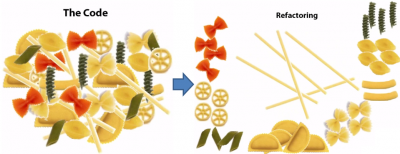
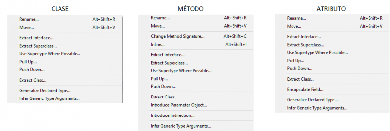
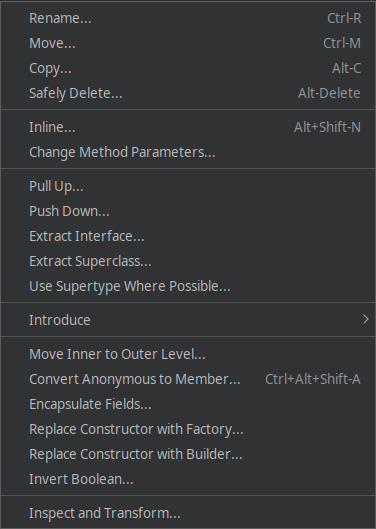

---
title: UD03: Refactoring and version control tools
language: EN
author: David Martínez Peña [www.martinezpenya.es]
subject: Development Environments
keywords: [EED, 2021, Environments, Development]
IES:IES Mestre Ramón Esteve (Catadau) [iesmre.es]
header: ${title} - ${subject} (ver: ${today})
footer: ${currentFileName}.pdf - ${author} - ${IES} - ${pageNo}/${pageCount}
typora-root-url: ${filename}/../
typora-copy-images-to: ${filename}/../assets
---
[toc]
# Refactoring

The term refactoring within the field of Software Engineering refers to modifying the code without changing its operation. It is used to create a clearer and simpler code, facilitating the subsequent reading or revision of a program. It could be understood as the maintenance of the code, to facilitate its understanding, but without adding or eliminating functionalities. **Refactoring code is about creating cleaner code.**



Refactoring should be an isolated step in the design of a program, to avoid introducing code errors when rewriting or modifying some parts of it. If after refactoring we have altered the operation of the code, we have made errors when refactoring.

It is refactored to:

- Code cleaning, improving consistency and clarity.
- Maintenance of the code, without correcting errors or adding functionalities.
- Eliminates the "dead" code, and is modularized.
- Facilitates future code maintenance and modification.

The following sections are inevitably related to each other, since all the techniques or rules pursue the same purpose.

## Java writing conventions

Code conventions exist because most of the cost of a program's code is used in its maintenance, (almost no program is kept with the original code for its entire life), and they improve the reading of the code allowing to understand new code much more fast and thorough. On the *Sun Microsystems* website, these conventions are included in a guide in [English](http://www.oracle.com/technetwork/java/codeconventions-150003.pdf), or a translation into [Spanish](http : //www.um.es/docencia/vjimenez/ficheros/practicas/Con ConvencionesCodigoJava.pdf) courtesy of *javaHispano*. Google has also recently created a [Style Guide](https://google.github.io/styleguide/javaguide.html#s1-introduction) for Java.

For the conventions to work, each programmer must try to be as faithful as possible to them.

### Files

All java source files are plain text files whose name ends with the extension *.java* Within each *.java* file we have 4 parts in the following order:

1. Possible comments about the class (author, date, licenses, etc)
2. *package* statement. All kinds must be in a package.
3. *import* statements. Import each class on a separate line.
4. The definition of a single class or interface **whose name is identical to the name of the file without the extension**.

```java
/* Correcto */
import java.awt.Frame;
import java.awt.Graphics;
```

```java
/* Incorrecto */
import java.awt.*;
```

Later within the definition of the class, we apply the following order:

1. *class or interface* statement
2. Class variables (static)
3. Instance variables (Class attributes)
4. Constructors (If there is overload they must be followed)
5. Methods (If there is an overload, they must be followed)

### Variable declarations

- Only one statement per line.

```java
int edad;
int cantidad; 
```

- Local variables must be initialized at the time of declaration or just after. They are declared just before use, to reduce their scope.
- Class or instance variables are declared at the beginning of the class definition.
- Arrays can be initialized en bloc:

```java
int[] array = 
{
 0, 1, 2, 3 
};
// ó
int[] array = { 0, 1, 2, 3 }; 
```

- Arrays have brackets [] attached to their data type:

```
String[] nombres; //correcto
String nombres[]; //incorrecto
```

> Therefore the correct form of the arguments in the `main` should be:` String[] args` and NOT: ~~`String args[]`~~

### Identifier names

For the identifiers we can use the English letters and numbers from the ASCII table. You should not use characters with accents or the (ñ). Underscores or dashes are also not used. **The names of the identifiers should always be as descriptive as possible, be it variable, method or class**. Only single character identifiers are used to represent the counters in the for loop, and they begin at the letter *i*.

- **Package** name: always in lowercase.
- Name of the **classes or interfaces**: *UpperCamelCase*. 
- Name of the **methods**: *lowerCamelCase*. They are usually verbs or phrases.
- Names of **constants**: *CONSTANT_CASE*. All capital letters, separating with a low slash.
- **Local variables, class attributes, parameter names**: *lowerCamelCase*.

### Magic Numbers

It is known by this name to any literal value ("text" or numeric) used in the code without any explanation. They should be replaced whenever possible by a constant that identifies their purpose.

```java
//incorrecto
int precioConIva = precioBase + (0.21 * precioBase); 
 
//correcto
//Se define en la clase
final static double IVA = 0.21; 
//Se utiliza en un método
int precioConIva = precioBase + (IVA * precioBase); 
```

### Code structure

- We must use **UTF-8** encoding
- In the flow control statements (`if`,` else`, `for`,` do-while`, `try-catch-finally`) braces {} are included, even if they contain no code or only one instruction. Braces {} are aligned at the beginning of the line.

```java
//correcto
if (final < indice) {
    filaInicial = indice – numeroFilas;
} else if (indice < filaInicial) {
    filaInicial = indice;
}

//incorrecto
if (final < indice) 
    filaInicial = indice – numeroFilas;
else if (indice < filaInicial)
    filaInicial = indice;
```

- A single instruction per line.
- The lines of code must not exceed 100 characters. If not, they must be **broken** before some operator.
- If the method declaration is too long, or an arithmetic expression is too long, or in an *if* statement, I must break.
- If an arithmetic or logical operation is made up of different types of operations with different hierarchies, parentheses should be used to facilitate its readability.

```java
public void ejecutarAccion(
    TipoParametro parametro1, TipoParametro parametro2, TipoParametro parametro3){
...
}
 
if ((condicion1 && condicion2)
      || (condicion3 && condicion4)
      || !(condicion5 && condicion6)) {
  llamarMetodo();
}
 
longName1 = longName2 * (longName3 + longName4 - longName5)
		+ (4 * longname6); //Siempre con el operador al principio de línea
```

- White spaces improve readability. They must be placed between operators, after semicolons in for loops, after assignment operators, and so on.

```java
cantidadTotal = cantidadInicial + cantidadFinal;
 
for(int i = 0; i < cantidadTotal; i++){
...
}
 
public String getItem(int fila, int columna) {
...
} 
 
getItem(cantidadInicial, cantidadFinal);
```

We must be familiar with and put into practice the conventions included in one of the indicated style guides.

## Bad Smells

It is known as **Bad Smell or Code Smell** ([bad smell](https://es.wikipedia.org/wiki/Hediondez_del_c%C3%B3digo)) to some indicators or symptoms of the code that possibly hide another problem deep. The *bad smells* are not code errors, bugs, since they do not prevent the program from working correctly, but they are indicators of flaws in the design of the code that make it difficult to maintain it later and increase the risk of future errors. Some of these symptoms are:

- **Duplicated code**. If identical or very similar blocks of code are detected in different parts of the program, it must be extracted by creating a method to unify it.

- **Very long methods**. The many-line method makes it difficult to understand. A long method is probably performing different tasks, which could be divided into other methods. The functions must be the smallest possible (3 lines better than 15). The shorter a method is, the easier it is to reuse it. *A method must do only one thing, do it well, and be the only one that it does.*

- **Very large classes**. Previous problem applied to a class. A class must have only one purpose. If a class is used for different problems we will have classes with too many methods, attributes and even instances. Classes must have the least number of responsibilities and that it is well defined.

- **Long parameter list**. Functions must have the minimum number of parameters possible, 0 being perfect. If a method requires many parameters it may be necessary to create a class with that amount of data and pass it an object of the class as a parameter. The same happens with the return value, if I need to return more than one piece of data.

- **Divergent change**. If a class needs to be modified often and for very different reasons, the class may be doing too many assignments. It could be eliminated and / or divided.

- **Shotgun surgery**. If when modifying a class, other classes or elements outside of it need to be modified to make the change compatible. The opposite of *smell* above.

- **Feature Envy**. It occurs when a class uses more methods from another class, or a method uses more data from another class, than its own.

- **Legacy rejected**. When a subclass extends (inherits) from another class, and uses few features of the superclass, there may be an error in the class hierarchy.

In the following [web page](https://sourcemaking.com/refactoring) we have most of Bad Smells grouped into 5 types.

## Good practices

- **Strings handling**: Strings are objects, so creating them is expensive. It is much faster to instantiate them with an assignment, than with the *new* operator.
  - Concatenating `String` with the '+' operator also generates a lot of load, since it creates a new` String` in memory (`String` objects are [immutable](https://curiotecnology.blogspot.com.es/2016 /10/because-string-is-inmutable-en-java.html)). You should always try to avoid concatenations (+) within a **loop**, or use other classes in that case (eg `StringBuilder`)

```java
//instanciación lenta
String lenta = new String("objeto string");
 
//instanciación rápida
String rapida = "objeto string";
```

- **Primitive types better than wrapper classes**: Wrapper classes, being objects, provide methods to work better with them, but like Strings, they are slower than primitive types.

- **Comparison of objects**: Remember that both the `Strings` and the` Wrapper` types are objects and their variables only contain their references (addresses). **Objects are not compared with ==**.

- Avoid unnecessary creation of objects. As said, they generate a lot of load.

```java
int x = 10;
int y = 10;
 
Integer x1 = new Integer(10);
Integer y1 = new Integer(10);
 
String x2="hola";
String y2 = new String("hola");
 
System.out.println(x == y);    //TRUE 
System.out.println(x1 == y1);  //FALSE, ya que son 2 objetos distintos
System.out.println(x2 == y2);  //FALSE, ya que son 2 objetos distintos

// These two have the same value
new String("test").equals("test") // --> true 

// ... but they are not the same object
new String("test") == "test" // --> false 

// ... neither are these
new String("test") == new String("test") // --> false 

// ... but these are because literals are interned by 
// the compiler and thus refer to the same object
"test" == "test" // --> true 

// ... string literals are concatenated by the compiler
// and the results are interned.
"test" == "te" + "st" // --> true

// ... but you should really just call Objects.equals()
Objects.equals("test", new String("test")) // --> true
Objects.equals(null, "test") // --> false
Objects.equals(null, null) // --> true
```

https://stackoverflow.com/questions/513832/how-do-i-compare-strings-in-java

- **Attribute visibility**: The fields of a 'standard' class should never be declared as public, much less not indicate a visibility modifier. Its *setters and getters* are used for access.
- **Always limit the scope of a local variable**. Create the local variable and initialize it as close to use as possible.
- **Always use a variable for a single purpose**. Sometimes we are tempted to reuse a variable, but it complicates readability.

```java
...
int resultadoTotal = resultadoInicial - resultadoFinal;
...
```

- **for loop**. Opt for the `for` whenever possible (in front of ` while`, `do-while`). The advantages are that it gathers all the control of the loop in the same line (start, end, and increment), and the control variable (`i`) is not accessible from outside of it. If you need to modify your control variable, use another loop.
- **Constants**: Any literal value must be defined as constant, except 1, -1, 0 or 2 which are used by the for loop. 
- **Switch**: It should always have a `break` after each case, and also the *default* case that will help correct future increases in the number of cases.
- *Defensive copying* is saving. When we create a constructor that receives the same type of object from the class, we must be careful and create a new object from the received one.

## Eclipse and NetBeans refactoring

**Eclipse** has different refactoring methods. Depending on what we show the refactoring menu on, it will offer us one or the other options. To refactor we will right click on the name of the desired element, and we will display the option **Refactor** from the contextual menu.



**NetBeans** does not show different options, we just have to right click on any area of ​​the code and choose the **Refactor** menu:



The **refactoring methods**, also called **refactoring patterns**, allow us to raise cases and preview the possible solutions that are offered to us. We can select different elements to display their refactoring menu (a class, a variable, a method, an instruction block, an expression, etc). Here are some of the most common methods:

- **Rename**: It is the option used to change the identifier to any element (variable name, class, method, package, directory, etc). When we apply it, they are changed every time that identifier appears.

- **Move**: Move a class (.java file) from one package to another and all the references are changed. The same operation is also performed by dragging the class from one package to another in the eclipse explorer.

- **Extract Constant**: Converts a literal number or string into a constant. You can see where the changes will be made, and also the state before and after refactoring. Later, all the appearances of that string are replaced by the name of the constant. This is used to modify the value in one place.

- **Extract Local Variable**: Converts a literal number or string into a local scope variable. If that same text string exists outside of the block or method, the change is not applied. Similar to the previous pattern, but to be applied within a method or code blocks between braces {}.

- **Convert Local Variable to Field**: Converts a local variable into a private attribute of the class. After applying the refactoring pattern, all uses of the local variable are replaced by the attribute.

- **Extract Method**: Converts a block of code into a method, from a block closed by braces {}. Eclipse adjusts the parameters and the return of the method. It is very useful when we detect * bad smells * in very long methods, or in repeating blocks of code.

- **Change Method Signature**: Allows you to change the name of the method and the parameters it receives. All dependencies and method calls within the current project will be updated.

- **Inline**: It allows us to adjust a reference to a variable or method in a single line of code.

```java
File fichero = new File("datos.dat");
PrintWriter escritor;
escritor = new PrintWriter(fichero);
PrintWriter escritor = new PrintWriter(new File("datos.dat"));
```

- **Extract Interface**: This refactoring pattern allows us to select the methods of a class to create an *Interface*. An *Interface* is a template that defines methods about what a class can do. It defines the methods of a class (Name, parameters and return type) but does not develop them.

- **Extract Superclass**: It allows creating a superclass (parent class) with the methods and attributes that we select from a specific class. We use it when the class we are working with could have things in common with other classes, which would also be subclasses of the superclass created.

Eclipse also allows us to see a history of the refactoring that has been done in a project, opening the menu **Refactor → History**.

# Version control tools

## Introduction

Version control is called the management of the various changes that are made to the elements of a product or its configuration.

A version, revision or edition of a product is the state in which said product is at a given moment of its development or modification. Version control systems facilitate the administration of the different versions of each product developed, as well as the possible specializations carried out (for example, for a specific client).

Version control is mainly done in the computer industry to control the different versions of the source code. However, the same concepts are applicable to other areas such as documents, images, websites, etc.

Although a version control system can be done manually, it is highly advisable to have tools that facilitate this management
(CVS (concurrent versions system), Subversion, SourceSafe, ClearCase, Darcs, Bazaar , Plastic SCM, Git, Mercurial, Perforce...).

### What should you provide?

A version control system should provide: 

- Storage mechanism for the elements to be managed (eg text files, images, documentation ...).
- Possibility of making changes to the stored elements (eg partial modifications, adding, deleting, renaming or moving elements).
- Historical record of the actions carried out with each element or set of elements (usually being able to return or extract a previous state of the product).

Although it is not strictly necessary, it is usually very useful to generate reports with the changes introduced between two versions, status reports, marking with an identifying name of the version of a set of files, etc.

### Classification

The main classification that can be established is based on the storage of the code:

- **Centralized**: there is a centralized repository of all the code, for which a single user (or set of them) is responsible. Are facilitated administrative tasks in exchange for reduced flexibility, as all strong decisions (such as creating a new branch) need approval of the person in charge. Some examples are CVS and Subversion.
- **Distributed**: each user has their own repository. No need to make decisions centrally. Different repositories can exchange and mix reviews with each other. Examples: Git and Mercurial.

### Functioning

All version control systems are based on having a repository, which is the set of information managed by the system. East
repository contains version history of all managed items. Each user can create a local copy by duplicating the content of the repository to allow its use. It is possible to duplicate the latest version or any version stored in history. This process is often known as check out or unprotect. To modify the local copy there are two basic semantics:

- Exclusive: to be able to make a change, it is necessary to mark the element to be modified in the repository and the system will take care of preventing another user from modifying said element. 
- Collaborative: in which each user downloads the copy, modifies it, and the system automatically combines the various modifications. The main problem is the possible appearance of conflicts that must be solved manually or the possible inconsistencies that arise when modifying the same file by several uncoordinated people. Also, this semantics is not appropriate for binary files.

After making the modification, it is necessary to update the repository with the changes made. Usually this process is called publish, commit, check in, or protect.

### Common vocabulary

The terminology used may vary from system to system, but some commonly used terms are described below.

**Repository**: The repository is the place where updated and historical data is stored, often on a server. It is sometimes called a depot or depot. It can be a file system on a hard drive, a database, etc.

**Module**: Set of directories and / or files within the repository that belong to a common project.

**Label ("tag")**: Give some version of each of the files of the module under development at a precise moment a common name ("label" or "label") to ensure that this development status is found later. under that name. In practice, all files are tagged at a certain point in time. For this the module is "frozen" during labeling to enforce a consistent version. But under certain circumstances it may be necessary to use versions of some files that do not temporarily coincide with those of the other files in the module.

**Revision ("version")**: A revision is a specific version of a file.

**Baseline**: An approved revision of a source document or file, from which subsequent changes can be made.

**Open branch or branch**: A module can be branched or forked in an instant of time so that, from that moment on, two copies of those files can be developed at different speeds or at different speeds. forms, independently. The module then has 2 (or more) "branches". The advantage is that you can make a "merge" of the modifications of both branches, allowing the creation of "test branches" that contain code for evaluation, if it is decided that the modifications made in the "test branch" are preserved, a "merge" is made with the main branch.

**Check-out**: A deployment creates a local working copy from the repository. You can specify a specific revision, and by default you usually get the latest one.

**"commit", "check-in", "ci", "install", "submit"**: A commit happens when a copy of the changes made to a local copy is written or embedded on repository.

**Conflict**: A conflict occurs in the following circumstances:

1. Users **Juanito** and **Ana** display versions of file `Clase.java` in which lines 10 through 20 are common.

2. User **Juanito** sends changes between lines 10 and 20 to file `Clase.java`.

3. User **Ana** does not update file `Clase.java` after User **Juanito** submits.

4. User **Ana** makes changes between lines 10 and 20.

5. User **Ana** later tries to push those changes to file `Clase.java`.

The system is unable to merge the changes. User **Ana** must resolve the conflict by combining the changes, or choosing one of them to discard the other.

**Resolve**: The act of user intervention to address a conflict between different changes to the same document. 

**"change", "diff", "delta"**: A change represents a specific modification to a document under version control. The granularity of the modification considered a change varies between different version control systems.

**"changelist", "change set", "patch"**: In many version control systems with atomic multi-change commits, a changelist identifies the set of changes made in a single commit . This can also represent a sequential view of the source code, allowing the source to be browsed from any particular changelist identifier.

**Export**: An export is similar to a check-out, except that it creates a clean directory tree without the version control metadata present in the working copy. It is often used prior to publishing content.

**Import**: An import is the action of copying a local directory tree (which is not currently a working copy) to the repository for the first time.

**Integration or merge ("merge")**: An integration or merge joins two sets of changes on a file or a set of files in a unified revision of said file or files.

- This can happen when a user, working on those files, updates his local copy with the changes made, and added to the repository, by other users. Similarly, this same process can occur in the repository when a user tries to check-in their changes.
- It can happen after the code has been branched, and a pre-branching problem is fixed in one branch, and that fix needs to be incorporated in the other.
- It can happen after files have been branched, developed independently for a while, and then required to be merged back into a single unified trunk.

**Reverse Integration**: The process of merging branches from different computers into the main trunk of the release system.

**Update ("sync" or "update")**: An update integrates the changes that have been made in the repository (for example by other people) in the local working copy.

**Working copy**: The working copy is the local copy of the files in a repository, at a specific moment in time or revision. All work done on files in a repository is initially done on a working copy, hence its name. Conceptually, it is a sandbox or sandbox.

**Freeze**: freeze means to allow the last changes (commits) to solve the bugs to be solved in a release (release) and suspend any other changes before a release, in order to obtain a consistent version. If the repository is not frozen, a developer could begin to resolve a bug that is not expected to be resolved and whose resolution leads to unforeseen side effects.

## Repository

A repository is basically a typical file server, with one big difference: what makes repositories special compared to those file servers is that they remember all the changes that have ever been written to them, in this way, every time we update the repository, it remembers every change made to the file or directory structure. In addition, it allows to establish additional information for each update, being able to have an example a changelog of the versions in the repository itself.

Each version control tool has its own repository, and unfortunately they are not interoperable, that is, you cannot get the data from the repository or update it if the repository and version control do not match. Actually, being a file server (special, but in essence it is the
same), you could always directly access the files stored in the repository and obtain the code without major problem, but we will not have a version control over said code until we associate it to said repository with the appropriate version control.

We could also associate a working copy (the one found on our hard drive) to several repositories of the same version control as long as it supports repository replication; however, if we tried to do this with different version control repositories, it is unpredictable how the system will respond to it.

## Version control tools.

We can find a good offer of version control systems available as proprietary and free software. We see some of the main version control systems on the market.

**CVS (concurrent versions system)**
It was one of the most widely used programs in the world of free software for software version control. It is based on the client-server model, there are versions of the program for a multitude of platforms. Its solidity and its proven effectiveness, both in small and large groups of users, made it the tool used by successful free software projects such as Mozilla, OpenOffice.org, KDE or GNOME, among others.

**RCS (revision control system)**
The RCS system is extremely simple and easy to install, but it cannot meet the needs of medium-sized projects or teams. Among the most notable limitations of RCS, it stands out that it can only work in a single directory when most projects have multiple directories. RCS uses a file locking system that prevents multiple developers from working on the same file.

**BitKeeper**
BitKeeper is a proprietary product developed by BitMover company. It is probably the most sophisticated product in its category. Among the characteristics that differentiate it from the rest of the products, the possibility of working with distributed repositories and a very advanced system to integrate different versions of the same file stand out.

**Microsoft Visual Source Safe**
It is one of the most used products for Windows application development. Mainly because it integrates into the Visual Studio work environment and with the rest of Microsoft development tools. It has really advanced visual file comparison functions, in its basic mode of operation it uses file locking.

**Git**
It is a software designed by [Linus Torvalds](https://es.wikipedia.org/wiki/Linus_Torvalds), thinking about the efficiency, reliability and compatibility of application version maintenance when they have a large number of code files source. Its purpose is to keep track of changes in computer files including coordinating the work that various people do on shared files in a code repository. Regarding copyright, Git is free software distributable under the terms of version 2 of the GNU General Public License.

**Mercurial**
This tool works on Linux, Windows and Mac OS X, It is a command line program. It is a tool that allows development to be distributed, robustly managing text and binary files. It has advanced branching and integration capabilities. It is a tool that includes a web interface for its configuration and use.

# Information sources

- [Wikipedia](https://es.wikipedia.org)
- [Code&Coke (Fernando Valdeón)](http://entornos.codeandcoke.com/doku.php?id=start)
- Apuntes IES El Grao (Mª Isabel Barquilla?)
- [Apuntes IOC (Marcel García)](https://ioc.xtec.cat/materials/FP/Recursos/fp_dam_m05_/web/fp_dam_m05_htmlindex/index.html)
- [Apuntes José Luis Comesaña](https://www.sitiolibre.com/)
- [Apuntes IES Luis Vélez de Guevara 17-18 (José Antonio Muñoz Jiménez)](http://jamj2000.github.io/slides/2017/09/05/entornosdesarrollo/)

