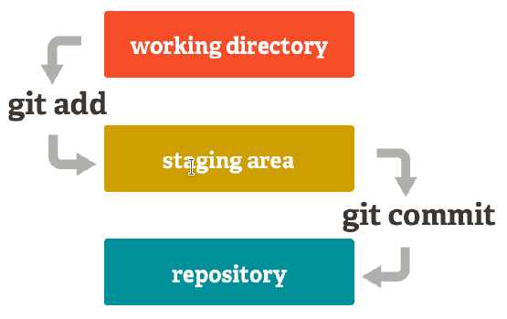
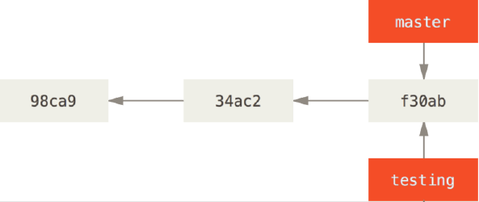
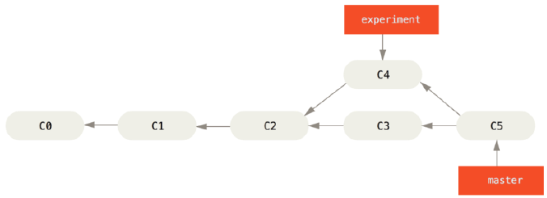

[toc]
# Git

## Configuration (`git config`)

Set username:

```sh
git config --global user.name "Your-Full-Name"
```

Set the user's email:
```sh
git config --global user.email "your-email-address"
```

Activate output coloring:
```sh
git config --global color.ui auto
```
Show original state in conflicts
```sh
git config --global merge.conflictstyle diff3
```
Show settings
```sh
git config --list
```

## Creation of repositories

### Create a new repository (`git init`)

This command creates a new folder with the name of the repository, which in turn contains another hidden folder called .git which contains the database where the changes are recorded in the repository.

`git init <repositorie-name>` creates a new repository with the name \<repositories-name\>.

### Copying repositories (`git clone`)

As soon as the copy is made, the two repositories, the original and the copy, are independent, that is, any change in one of them will not be reflected in the other.

`git clone <url-repositorio>`  creates a local copy of the repository located at  \<url-repositories\>.

### Add changes to a repository

With Git, any change we make to a project has to go through three states until you definitely save to the repository **Working directory:** It is the directory that contains a copy of a specific version of the project you are working on. It can contain files that do not belong to the repository.

**Temporary area of exchange (staging area):** it is an area where the changes are saved temporarily from the working directory before making them final and registering them in the repository.

**Repository:** It is where the changes confirmed from the zone are finally saved exchange time.

### Add changes to the temporary swap area (`git add`)

`git add <file>`  adds changes to file <file> in the working directory to the temporary exchange area. `git add <file>`  adds the changes to all files in the <folder> folder of the directory from work to the temporary exchange area. `git add .` adds all the changes of all files not yet saved in the area of temporary exchange.

### Add changes to the temporary swap area (`git commit`)

`git commit -m "menssage"`commits all changes to the temporary swap zone adding them to the repository and creating a new version of the project. "message" is a short message describing the changes made that will be associated with the new version of the project.

`git commit --amend -m "message"`  change the message of the last commit to the new message`"message"`.



### Change Log

To save changes to a Git repository, it uses a three-tier structure:

- **Commit** It contains information about the author, the time and the message of the changes.

- **Tree Each** Each commit also contains a tree where the names and paths of the files in the repository when the commit was made are recorded.

- **Blob (binary file object)** For each of the files listed in the tree there is a blob, which contains a compressed snapshot of the file's contents when the commit was made.

If a file in the repository has not changed in the commit, the tree points to the file blob of the last commit where the file changed.


### Reference a commit

Each commit has an associated 40 hexadecimal character hash code that uniquely identifies it. There are two ways to refer to a commit:

- **Absolute name:** Your hash code is used (just indicate the first 4 or 5 digits).
- **Relative name: **The word **HEAD** is used to always refer to the last commit. **HEAD~1** is used to refer to the penultimate commit, **HEAD~2**, etc.

##  Status and history of a repository

###  Show the status of a repository (`git status`)

`git status`  shows the status of changes to the repository since the last version saved. In particular, it shows les with changes in the working directory that are not have added to the temporary swap area and the les in the temporary swap area that have not been added to the repository.

### Show the version history of a repository  (`git log`)

`git log` displays the commit history of a repository in chronological order. For each commit displays its hash code, author, date, time, and associated message. This command is very versatile and shows the history of the repository in different formats depending on the parameters given to it. The most common are:

- `--oneline` shows each commit on one line producing a more compact output.
- `--graph` displays the history as a graph.

### Show the change history of a file  (`git show`)

`git show`shows the user, day, time, and message of the last commit, as well as the differences with the previous one.

`git show <commit>` shows the user, the day, the time and the message of the indicated commit, like this as the differences with the previous one.

### Show the change history of a file (`git annotate`)

`git annotate` displays the contents of a file by annotating each line with file information. commit in which it was introduced. Each line of the output contains the first 8 digits of the code hash of the commit corresponding to the change, the author of the changes, the date, the line number of the file and the content of the line.

### Show the differences between versions (`git diff`)

`git diff` shows differences between working directory and swap zone
temporary.
`git diff --cached`show diffs between temporary swap and last
commit.
`git diff HEAD` shows the difference between the working directory and the last commit.

## Undo changes

### Remove changes from the working directory or go back toan older version (`git checkout`)

`git checkout <commit> -- <file>` updates the file `<file>` to the version corresponding to the commit `<commit>`. It is often used to remove changes to a le that have not yet been saved to the file. temporary swap area, using the command  `git checkout HEAD -- <file>`

### Remove changes from temporary swap area (`git reset`)

`git reset <file>` removes changes from l `<file>` from the swap zone temporary, but preserves the changes in the working directory.

To completely remove the changes to a le that have been saved in the temporary swap you have to apply this command and then `git checkout HEAD - <file>`.

### Removing changes from a commit (`git reset`)

- `git reset --hard <commit>` removes all changes since the commit `<commit>`  and
  update the  `HEAD` this commit.

  - Eye! Carefully use this command as changes after the indicated commit they are completely lost.
  
  Typically used to remove all changes to the working directory since the last  commit using the`git reset --hard`
  `HEAD`.
  
- `git reset <commit>`  updates the HEAD to the commit `<commit>`, i.e. removes all commits after this commit, but it does not delete the changes from the directory of worked.

## Branches

Initially any repository has a single branch called master where they go. all commits happening in a linear fashion. One of the most useful features of Git is that it allows the creation of branches to work in different versions of a project at the same time. This is very useful if, for example, you want to add new features to the project without inter were with what has been developed so far. When the development of the new functionalities is finished, the branches can be merged to incorporate the changes into the main project.

###  Creating branches (`git branch`)

`git branch <branch>` creates a new branch with the name `<branch>`  in the repository from the last commit, that is, where HEAD points. When creating a branch from a commit, the stream of commits forks into two so that they can develop two versions of the project in parallel.



### Branch listing (`git log`)

`git branch`  shows the active branches of a repository indicating with * the active branch in that moment. `git log --graph --oneline` oneline show the history of the repository as a graph (`--graph`) including all branches (`--all`).

### Switching branches (`git checkout`)

`git checkout <branc>` updates the files in the working directory to the latest version of the repository corresponding to branch `<branch>`,  and activates it, that is, HEAD now points to the latest commit of this branch. `git checkout -b <branch>` creates a new branch with the name `<branch>` and activates it, i.e. HEADhappens to point to the last commit of this branch. This command is equivalent to applying the `git branch <rama>` commands and then `git checkout <branch>`.

###  Merging branches (`git merge`)

`git merge <branch>`  integrate changes from branch `<branch>`  into the current branch it points to HEAD.



### Conflict resolution

To merge two branches it is necessary that there are no conflicts between the changes made to the two versions of the project. If in both versions changes have been made to the same part of a file, then a conflict occurs and needs to be resolved before the branches can be merged. The resolution must be done manually observing the changes that intervene and deciding which should prevail, although there are tools like `KDif3` or meld` q that they facilitate the process.

###  Rebasing branches (`git rebase`)

`git rebase <branches-1> <branches-2>`replicates changes from branch  `<branches-2>`to branch `<branches-1>` starting from the common ancestor of both branches. The result is the same as merging the two branches but the `<branches-2>`fork disappears as its commits become in the `<branches 1>`.

### Removing branches (git branch -d)

`git branch -d <branch>` removes the branch named `<branch>`  as long as it has been previously merged.  git branch -D <branch>` removes the branch named `<branch>`even if it hasn't been merged. If the branch has not been previously merged all changes from that branch will be lost.

### Remote repositories

The other feature of Git, which together with branches, facilitates collaboration between different users in a project, is remote repositories. Git allows the creation of a copy of the repository on a git server on the internet. The main advantage of having a remote copy of the repository, apart from serving as a backup, is that other users can access it and make changes as well. There are many hosting providers for Git repositories but the most used are [GitHub](https://github.com/) y [GitLab](https://about.gitlab.com/).

# ¿What is GitHub?


[GitHub](https://github.com/)  is the cloud hosting provider for git-managed repositories more used and the one currently hosting the most source code software development projects open in the world.

The main advantage of [GitHub](https://github.com/)  is that it allows you to host an unlimited number of repositories. both public and private, and which also offers error registration services, request for new functionalities, task management, wikis or publication of web pages, for each project, even with the basic plan which is free.

##  Configuration with public/private key

Follow the [github](https://docs.github.com/es/authentication/connecting-to-github-with-ssh/generating-a-new-ssh-key-and-adding-it-to-the-ssh-agent),  manual, which we summarize in these points:

### Generate the key (Linux):

```sh
ssh-keygen -t ed25519 -C "your_email@example.com"
```

or:

```sh
ssh-keygen -t rsa -b 4096 -C "your_email@example.com"
```

Then enter the location of the file (or leave it as default) and enter the `passphrase`.

### Add the key to our github account

Following the steps in the [documentación](https://docs.github.com/es/authentication/connecting-to-github-with-ssh/adding-a-new-ssh-key-to-your-github-account)

### Configure our linux team.

Some networks block access to port `22`  (such as the school network), for it `github`has enabled the ability to access `ssh` through port `443`  (typically `https`). To configure our team and access`github` via `ssh`with our user and our key we must configure the file `~/.ssh/config`  with the following content:

```sh
Host github.com
Hostname ssh.github.com
Port 443
User martinezpenya
IdentityFile ~/.ssh/pubuntu_github_ssh_key
```

## Add a remote repository (`git remote add`)

`git remote add <remote-repositories> <url>` creates a link named `<remote-repositories>`  to a remote repository located at  `<url>`.

When a remote repository is added to a repository, Git will also track changes to the repository. Remote repository so that you can download changes from the remote repository to the local and changes can be uploaded from the local repository to the remote one.

## List of remote repositories (`git remote`)

`git remote` shows a list with all links to remote nest repositories in a local repository.
`git remote -v`  also shows the urls for each remote repository.

## Download changes from a remote repository (`git pull`)

`git pull <remote> <branc>` download changes from branch  `<branc>`  of the remote repository `<remote>`and integrates them in the latest version of the local repository, that is, in the HEAD. `git fetch <remote>`  downloads changes from remote repository `<remote>` but does not integrate them into the latest version from the local repository.

## Push changes to a remote repository (`git push`)

`git push <remoto> <rama>`pushes branch changes to remote repository ` <remote>` los <branch> in the local repository.

## Collaboration on remote GitHub repositories

There are two ways to collaborate on a repository hosted on GitHub:

-  Being a contributor to the repository:
  1.  `Receive authorization as a collaborator` from the owner of the project.
  2. `Clone` the local repository
  3. `Make changes` to the local repository.
  4.  `Download the changes`to the remote repository. First do `git pull` to integrate the remote changes into the local repository and then  `git push` to push the changes from the local repository to the remote one.
- Replicate the remote repository in our Git Hub account using a fork
  1. `Replicate` changes to our remote repository.
  2. `Request` the person who owns the original repository to integrate our
  3. Changes to your repository via a pull request .

# Information sources

- [Wikipedia](https://es.wikipedia.org)
- [Code&Coke (Fernando Valdeón)](http://entornos.codeandcoke.com/doku.php?id=start)
- Notes IES El Grao (Mª Isabel Barquilla?)
- [Notes IOC (Marcel García)](https://ioc.xtec.cat/materials/FP/Recursos/fp_dam_m05_/web/fp_dam_m05_htmlindex/index.html)
- [Notes José Luis Comesaña](https://www.sitiolibre.com/)
- [Notes IES Luis Vélez de Guevara 17-18 (José Antonio Muñoz Jiménez)](http://jamj2000.github.io/slides/2017/09/05/entornosdesarrollo/)
- Introductor a Git (Alfredo Sánchez)
