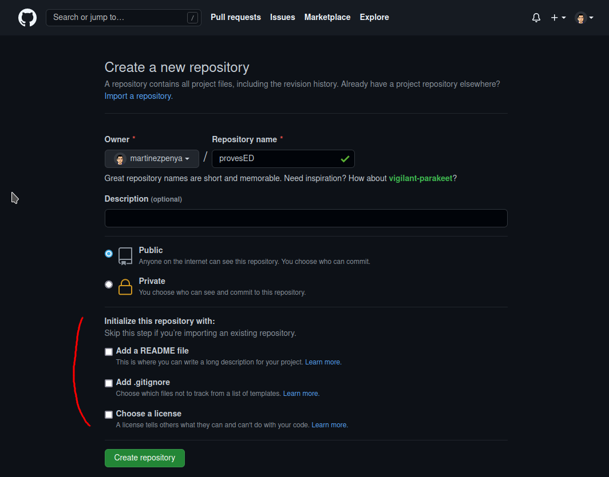
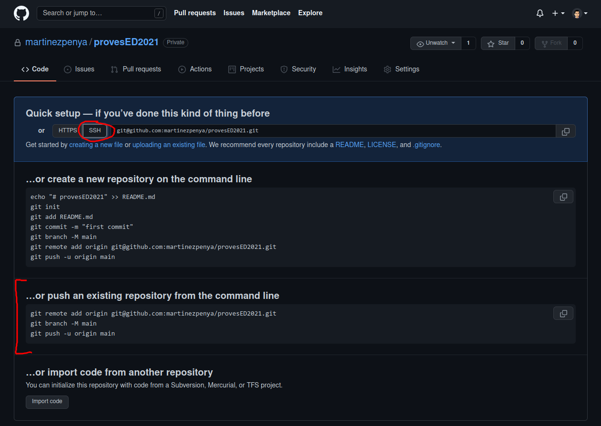
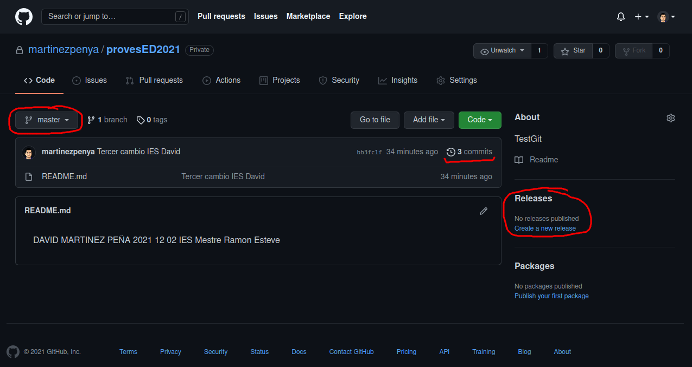
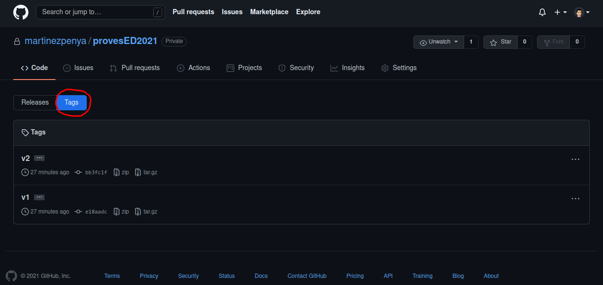
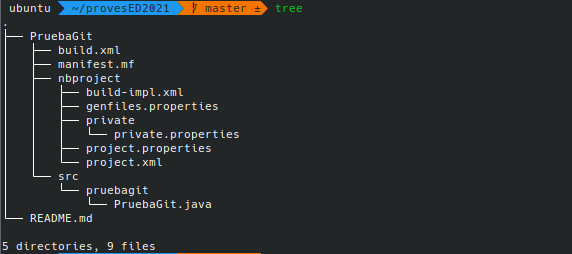
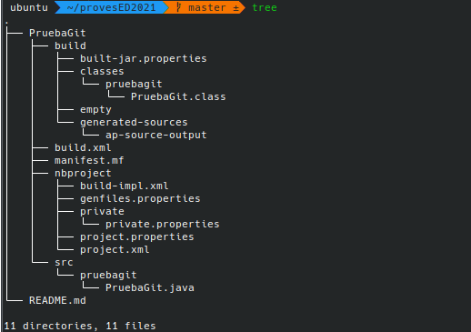
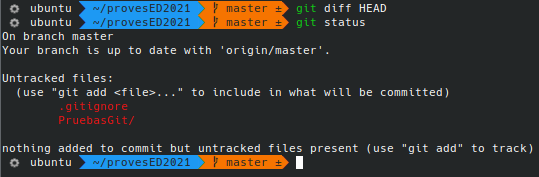
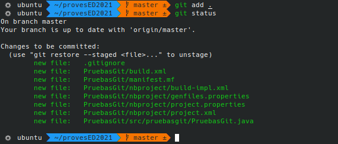

[toc]
# Areas of a Git repository

In this activity you will have to search for information and explain the 3 areas of a Git project:

- **Working directory**
- **Staging area**
- **Repository** (**.git folder)**


**Upload to the AULES platform a PDF document with the relevant screenshots and explanations.**

# Inicialize local repository

In the next activity, we are going to create a local repository, that is, on our personal PC.
Then we will add and modify some files and log the changes. We will work from the text terminal.

> You must collect the information and captures necessary to generate the final document.

We will follow the following process:

## We create a folder to host the proyect. 

For example we can do (put yor name).

```sh
mkdir pruebas-david
cd pruebas-david
```

## We check that we have the empty folder

```sh
ls -la
```

## We initialize the repository

```sh
git init
```

## We check that a folder has been created  `.git`.

This is the folder where all the changes we make will be recorded.

```sh
ls  -la
```

Check the content of this new folder, why does it have a dot in front of it?

## Create/edit a file `README.md`

```sh
nano README.md
```

## We add a line to the file

We add to this file a line with our name and surnames. We save file.

## We register changes in the repository. 

To do this we must perform 2 steps:

  1. Added to staging area:   

    git add README.md

  2. Add to repository:  

    git commit -m "Primer cambio registrado David"

The first command (`git add`) ads the `README.md` file to the staging area. And the second command (`git commit ...`) adds it to the local repository.


## We repeat points 5, 6 and 7 two more times.

The first time we add a line with the current date and then we do again  `git add ...`   y `git commit ...`

The second time we add a line with the name of the IES and then we do again `git add ...`   y `git commit ...`

## Finally we see changes made

For them we will execute

```sh
git  log
git  log  --oneline
```


3 commits should appear

> *NOTE: Do not delete the local repository. We will use it again in the next activity.*

**Upload a PDF document to the AULES platform with the relevant screenshots and explanations.**

# Review commits made

In the next activity, we will use the command `git checkout` to move through the different commits First of all check that you have at least 3 commits made. To do this, run:

```sh
git  log  --oneline --all
```

The option `--oneline`, It shows us the information of each commit in one line.

The option `--all`, shows us all the commits.

You should see something similar to the following image:


The first column is a **hash**,an identifier.

The numbers are not ordered. In my case the first commit has a hash `8b670f6`. My last commit is `fedb39f`. 

You will have a different hash. Don't worry, it is.

The second column is the message that we put when we made the commit.

Also notice that in the last commit, in my case `fedb39f`, there is **identifier HEAD**. 
This is a reference that points to the commit we are currently on.
In addition, another **mastes identifier** appears that indicates the branch we are on. By default, it is always master

**The master identifier always points to the last commit of the branch**.
However, we can move the HEAD identifier and move between different commits and see how the files were at each moment. 

To move the HEAD identifier we use the command **git checkout**  *hash_number*.

Perform the following steps and create the corresponding captures:

## Let's see the content of the `README.md` file in the current commit. 

For this we do:

```sh
cat  README.md
```

3 lines of text should appear: your name, the date and the IES.

## Let's move to the first commit.. 

For this we do:

```sh
git  checkout  8b670f6
```

> You must put the hash you have in the first commit.

You will see a message containing "*You are in 'detached HEAD' state*....". This indicates that the HEAD reference is not at the end of the branch. Do not worry about it.

Now let's see the content of the file `README.md`.

```sh
cat README.md
```

Only one line should appear with your name. It is the content that said file had in that commit.

## Let's see where we are on the branch. For this we execute:

```sh
git  log  --oneline --all
```

Something similar to the following image should appear:


Notice where the HEAD reference is pointing at this time. 

>Something that may have gone unnoticed but is extremely IMPORTANT is that every time we move from one commit to another, the content of the working directory changes. This is done automatically by git.

We WILL NOT make any changes to the files, we are just going to take a look.

## Let's move to the second commit. 

For this we do:

```sh
git  checkout  c578
```

> You must put the hash you have. It is not necessary to put all the digits, we can shorten the hash.

Run

```sh
cat README.md
```

and take a screenshot.

There should be 2 lines: your name and the date.

## Do it again

```sh
git  log  --oneline --all
```

And check that `HEAD`it's in the second commit.

## Finally, 

To go back to the last commit of the master branch, we simply do:

```sh
git checkout master
```

We can see that everything is in its place by

```SH
git log  --oneline --all
```

Take a screenshot.

> *NOTE: Do not delete the local repository. We will use it again in the next activity.*

**Upload to the AULES platform a PDF document with the relevant screenshots and explanations.**

# Tag commits and see differences

In this activity we are going to see 3 commands:

- `git tag`
- `git show` 
- `git diff`

The first command (`git tag`) allows us to put labels on commits. **Not all commits are tagged, only the releases we want**.

The next 2 (`git show` y `git diff`) are to see the changes made between different commits. They are very similar although with small differences.

**Basically `git show` allows us to see the changes of a commit with respect to the previous one, while `git diff` allows us to see changes in a range of commits**.

However, both `git show` and `git diff` have so many options that we will only focus on the essential ones here.

Let us begin.

## We label the commit first and the third.

The first commit will be version 1 of our project. The tag will be `v1`.

The third commit will be version 2 of our project. The tag will be `v2`.

The second commit will not be tagged.

> The screenshot shows an error that we will later correct in the v2 tag.


To tag we use the command

```sh
git  tag  -a  nombre_etiqueta  -m  "Mensaje"   commit_a_etiquetar
```

For example, in my case:

```sh
git tag  -a v1  -m "Versión 1"  8b67
git tag  -a v2  -m "Versión 2"  fdeb
```

The `-a` option means annotate.

The `-m` option allows us to put a message.

Finally we must put the commit to which we want to apply the label.

If for any reason we make a mistake when creating the label, we can eliminate it with

```sh
git tag -d nombre_etiqueta
```

For example, I made a mistake in the message of v2, so I do


## Using labels to move

Tags allow us to reference commits in a more convenient way than using the hash identifier.

For example it is more comfortable to use:

```sh
git checkout v1
```

what to wear

```sh
git checkout 8b67
```

To go back to the last commit do

```sh
git checkout master
```

## Examined changes of a commit against the previous one.


To see the changes introduced with respect to the previous commit we do:

```sh
git show
```

In this case, by matching all pointers (HEAD, master, v2, and fdeb) to the same site, the above command is equivalent to

```sh
git show HEAD
git show master
git show fdeb
git show v2
```


As we can see, a line was added, the one that contains the IES.

**Added lines appear in green with a `+`** **sign**.

**Deleted lines appear in red and with a `-`** **sign**.

In this case we have only performed addition operations.

To see the change made in the second commit compared to the first, we do

```sh
git show c578
```

The line with the date should be added.

And to see the change made in the commit first relative to the empty repository, we do

```sh
git show v1
```

The line with the name should appear added.

## Examined changes of a commit with respect to several previous ones.

If we want to see all the changes made over several commits, we will use `git diff`.

The way of use is

```sh
git diff commit1..commit2
```

For example, to see the changes between version 1 and version 2, we do

```sh
git diff v1..v2
```


We can see that 2 lines have been added since commit v1.

It is highly recommended to put the oldest commit first and then the newest commit. If we do it the other way around, instead of appearing in green, the result will appear in red, and its interpretation will be more confusing.

## Difference between `git show` and `git diff`

we can also do

```sh
git show v1..v2
```

Run that command and take a screenshot. Briefly explain the difference between`git diff v1..v2`


> *NOTE: Do not delete the local repository. We will use it again in the next activity.*

**Upload to the AULES platform a PDF document with the relevant screenshots and explanations.**

# Create remote repository and upload local commits

In this activity we will create an empty repository on GitHub and upload the content of our local repository.

## First, we create a completely empty repository on GitHub.

We access our GitHub account. 

In the **upper right corner**, click on the **+** sign and then on **New repository**


We choose the name of the repository. It does not have to match the name of the local repository, although it is advisable so as not to make a mess.

Instead of provesED put your name.



> You can choose to your liking if the repository is public or private, this will not affect the rest of the sections.

> It is very important that you **DO NOT INITIALIZE THE REPOSITORY**. If the repository was not empty it could give us a conflict.

In a later activity we will create conflicts and see how to resolve them. But in this activity, we are only going to work on the basics.

We will click on **Create Repository** and a page like the following will appear:



There we can see the URL of the remote repository. There are 2 ways to access:

- **via HTTPS**
- **via SSH**

> **We will use SSH since it is more secure and allows us to use public-private encryption** due to the fact that recently github has disabled access by username and password. In the point `2.1 Configuration with public/private key` of the file `UD03_anexo_ES.pdf` you have detailed the configuration and steps to follow, if you have not yet configured your PC in this way... **you must do it before continuing** .

Below are the commands to execute in our local repository. We see it in the next point.

For your comfort, do not close the page. We will come back to it later.

## Associate local repository with remote repository

In our local repository, to associate it with the remote repository, we do:

```sh
git remote add origin git@github.com:martinezpenya/provesED2021.git
```

Our remote repository will be identified as **origin**. We can give it another name, but we must not. It is a widely accepted convention to name the remote GitHub repository by this name.

To see if it has been added correctly we do

```sh
git remote -v
```


2 entries should appear, one for download (fetch) and one for upload (push)

> NOTE: If for any reason we make a mistake and misspell the name or URL, we can delete the association with
> ```sh
> git remote remove origin
> ```
> and then recreate the association. 

## Push all local commits to remote repository

To upload the content of our local repository to the remote repository we do:

```sh
git push -u origin master
```

The **origin** identifier is the name we gave our link. The identifier **master** refers to the main branch.

It's a widely followed convention, so stick to it.

> If we have correctly configured git on our PC, the changes from our PC should be sent to the remote repository without asking for a password since we are using the key that we have configured in our system.

## Checking the upload.

We go back to the GitHub page and update it. Something similar to this will appear:



GitHub offers many features.

So we'll focus on releases right now. These correspond to the tagging we did in the previous activity with `git tag`.

We had 2 releases, labeled v1 and v2, but none appear here.

The reason is that we must upload the labels separately with the command
```sh
git push --tags
```
So we will execute said command from our local repository. We will refresh the page. Et voilà!





## Examining commits and releases on GitHub.

**Tap on commits** and take a screenshot. On your own you can examine each of the commits.

**Tap on Tags** and take a screenshot. Note that compressed files have been created with the source code for download.


> *NOTE: Do not delete the local repository or remote repository. We will use them again in the next activity.*

**Upload a PDF document to the AULES platform with the relevant screenshots and explanations.**

# Undo changes in local repository

In this activity, we will see what we can do when we make mistakes.

If we make a change and we have "messed up", we can undo the "wrong".

Let's see it in a practical way using the `git reset --hard` command.

##  Undo changes to the working directory

Being in the last commit of the master branch, we modify the `README.md` file

Let's remove the last 2 lines.

```sh
nano README.md
```

We edit. There should be a single line with our name.

To see the changes that we have introduced, we execute:

```sh
git diff HEAD
```

In other words, we are going to see the differences that exist in our working directory with respect to the HEAD commit, that is, the last confirmed commit.

> NOTE: If we wanted to see the differences in our working directory from the Version 1 commit, we would do `git diff v1`.
> Notice that we are seeing the differences towards the past. This way of using git diff is different from the one we saw in the last activity, in which we saw the differences going forward.


It is clearly seen that we have removed the last 2 lines.

To return the status of this file and ANY OTHER in our working directory that we have modified, we run:

```sh
git reset --hard
```


##  ¿And to undo the preparation area?

Let's imagine that we have gone a little further, and that in addition to modifying the working directory, we have added the changes to the Staging Area. That is, we have done

```sh
nano README.md
```

Deleted the last 2 lines.

And then we added to the staging area by

```sh
git add README.md
```

Do not worry in this case the previous command can also be applied:

```sh
git reset --hard
```

This command takes the contents of our committed commit and retrieves both the working directory and the staging area.

## And what if I already made a commit?

Let's imagine that we have gone a little further, and that in addition to modifying the working directory and adding the changes to the Staging Area, we have made a commit. That is, we have done

```sh
nano README.md
```

Deleted the last 2 lines.

And then we added to the staging area by

```sh
git add README.md
```

And we have also done

```sh
git commit -m "Delete lines from README.md"
```


Well, in this case we can also use the `git reset --hard` command as follows:

```sh
git reset --hard HEAD~1
```


**HEAD~1** means the commit before the current one. That is **one commit backwards**.

**HEAD~2** means **2 commits backwards**.

**HEAD~n** means **n commits backwards**, substituting a number for n.

> **NOTE: Using `git reset --hard` in the latter way is dangerous, because we lose the last commit(s). So we have to make sure that this is what we want**.


> *NOTE: Do not delete the local or remote repository. We will use them again in the next activity.*

**Upload to the AULES platform a PDF document with the relevant screenshots and explanations.**

# `.gitignore` file

In this activity we will start working with something more real. For example, a simple Java application. This activity is also practical.

We are going to continue using the repository that we were using in the previous activities.
```sh
git log  --oneline --all
```


##  We create a HelloWorld application in Java with our IDE.

To do this we will open our favorite IDE (in my case NetBeans) we will create a new project (in my case TestsGit) based on ant in the same folder where we have our local GIT repository. We create the main class, and modify it so that it can print the typical "Hello world."

Our folder structure should look something like this:



> NOTE: The `README.md` file is not created by NetBeans. It already existed previously in the folder.

 If now from NetBeans we compile or run our program, a new folder will also appear called`build`:



We can see in the list that inside the `build` folder we have the bytecode resulting from the compilation.


## Adding files to the local repository

As we saw in the previous activity, if we now run **`git diff HEAD`**, we would expect to see our working directory change from the last commit.

However this is not what happens. **NOTHING DISPLAYED**. Why is this?

This is because git diff `HEAD` works always taking into account files that have already been previously added to the repository. In other words, it only takes into account the files with monitoring.

**New files are untracked files**. In this case we must use **`git status`** to see this circumstance.



Now we need to add all these files to the staging area and then commit.

> BUT WAIT A MINUTE. I'm going to explain something to you.

**When working with source code projects there are some files that you don't want to add to the repository, since they don't contribute anything**. In the repository, as a general rule, there should be no executable files, no bytecode, no object code, and often no .zip, .rar, .jar, .war, etc. These files bloat the repository and, when we have many commits, they make the repository too large and can also slow down the download and upload work.

For each language and for each development environment it is recommended not to include certain types of files. These are the **files to ignore**. Each programmer can add or remove from the list those they consider appropriate. The files and folders to ignore must be specified in the **`.gitignore`** file. On each line you put a file, a folder or a regular expression indicating various types of files or folders.

> You can see that when creating our project in NetBeans the IDE has automatically generated a default `.gitignore` that has appeared next to the new `TestsGit` folder

in the repository https://github.com/github/gitignore you have many examples for different languages, build tools and environments.

For the Java language: https://github.com/github/gitignore/blob/master/Java.gitignore

For the Gradle tool: https://github.com/github/gitignore/blob/master/Gradle.gitignore

For the Netbeans environment: https://github.com/github/gitignore/blob/master/Global/NetBeans.gitignore

We, following the indications of this last link, are going to ignore the suggested folders and files. So the **`.gitignore`** file should have the following content:

```sh
**/nbproject/private/
**/nbproject/Makefile-*.mk
**/nbproject/Package-*.bash
build/
nbbuild/
dist/
nbdist/
.nb-gradle/
```

The trailing slash is optional, but I like to put it when referring to folders, so I know when it's a file and when it's a folder.

Create the file `.gitignore` with said content and take a screenshot.

Now yes, we do:

```sh
git add .
git status
```


We will see that the `dist`, `build` and `nbproject/private` folders do not appear, nor do any of the omitted files in `.gitignore`.




Now we can run

```sh
git  commit  -m  "Código fuente inicial"
```

> Notice that I have written `git add .`. The dot indicates the current directory, and is a way of indicating that I include in the staging area all the files in the directory I am in (except the files and folders indicated in `.gitignore`) This form of git is used quite a lot add when we don't want to add the files one by one.

## Push changes from local repository to remote repository

Now we only have to upload the changes made to the remote repository with **git push**


To make this section more interesting, we are going to create a tag in the current commit and upload it to github so that it creates a new *release*.

```sh
git  tag  v3
git  push --tags
```


Well, the v1 and v2 tags are not uploaded because we had already uploaded them previously.

In this case, we could also have executed

```sh
git push origin v3
```


And the history of our local repository would be this beautiful


Access your repository on GitHub and take a screenshot of the *Tags*.

Take another screenshot of the code files and folders uploaded to GitHub. Neither the `dist`, `build` folder, nor the `nbproject/private` folder should appear. And yes the `.gitignore` file should appear.

> NOTE: The `.git` folder is never displayed on GitHub.


> *NOTE: Do not delete the local repository or remote repository. We will use them again in the next activity.*

**Upload a PDF document to the AULES platform with the relevant screenshots and explanations.**

# Using an SSH key pair

> In our case (December 2021), gitHub no longer allows HTTP connections, only SSH, and we already did this at the beginning of the exercises, so you can skip step 8 and go directly to point 9. I'll leave it here as reference and consultation.

As you may have noticed, every time we do a `git push` it asks for the username and password. This is quite annoying.

One way around this is by using an **SSH key pair** (a private key and a public key). Both complement each other. One without the other is useless.

This method prevents our GitHub username and password from being saved to a disk file. Therefore it is very safe. In the event that someone logs in to our PC, they could access our passwords. In that case we would delete the key pair and re-create new ones and our GitHub username and password would never be compromised.

We will follow the following steps:

## We generate a pair of SSH keys

It is very simple. As a normal user (without being root) we execute the command

```sh
ssh-keygen
```


We press Enter to everything. Unless a previous key pair already exists. In that case it will ask us if we want to override (Override (y/n)? ) In this case, in this question we answer y . Then all Enter.

This will create a **~/.ssh** folder and inside at least 2 files:

- **id_rsa**
- **id_rsa.pub**

The first file corresponds to the private key and the second to the public key.

We copy the content of the public key into a text editor. We will need it later.


*ssh-rsa must be copied .... jose@lenovo*

In your case, instead of jose@lenovo another user and pc will appear.

## We add public ssh key to github.

We log in to GitHub and in the general menu (upper right corner) we select the **Settings** option.


Then, on the left, we choose the option **SSH and GPG keys**


Next, on the right, click on the button **New SSH key**


Then we put a name to the key, for example pc-house. And we copy the content of the public key. Finally, click on the button **Add SSH key**


The above key can be used for any of our repositories. To make use of it, all we need is the URL in SSH format of each repository.


## We check that it has been created correctly

If, for any reason, someone accessed our PC and took the private key, it would be enough to delete this public key from GitHub and the thief would not use our private key at all.


## Getting repository SSH URL

**Clone or download** button, **Use SSH**

We copy URL in SSH format. Its format is relatively easy to memorize. Always git@githbub.com followed by a colon : and then the username / repository name.


## Associating our local repository via SSH

Our local repository was associated with origin via HTTPS. We must unsubscribe said link and create a new one that makes use of the SSH protocol.

We run
```sh
git  remote  remove  origin
git  remote  add  origin   git@github.com:your_user/your_repository
```


## We create a commit and push it to GitHub.

To verify that we are not prompted for a username and password when we do a git push, we are going to modify the README.md file, create a commit, and upload it to GitHub.

We will put at the beginning of each line the symbol > and a space. The README.md file would look something like this:

```
> David Martinez
> 12 November 2021
> IES Mestre Ramón Esteve
```

Then we save and execute

```sh
git add README.md
git commit -m "Added appointment"
git push -u origin master
```

Running the last command will make an SSH connection to GitHub.


When an SSH connection is made with a new key, confirmation is requested the first time and you must type **yes**.
After that, the remote host will be registered in the **.ssh/known_hosts** file. Subsequent times confirmation is no longer required, as long as the `.ssh/known_hosts` file contains such records.

> *NOTE: Do not delete the local repository or remote repository. We will use them again in the next activity.*

**Upload to the AULES platform a PDF document with the relevant screenshots and explanations.**

# Resolving conflicts

In this activity we will see what is meant by conflict, when it occurs and how to resolve it.

As you know, the same repository can have copies in different places. Right now we have a copy on GitHub and a local one on our PC. But there could be more local copies on other PCs.

Whenever we make changes (ie commits) to the same file on the same lines but on different copies, a conflict will occur.

To see this, we're going to commit to our repository on GitHub, and then commit to our local repository. We will work with the `README.md` file only.

## We modify remote README.md file

On GitHub we are going to modify the `README.md` file and register the change (commit).

To do this, we enter our remote repository, click on the `README.md` file and then click on the pencil to edit.


> Recently (mid-August 2021) gitHub added an interesting functionality to all of its repositories, and that is the ability to open the online vsCode editor for any repository simply by using the "`.`" `hotkey`.
>
> Therefore we can make this modification as shown in the screenshots, or press the "`.`" (period) and use vsCode Online to make the modification.

**We insert a first line with title # and modify the date line**.


We register the commit. To do this, click on **Commit changes**

If we wish, we can put a message to the commit and a description, although it is not mandatory. GitHub sets one by default.


## We modify local README.md file

In our local repository, we are also going to modify the README.md file.

In this case we will add a line to the end of the file and modify the date line.

```sh
nano  README.md
```


We save the changes and record commit.
```sh
git add README.md
git commit -m "README.md update"
```


## 3. We try to upload the local commit

Attempting to push our local commit to the remote repository will reject it.

```sh
git  push
```


**This is not a conflict.
It simply tells us that we must first update our local repository with the content of the remote repository**.

If we have made changes to our remote repository, we will need to integrate them into our local repository before we can upload new local changes.

## Conflict occurs

So we do

```sh
git  pull
```

to **download commits from the remote repository** that we don't have locally.

**This should not cause a conflict.
But in this case it does occur, because we have modified the same file (`README.md`) and also on the same line (the date line)** 

So the merge is done, but it warns us that there is a conflict in that file. We will have to solve it manually.


## We fix the conflict

To fix the conflict, we open the file in question and in the line or lines where the conflict has occurred we will see some marks like the following:

**`<<<<<<<`**

```
    line or lines in local commit
```
**`=======`**

```
   line or lines in remote commit
```
**`>>>>>>>`**


**Resolving the conflict consists of choosing one of the 2 options and removing the previous marks**.
Although we can also not choose any of the options and write another instead.
This is what I have done here by setting the date May 11.


Next, we save the changes. And we register a new commit.

```sh
git add README.md
git commit  -m "Fixed conflict in README.md"
```


Now we can upload our commit with the conflict resolved.

**`git push`**


> NOTE: To avoid situations like the above, it is advisable not to make changes on GitHub, and if we have made them or uploaded commits from another local repository, the first thing we should do is `git pull`, resolve any conflicts that may arise, make the local commits that we want and finally upload commits to GitHub. In summary, a good strategy can be the following: at the beginning of the day we will do `git pull`, and at the end of the day we will do `git push`.

> *NOTE: Do not delete the local repository or remote repository. We will use them again in the next activity.*

**Upload to the AULES platform a PDF document with the relevant screenshots and explanations.**

# Branch Creation

In this activity we are going to start working with branches. Specifically, we will see how to **create new branches**.

We can define a branch as a **parallel development within the same repository**. We can start such parallel development on any commit.

In essence, the main purposes of the branches are 2:

- **make changes to the repository without affecting the master branch**. Also applicable to other branches.
- **make changes in the repository and integrate them later in the master branch**. Also applicable to other branches

By default each git repository has a **master branch**. This is the main branch.
For security reasons, it is common to make the changes in some other branch and later integrate them into the master branch.
There are **workflows** ( [workflows](https://buddy.works/blog/5-types-of-git-workflows) )in which only commits are created in the master branch, only commits from other branches are integrated.

In this activity we will use 2 methods to work with new branches:

- **`git checkout -b`** *`new-branch`*
 - **`git branch`** *`new-branch`* , and then **`git checkout`** *`new-branch`*

Let's check first, the current state of our repository. With `git log ...` we can see that we only have the master branch.

For this we execute
```sh
git log --oneline --all --graph
```

The option **`--graph`** allows us to view the branches "graphically".


We can also see "another branch" without a name with the commit `b0ef` `Update README.md`.
This is actually the commit we edited on GitHub in a previous activity and had to merge into the local master branch, before pushing it back to GitHub.

## Create branch using `git checkout -b ...`

The `git checkout -b new-branch` command has essentially 2 forms:

1. **`git checkout -b new-branch`** (Create a new branch from the current commit, and move to it)
2. **`git checkout -b new-branch commit-from-start`** (We create a new branch from the indicated commit, and move to it)

In this section we are going to create 2 branches (we will call them `branch1` and `branch2`) from the first commit,
i.e. the oldest commit, which we have labeled `v1`.

To create `branch1` and move to it, we will use the most direct way. For this we do:

```sh
git checkout -b rama1 v1
```

On said `branch1`, we create a new commit.

	

The result is


Now let's make another branch called `branch2` from commit `v1`, in a slightly different way.

Let's imagine that we've accidentally moved to the `v1` commit with

**`git checkout v1`**

	

As we are informed in the message, right now we are working in *detached* mode (detached HEAD). This allows us to make the changes we want by creating commits without affecting the master branch.

It is advisable to run the `git checkout -b rama2` command now, because later we could forget about it, and when we change the branch we would lose the commits made.

However, we are going to simulate that we forget to execute the previous command. We start making commits. In this case to simplify, we will only perform a commit.

	

This creates a new commit for us. We run one more time
```sh
git log --oneline --all --graph
```

	

As shown in the screenshot, there is no pointer in the form of a branch, so if we now, for example, execute `git checkout master`, we will lose all the commits made (in this case only one, but it could be many more).

If we do not want to lose these commits, we must execute

**`git checkout -b rama2`**

	

After this, we will be able to change branches with `git checkout` without fear of losing previous commits.

Make sure to run the above command before moving on to the next point.

## Create branches with `git branch` ...

The command `git branch  nueva-rama` It has essentially 2 forms:

1. **`git branch  new-branch`**  (We create a new branch from the current commit, but do NOT jump to it)
2. **`git branch  new-branch  start-commit`**  (We create a new branch from the indicated commit, but we do NOT move to it)

After executing one of the above ways, we should always do a `git checkout` afterwards if we want to work with the new branch.

Let's see its use, making use of the second way. From the current branch, that is branch2, we are going to create 2 branches (called license and author) from the master branch.

```sh
git branch license master
git branch autor    master
```


To start working with any of them, we must execute `git checkout ...` For example

```sh
git license checkout
```

With `git log --oneline --all --graph` we can see that the **`HEAD`** pointer now points to the `license` branch.

	

In this branch we will create a new file called `LICENSE`.

For this we do

```sh
nano LICENSE
```

We write inside a line with the following text: **GPL v3**

And we commit

```sh
git add LICENSE
git commit -m "New file LICENSE"
```

To work with the `author` branch, we run

```sh
git checkout autor
```

In this branch we are going to create an `AUTHOR` file and we are also going to modify the `README.md` file.

For this we do

```sh
nano AUTHOR
```

We write inside a line with the following text: **JOSÉ ANTONIO MUÑOZ JIMÉNEZ**

We will also modify the `README.md` file.
On the line where our name appears, we'll change the text to all caps.
The purpose is to cause a merge conflict in the future, which we will resolve in the next activity.

Y realizamos commit

```sh
git add AUTHOR
git commit -m "New AUTHOR file and edited README.md"
```

The result of `git log --oneline --all --graph` is 

	

## Push branches to remote repository

To upload all the changes made in all the branches we execute

**`git push origin --all`**

	

The result is that all pointers to remote branches are updated (shown in red in the screenshot below)

	

In **GitHub**, within the corresponding repository, we can see a graph of the branches by clicking on the **`Insights`** tab and then on the **`Network`** option (on the left side of the new page)

	

> *NOTE: Do not delete the local repository or remote repository. We will use them again in the next activity.*
**Upload to the AULES platform a PDF document with the relevant screenshots and explanations.**

# Merging and deleting branches

This activity is a continuation of the previous one. In it we will see how to perform **merge** branches and how to remove pointers to old branches.

Let's assume that we have worked on the branches of the previous activity `branch1`, `branch2`, `license` and `author`) by adding several more commits, although this has not really been the case. Branches with a single commit are usually not that frequent.

And it's time to discard the work done in some branch and integrate the content of others in the `master` branch.

**In this activity we will discard the work done in `branch2`, and integrate the `branch1`, `license` and `author` branches into `master`**.

To merge branches, use the command

**`git merge ...`**


## Removing a local branch

To remove a local branch use the command

```sh
git branch -d  rama
```

For example, to delete `branch2` we do

```sh
git branch -d rama2
```

The delete is not executed, since the changes have not been integrated into `master`, nor into any other branch.

To force the deletion we do

```sh
git branch -D rama2
```

In this way we lose all the modifications that we would have made in that branch.


## Merging local branches 

We are going to integrate the changes made in `branch1`, `license` and `author` into the `master` branch.

We will proceed as follows:

1. We switch to the `master` branch
2. We merge `licencia` branch
3. We merge `autor` branch
4. We merge branch `rama1`


### Switch to `master` branch

It is **VERY IMPORTANT** to switch to the `master` branch. If we don't make the change, all merges would be done on the `author` branch (the branch we're currently on).

We must do
```sh
git  checkout master
```


### We merge `licencia` branch

First, let's look at the structure of the branches. We make
```sh
git log --oneline --all --graph
```

	

Note that merging the `license` branch into the `master` branch is equivalent to moving the `HEAD` and `master` pointers up, ie matching them with the `license` pointer.

This type of merger is the simplest and never gives rise to conflicts. It is known as **fast-forward merge** (abbreviated **FF**) or **fast-forward merge**.

To merge this branch we do
```sh
git merge licencia
```

	

Observe how it is after the fusion. Only the `HEAD` and `master` pointers have been moved.

	

> **NOTE: Don't worry right now about the remote pointers (the ones that appear in red). Later we will synchronize them with the remote repository.**

### Merge `autor` branch

If instead of merging a branch that is ahead of `master`, what we do is merge a branch that is in parallel with the `master` branch, then we will perform a **3-way merge**

This type of merging can cause conflicts. If both branches contain modifications on the same lines in the same files a conflict may occur.

In this case, the `README.md` file has a line with the author's name, but with separate lines in the `master` and `author` branches (all caps).

To perform the merge we run

```sh
git merge autor
```

When the editor appears with the associated message, we will accept the message or edit it to our liking.


In this case, the conflict did not arise. It was automatically resolved in favor of the contents of the `author` branch.
Therefore the author in the `README.md` file will appear in all caps.

Notice how a new commit has been created as a result of merging the `author` branch and the `master` branch.
This always happens in the 3-way merge.

	


### We merge branch branch1

Finally, we will integrate the changes made in `branch1` into master.
It is a type of **3-way merger**, just like the previous one.

In this case, no conflict will occur, since in this branch we have only made changes
about the `branch1.txt` file, which does not exist in the `master` branch.

To perform the merger we do
```sh
git merge branch1
```

When the editor appears with the associated message, we will accept the message or edit it to our liking.

	


## Pushing changes to remote repository

To upload to the remote repository all the changes made in our local repository, we execute

```
git push origin --all
```

	


## Removing pointers to local branches

To remove local pointers we run

```sh
git branch -d rama1
```

The pointers to `license` and `author` will not be removed, in case we wish to continue working on those branches in the future.
	


## Removing pointers to remote branches

To remove the pointers in the remote repository, we run

```sh
git push origin --delete branch1
git push origin --delete branch2
```


The pointers to `origin/license` and `origin/author` will not be removed,
in case in the future we wish to continue working in these branches.

To see the status we run `git log ...`
See how the branches are up to date and in sync with the remote repository.


## Checking changes in remote repository

To see a graph of the branches in the remote repository, click on **Insights**, **Network**.


## Task proposed for the student

As a task, it is proposed

- go back to the `licencia` branch, add content to the `LICENSE` file and commit.
- go back to the `author` branch, add content to the `AUTHOR` file and commit.
- integrate changes from both branches into the `master` branch.

> *NOTE: Do not delete the local repository or remote repository. We will use them again in the next activity.*

**Upload to the AULES platform a PDF document with the relevant screenshots and explanations.**