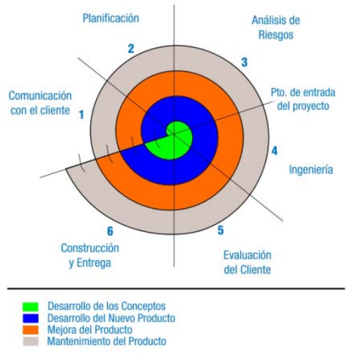
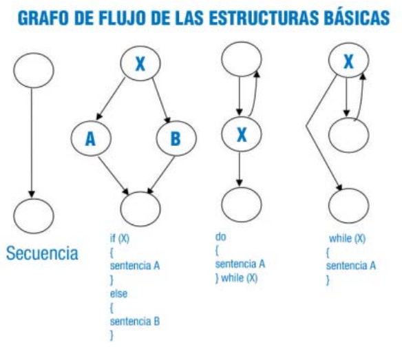
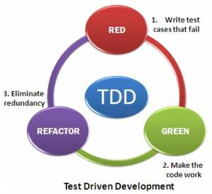

[toc]

# Planificación de las pruebas.

Durante todo el proceso de desarrollo de software, desde la fase de diseño, en la implementación y una vez desarrollada la aplicación, es necesario realizar un conjunto de pruebas ( Proceso que permite verificar y revelar la calidad de un producto software. Se utilizan para identificar posibles fallos de implementación, calidad o usabilidad de un programa), que permitan verificar que el software que se está creando, es correcto y cumple con las especificaciones impuesta por el usuario.

En el proceso de desarrollo de software, nos vamos a encontrar con un conjunto de actividades, donde es muy fácil que se produzca un error humano. Estos errores humanos pueden ser: una incorrecta especificación de los objetivos, errores producidos durante el proceso de diseño y errores que aparecen en la fase de desarrollo.



Mediante la realización de pruebas se software, se van a realizar las tareas de verificación (Proceso por el que se comprueba que el software cumple los requisitos especificados) y validación (Proceso que comprueba si el software hace lo que el usuario deseaba. Tiene que estar verificado) del software. La verificación es la comprobación que un sistema o parte de un sistema, cumple con las condiciones impuestas. Con la verificación se comprueba si la aplicación se está construyendo correctamente. La validación es el proceso de evaluación del sistema o de uno de sus componentes, para determinar si satisface los requisitos especificados.

Para llevar a cabo el proceso de pruebas, de manera eficiente, es necesario implementar una estrategia de pruebas. Siguiendo el Modelo en Espiral (Modelo de ciclo de vida de ciclo de vida del software, en el que las actividades se conforman en una espiral. Cada bucle o iteración representa un conjunto de actividades), las pruebas empezarían con la prueba de unidad, donde se analizaría el código implementado y seguiríamos en la prueba de integración, donde se prestan atención al diseño y la construcción de la arquitectura del software. El siguiente paso sería la prueba de validación, donde se comprueba que el sistema construido cumple con lo establecido en el análisis de requisitos de software. Finalmente se alcanza la prueba de sistema que verifica el funcionamiento total del software y otros elementos del sistema.

# Tipos de prueba.

No existe una clasificación oficial o formal, sobre los diversos tipos de pruebas de software. En la ingeniería del software, nos encontramos con dos enfoques fundamentales:

- **Prueba de la Caja Negra** (Black Box Testing): cuando una aplicación es probada usando su interfaz externa, sin preocuparnos de la implementación de la misma. Aquí lo fundamental es comprobar que los resultados de la ejecución de la aplicación, son los esperados, en función de las entradas que recibe.
- **Prueba de la Caja Blanca** (White Box Testing): en este caso, se prueba la aplicación desde dentro, usando su lógica de aplicación.


Una prueba de tipo Caja Negra se lleva a cabo sin tener que conocer ni la estructura, ni el funcionamiento interno del sistema. Cuando se realiza este tipo de pruebas, solo se conocen las entradas adecuadas que deberá recibir la aplicación, así como las salidas que les correspondan, pero no se conoce el proceso mediante el cual la aplicación obtiene esos resultados.

En contraposición a lo anterior, una prueba de Caja Blanca, va a analizar y probar directamente el código de la aplicación. Como se deriva de lo anterior, para llevar a cabo una prueba de Caja Blanca, es necesario un conocimiento específico del código, para poder analizar los resultados de las pruebas.

|                       | Tipos de pruebas de software                                 |
| --------------------- | ------------------------------------------------------------ |
| Pruebas de unidad     | Con ella se va a probar el correcto funcionamiento de un módulo de código |
| Pruebas de carga      | Este es el tipo más sencillo de pruebas de rendimiento. Una prueba de carga se realiza generalmente para observar el comportamiento de una aplicación bajo una cantidad de peticiones esperada.<br/>Esta carga puede ser el número esperado de usuarios concurrentes utilizando la aplicación y que realizan un número específico de transacciones durante el tiempo que dura la carga. Esta prueba puede mostrar los tiempos de respuesta de todas las transacciones importantes de la aplicación. Si la base de datos, el servidor de aplicaciones, etc también se monitorizan, entonces esta prueba puede mostrar el cuello de botella en la aplicación. |
| Prueba de estrés      | Esta prueba se utiliza normalmente para romper la aplicación. Se va doblando el número de usuarios que se agregan a la aplicación y se ejecuta una prueba de carga hasta que se rompe. Este tipo de prueba se realiza para determinar la solidez de la aplicación en los momentos de carga extrema y ayuda a los administradores para determinar si la aplicación rendirá lo suficiente en caso de que la carga real supere a la carga esperada. |
| Prueba de estabilidad | Esta prueba normalmente se hace para determinar si la aplicación puede aguantar una carga esperada continuada. Generalmente esta prueba se realiza para determinar si hay alguna fuga de memoria en la aplicación |
| Pruebas de picos      | La prueba de picos, como el nombre sugiere, trata de observar el comportamiento del sistema variando el número de usuarios, tanto cuando bajan, como cuando tiene cambios drásticos en su carga.<br />Esta prueba se recomienda que sea realizada con un software automatizado que permita realizar cambios en el número de usuarios mientras que los administradores llevan un registro de los valores a ser monitorizados |
| Prueba estructural    | El enfoque estructural o de caja blanca se centra en la estructura interna del programa (analiza los caminos de ejecución). |
| Prueba funcional      | El enfoque funcional o de caja negra se centra en las funciones, entradas y salidas que recibe y produce un módulo o función concreta. |
| Pruebas aleatorias    | El enfoque aleatorio consiste en utilizar modelos (en muchas ocasiones estadísticos) que representen las posibles entradas al programa para crear a partir de ellos los casos de prueba. |
| Pruebas de regresión  | Son cualquier tipo de pruebas de software que intentan descubrir las causas de nuevos errores, carencias de funcionalidad, o divergencias funcionales con respecto al comportamiento esperado del software, inducidos por cambios recientemente realizados en partes de la aplicación que anteriormente al citado cambio no eran propensas a este tipo de error. Esto implica que el error tratado se produce como consecuencia inesperada del citado cambio en el programa. |

> Resulta habitual, que en una empresa de desarrollo de software se gaste el 40 por ciento del esfuerzo de desarrollo en la prueba ¿Por qué es tan importante la prueba? ¿Qué tipos de errores se intentan solucionar con las pruebas?
> Las pruebas son muy importantes, ya que permiten descubrir errores en un programa, fallos en la implementación, calidad o usabilidad del software, ayudando a garantizar la calidad.
> Con las pruebas se intenta verificar que cada componente que se ha diseñado, ya sea un método, función, módulo, etc. realiza la función para la que se ha diseñado. También se intenta comprobar, que existen condiciones en las que todos los caminos de una aplicación llegan a ejecutarse.

## Funcionales.

Estamos ante pruebas de la caja negra. Se trata de probar, si las salidas que devuelve la aplicación, o parte de ella, son las esperadas, en función de los parámetros de entrada que le pasemos. No nos interesa la implementación del software, solo si realiza las funciones que se esperan de él.

Las pruebas funcionales siguen el enfoque de las pruebas de Caja Negra. Comprenderían aquellas actividades cuyo objetivo sea verificar una acción específica o funcional dentro del código de una aplicación. Las pruebas funcionales intentarían responder a las preguntas: ¿puede el usuario hacer esto? o ¿funciona esta utilidad de la aplicación?

Su principal cometido, va a consistir, en comprobar el correcto funcionamiento de los componentes de la aplicación informática. Para realizar este tipo de pruebas, se deben analizar las entradas y las salidas de cada componente, verificando que el resultado es el esperado. Solo se van a considerar las entradas y salidas del sistema, sin preocuparnos por la estructura interna del mismo.

Si por ejemplo, estamos implementando una aplicación que realiza un determinado cálculo científico, en el enfoque de las pruebas funcionales, solo nos interesa verificar que ante una determinada entrada a ese programa el resultado de la ejecución del mismo devuelve como resultado los datos esperados. Este tipo de prueba, no consideraría, en ningún caso, el código desarrollado, ni el algoritmo (Conjunto ordenado de pasos a seguir para la resolución de un problema), ni la eficiencia, ni si hay partes del código innecesarias, etc.

Dentro de las pruebas funcionales, podemos indicar tres tipos de pruebas:

- **Particiones equivalentes:** La idea de este tipo de pruebas funcionales, es considerar el menor número posible de casos de pruebas, para ello, cada caso de prueba tiene que abarcar el mayor número posible de entradas diferentes. Lo que se pretende, es crear un conjunto de clases de equivalencia, donde la prueba de un valor representativo de la misma, en cuanto a la verificación de errores, sería extrapolable al que se conseguiría probando cualquier valor de la clase.
- **Análisis de valores límite:** En este caso, a la hora de implementar un caso de prueba, se van a elegir como valores de entrada, aquellos que se encuentra en el límite de las clases de equivalencia.
- **Pruebas aleatorias:** Consiste en generar entradas aleatorias para la aplicación que hay que probar. Se suelen utilizar generadores de prueba, que son capaces de crear un volumen de casos de prueba al azar, con los que será alimentada la aplicación. Esta tipo de pruebas, se suelen utilizar en aplicaciones que no sean interactivas, ya que es muy difícil generar las secuencias de entrada adecuadas de prueba, para entornos interactivos.

Existen otros tipos de pruebas funcionales, aunque todas comparten un mismo objetivo, y es comprobar, solo actuando en la interfaz de la aplicación, que los resultados que produce son los correctos en función de las entradas que se le introducen para probarlos.

## Estructurales.

Ya hemos visto que las pruebas funcionales se centran en resultados, en lo que la aplicación hace, pero no en cómo lo hace.

Para ver cómo el programa se va ejecutando, y así comprobar su corrección, se utilizan las pruebas estructurales, que se fijan en los caminos que se pueden recorrer:

Las pruebas estructurales son el conjunto de pruebas de la Caja Blanca. Con este tipo de pruebas, se pretende verificar la estructura interna de cada componente de la aplicación, independientemente de la funcionalidad establecida para el mismo. Este tipo de pruebas, no pretenden comprobar la corrección de los resultados producidos por los distintos componentes, su función es comprobar que se van a ejecutar todas la instrucciones del programa, que no hay código no usado, comprobar que los caminos lógicos del programa se van a recorrer, etc.



Este tipo de pruebas, se basan en unos criterios de cobertura lógica, cuyo cumplimiento determina la mayor o menor seguridad en la detección de errores. Los criterios de cobertura que se siguen son:

- **Cobertura de sentencias**: se han de generar casos de pruebas suficientes para que cada instrucción del programa sea ejecutada, al menos, una vez.
- **Cobertura de decisiones**: se trata de crear los suficientes casos de prueba para que cada opción resultado de una prueba lógica del programa, se evalúe al menos una vez a cierto y otra a falso.
- **Cobertura de condiciones**: se trata de crear los suficientes casos de prueba para que cada elemento de una condición, se evalúe al menos una vez a falso y otra a verdadero.
- **Cobertura de condiciones y decisiones**: consiste en cumplir simultáneamente las dos anteriores.
- **Cobertura de caminos**: es el criterio más importante. Establece que se debe ejecutar al menos una vez cada secuencia de sentencias encadenadas, desde la sentencia inicial del programa, hasta su sentencia final. La ejecución de este conjunto de sentencias, se conoce como camino. Como el número de caminos que puede tener una aplicación, puede ser muy grande, para realizar esta prueba, se reduce el número a lo que se conoce como camino prueba.
- **Cobertura del camino de prueba**: Se pueden realizar dos variantes, una indica que cada bucle se debe ejecutar sólo una vez, ya que hacerlo más veces no aumenta la efectividad de la prueba y otra que recomienda que se pruebe cada bucle tres veces: la primera sin entrar en su interior, otra ejecutándolo una vez y otra más ejecutándolo dos veces.

## Regresión.

Durante el proceso de prueba, tendremos éxito si detectamos un posible fallo o error. La consecuencia directa de ese descubrimiento, supone la modificación del componente donde se ha detectado. Esta modificación, puede generar errores colaterales, que no existían antes. Como consecuencia, la modificación realizada nos obliga a repetir pruebas que hemos realizado con anterioridad.

El objetivo de las pruebas de regresión, es comprobar que los cambios sobre un componente de una aplicación, no introduce un comportamiento no deseado o errores adicionales en otros componentes no modificados.

- Las pruebas de regresión se deben llevar a cabo cada vez que se hace un cambio en el sistema, tanto para corregir un error, como para realizar una mejora. No es suficiente probar sólo los componentes modificados o añadidos, o las funciones que en ellos se realizan, sino que también es necesario controlar que las modificaciones no produzcan efectos negativos sobre el mismo u otros componentes.

Normalmente, este tipo de pruebas implica la repetición de las pruebas que ya se hayan realizado previamente, con el fin de asegurar que no se introducen errores que puedan comprometer el funcionamiento de otros componentes que no han sido modificados y confirmar que el sistema funciona correctamente una vez realizados los cambios.

En un contexto más amplio, las pruebas de software con éxito, son aquellas que dan como resultado el descubrimiento de errores. Como consecuencia del descubrimiento de errores, se procede a su corrección, lo que implica la modificación de algún componente del software que se está desarrollando, tanto del programa, de la documentación y de los datos que lo soportan. La prueba de regresión es la que nos ayuda a asegurar que estos cambios no introducen un comportamiento no deseado o errores adicionales. La prueba de regresión se puede hacer manualmente, volviendo a realizar un subconjunto de todos los casos de prueba o utilizando herramientas automáticas.

El conjunto de pruebas de regresión contiene tres clases diferentes de clases de prueba: 

- Una muestra representativa de pruebas que ejercite todas las funciones del software;
- Pruebas adicionales que se centran en las funciones del software que se van a ver probablemente afectadas por el cambio;
- Pruebas que se centran en los componentes del software que han cambiado.

Para evitar que el número de pruebas de regresión crezca demasiado, se deben de diseñar para incluir sólo aquellas pruebas que traten una o más clases de errores en cada una de las funciones principales del programa. No es práctico ni eficiente volver a ejecutar cada prueba de cada función del programa después de un cambio.

#  Procedimientos y casos de prueba.

Según el IEEE, un caso de prueba es un conjunto de entradas, condiciones de ejecución y resultados esperados, desarrollados para un objetivo particular, como, por ejemplo, ejercitar un camino concreto de un programa o verificar el cumplimiento de un determinado requisito, incluyendo toda la documentación asociada.

Dada la complejidad de las aplicaciones informáticas, que se desarrollan en la actualidad, es prácticamente imposible, probar todas las combinaciones que se pueden dar dentro de un programa o entre un programa y las aplicaciones que pueden interactuar con él. Por este motivo, en el diseño de los casos de prueba, siempre es necesario asegurar que con ellos se obtiene un nivel aceptable de probabilidad de que se detectarán los errores existentes.

Las pruebas deben buscar un compromiso entre la cantidad de recursos que se consumirán en el proceso de prueba, y la probabilidad obtenida de que se detecten los errores existentes.

Existen varios procedimientos para el diseño de los casos de prueba:

- **Enfoque funcional o de caja negra**. En este tipo de prueba, nos centramos en que el programa, o parte del programa que estamos probando, recibe un entrada de forma adecuada y se produce una salida correcta, así como que la integridad de la información externa se mantiene. La prueba no verifica el proceso, solo los resultados.
- **Enfoque estructural o caja blanca**. En este tipo de pruebas, debemos centrar en la implementación interna del programa. Se trata de comprobar que la operación interna se ajusta a las especificaciones. En esta prueba, se deberían de probar todos los caminos que puede seguir la ejecución del programa.
- **Enfoque aleatorio**. A partir de modelos obtenidos estadísticamente, se elaboran casos de prueba que prueben las entradas del programa.

# Herramientas de depuración.

Todo entorno de desarrollo, independientemente de la plataforma, así como del lenguaje de programación utilizado, suministra una serie de herramientas de depuración, que nos permiten verificar el código generado, ayudándonos a realizar pruebas tanto estructurales como funcionales.

Durante el proceso de desarrollo de software, se pueden producir dos tipos de errores: errores de compilación o errores lógicos. Cuando se desarrolla una aplicación en un IDE, ya sea Visual Studio, Eclipse o Netbeans, si al escribir una sentencia, olvidamos un ";", hacemos referencia a una variable inexistente o utilizamos una sentencia incorrecta, se produce un error de compilación. Cuando ocurre un error de compilación, el entorno nos proporciona información de donde se produce y como poder solucionarlo. El programa no puede compilarse hasta que el programador o programadora no corrija ese error.

El otro tipo de errores son lógicos, comúnmente llamados bugs, estos no evitan que el programa se pueda compilar con éxito, ya que no hay errores sintácticos, ni se utilizan variables no declaradas, etc. Sin embargo, los errores lógicos, pueden provocar que el programa devuelva resultados erróneos, que no sean los esperados o pueden provocar que el programa termine antes de tiempo o no termine nunca.

Para solucionar este tipo de problemas, los entornos de desarrollo incorporan una herramienta conocida como depurador. El depurador permite supervisar la ejecución de los programas, para localizar y eliminar los errores lógicos. Un programa debe compilarse con éxito para poder utilizarlo en el depurador. El depurador nos permita analizar todo el programa, mientras éste se ejecuta. Permite suspender la ejecución de un programa, examinar y establecer los valores de las variables, comprobar los valores devueltos por un determinado método, el resultado de una comparación lógica o relacional, etc.

## Puntos de ruptura.

Dentro del menú de depuración, nos encontramos con la opción insertar punto de ruptura (breakpoint). Se selecciona la línea de código donde queremos que el programa se pare, para a partir de ella, inspeccionar variables, o realizar una ejecución paso a paso, para verificar la corrección del código.

Durante la prueba de un programa, puede ser interesante la verificación de determinadas partes del código. No nos interesa probar todo el programa, ya que hemos delimitado el punto concreto donde inspeccionar. Para ello, utilizamos los puntos de ruptura.

Los puntos de ruptura son marcadores que pueden establecerse en cualquier línea de código ejecutable (no sería válido un comentario, o una línea en blanco). Una vez insertado el punto de ruptura, e iniciada la depuración, el programa a evaluar se ejecutaría hasta la línea marcada con el punto de ruptura. En ese momento, se pueden realizar diferentes labores, por un lado, se pueden examinar las variables, y comprobar que los valores que tienen asignados son correctos, o se pueden iniciar una depuración paso a paso, e ir comprobando el camino que toma el programa a partir del punto de ruptura. Una vez realiza la comprobación, podemos abortar el programa, o continuar la ejecución normal del mismo.

Dentro de una aplicación, se pueden insertar varios puntos de ruptura, y se pueden eliminar con la misma facilidad con la que se insertan.

## Tipos de ejecución.

Para poder depurar un programa, podemos ejecutar el programa de diferentes formas, de manera que en función del problema que queramos solucionar, nos resulte más sencillo un método u otro. Nos encontramos con lo siguientes tipo de ejecución: paso a paso por instrucción, paso a paso por procedimiento, ejecución hasta una instrucción, ejecución de un programa hasta el final del programa, 

- Algunas veces es necesario ejecutar un programa línea por línea, para buscar y corregir errores lógicos. El **avance paso a paso** a lo largo de una parte del programa puede ayudarnos a verificar que el código de un método se ejecute en forma correcta.
- El **paso a paso por procedimientos**, nos permite introducir los parámetro que queremos a un método o función de nuestro programa, pero en vez de ejecutar instrucción por instrucción ese método, nos devuelve su resultado. Es útil, cuando hemos comprobado que un procedimiento funciona correctamente, y no nos interese volver a depurarlo, sólo nos interesa el valor que devuelve.
- En la **ejecución hasta una instrucción**, el depurador ejecuta el programa, y se detiene en la instrucción donde se encuentra el cursor, a partir de ese punto, podemos hacer una depuración paso a paso o por procedimiento.
- En la **ejecución de un programa hasta el final del programa**, ejecutamos las instrucciones de un programa hasta el final, sin detenernos en las instrucciones intermedias.

Los distintos modos de ejecución, se van a ajustar a las necesidades de depuración que tengamos en cada momento. Si hemos probada un método, y sabemos que funciona correctamente, no es necesario realizar una ejecución paso a paso en él.
En el IDE NetBeans, dentro del menú de depuración, podemos seleccionar los modos de ejecución especificados, y algunos más. El objetivo es poder examinar todas las partes que se consideren necesarias, de manera rápida, sencilla y los más clara posible.

## Examinadores de variables.

Durante el proceso de implementación y prueba de software, una de las maneras más comunes de comprobar que la aplicación funciona de manera adecuada, es comprobar que las variables vayan tomando los valores adecuados en cada momento.

Los examinadores de variables, forman uno de los elementos más importantes del proceso de depuración de un programa. Iniciado el proceso de depuración, normalmente con la ejecución paso a paso, el programa avanza instrucción por instrucción. Al mismo tiempo, las distintas variables, van tomando diferentes valores. Con los examinadores de variables, podemos comprobar los distintos valores que adquieren las variables, así como su tipo. Esta herramienta es de gran utilidad para la detección de errores.

En el caso del entorno de desarrollo NetBeans, nos encontramos con un panel llamado Ventana de Inspección. En la ventana de inspección, se pueden ir agregando todas aquellas variables de las que tengamos interés en inspeccionar su valor. Conforme el programa se vaya ejecutando, NetBeans irá mostrando los valores que toman las variables en la ventana de inspección.

Como podemos apreciar, en una ejecución paso a paso, el programa llega a una función de nombre potencia. Esta función tiene definida tres variables. A lo largo de la ejecución del bucle, vemos como la variable result, van cambiando de valor. Si con valores de entrada para los que conocemos el resultado, la función no devuelve el valor esperado, "Examinando las variables" podremos encontrar la instrucción incorrecta.

Los depuradores son programas que permiten analizar de manera exhaustiva y en paso a paso, lo que pasa dentro del código de un programa. Gracias a los depuradores es fácil probar las aplicaciones para encontrar los posibles errores, analizando sus causas y posibles soluciones.

# Validaciones.

En el proceso de validación, interviene de manera decisiva el cliente. Hay que tener en cuenta, que estamos desarrollando una aplicación para terceros, y que son estos los que deciden si la aplicación se ajusta a los requerimientos establecidos en el análisis.

En la validación intentan descubrir errores, pero desde el punto de vista de los requisitos (Comportamiento y casos de uso que se esperan que cumpla el software que se está diseñando). La validación del software se consigue mediante una serie de pruebas de caja negra que demuestran la conformidad con los requisitos. Un plan de prueba traza la clase de pruebas que se han de llevar a cabo, y un procedimiento de prueba define los casos de prueba específicos en un intento por descubrir errores de acuerdo con los requisitos. Tanto el plan como el procedimiento estarán diseñados para asegurar que se satisfacen todos los requisitos funcionales, que se alcanzan todos los requisitos de rendimiento, que las documentaciones son correctas e inteligible y que se alcanzan otros requisitos, como portabilidad (Capacidad de un programa para ser ejecutado en cualquier arquitectura física de un equipo), compatibilidad, recuperación de errores, facilidad de mantenimiento etc.

Cuando se procede con cada caso de prueba de validación, puede darse una de las dos condiciones siguientes:

- Las características de funcionamiento o rendimiento están de acuerdo con las especificaciones y son aceptables o 
- Se descubre una desviación de las especificaciones y se crea una lista de deficiencias. Las desviaciones o errores descubiertos en esta fase del proyecto raramente se pueden corregir antes de la terminación planificada.

# Pruebas de código.

La prueba consiste en la ejecución de un programa con el objetivo de encontrar errores. El programa o parte de él, se va a ejecutar bajo unas condiciones previamente especificadas, para una vez observados los resultados, estos sean registrados y evaluados.

Para llevar a cabo las pruebas, es necesario definir una serie de casos de prueba, que van a ser un conjunto de entradas, de condiciones de ejecución y resultados esperados, desarrollados para un objetivo particular.

Para el diseño de casos de prueba, se suelen utilizar tres enfoques principales:

- Enfoque estructural o de caja blanca. Este enfoque se centra en la estructura interna del programa, analizando los caminos de ejecución. Dentro de nuestro proceso de prueba, lo aplicamos con el cubrimiento.
- Enfoque funcional o de caja negra. Este enfoque se centra en las funciones, entradas y salidas. Se aplican los valores límite y las clases de equivalencia.
- Enfoque aleatorio, que consiste en utilizar modelos que represente las posibles entradas al programa, para crear a partir de ellos los casos de prueba. En esta prueba se intenta simular la entrada habitual que va a recibir el programa, para ello se crean datos entrada en la secuencia y con la frecuencia en que podrían aparecer. Para ello se utilizan generadores automáticos de casos de prueba.

## Cubrimiento.

Con este tipo de prueba, lo que se pretende, es comprobar que todas las funciones, sentencias, decisiones, y condiciones, se van a ejecutar.

Por ejemplo:

```java
int prueba (int x, int y){
    int z=0;
    if ((x>0) && (y>0)){
        z=x;
    }
    return z;
}
```

Considerando que esta función forma parte de un programa mayor, se considera lo siguiente:

- Si durante la ejecución del programa, la función es llamada, al menos una vez, el cubrimiento de la función es satisfecho.
- El cubrimiento de sentencias para esta función, será satisfecho si es invocada, por ejemplo como prueba(1,1), ya que en esta caso, cada línea de la función se ejecuta, incluida z=x;
- Si invocamos a la función con prueba(1,1) y prueba(0,1), se satisfará el cubrimiento de decisión. En el primer caso, la if condición va a ser verdadera, se va a ejecutar z=x, pero en el segundo caso, no.
- El cubrimiento de condición puede satisfacerse si probamos con prueba(1,1), prueba(1,0) y prueba(0,0). En los dos primeros casos (x<0) se evalúa a verdad mientras que en el tercero, se evalúa a falso. Al mismo tiempo, el primer caso hace (y>0) verdad, mientras el tercero lo hace falso.

Existen otra serie de criterios, para comprobar el cubrimiento.

- Secuencia lineal de código y salto.
- JJ‐Path Cubrimiento.
- Cubrimiento de entrada y salida.

Existen herramientas comerciales y también de software libre, que permiten realizar la pruebas de
cubrimiento, entre ellas, para Java, nos encontramos con Clover.

## Valores límite.

En el código Java adjunto, aparecen dos funciones que reciben el parámetro x. En la función1, el parámetro  es de tipo real y en la función2, el parámetro es de tipo entero.

```java
public double funcion1 (double x){
    if (x>5)
        return x;
    else
        return -1;
}

public int funcion2 (int x){
    if (x>5)
        return x;
    else
        return -1;
}
```

Como se aprecia, el código de las dos funciones es el mismo, sin embargo, los casos de prueba con valores límite va a ser diferente.

La experiencia ha demostrado que los casos de prueba que obtienen una mayor probabilidad de éxito, son aquellos que trabajan con valores límite.

Esta técnica, se suele utilizar como complementaria de las particiones equivalentes, pero se diferencia, en que se suelen seleccionar, no un conjunto de valores, sino unos pocos, en el límite del rango de valores aceptado por el componente a probar.

Cuando hay que seleccionar un valor para realizar una prueba, se escoge aquellos que están situados justo en el límite de los valores admitidos.

Por ejemplo, supongamos que queremos probar el resultado de la ejecución de una función, que recibe un parámetro x:

- Si el parámetro x de entrada tiene que ser mayor estricto que 5, y el valor es real, los valores límite pueden ser 4,99 y 5,01.
- Si el parámetro de entrada x está comprendido entre ‐4 y +4, suponiendo que son valores enteros, los valores límite serán ‐5, ‐4 ,‐3,3, 4 y 5.

## Clases de equivalencia.

Las clases de equivalencia, es un tipo de prueba funcional, en donde cada caso de prueba, pretende cubrir el mayor número de entradas posible.

El dominio de valores de entrada, se divide en número finito de clases de equivalencia. Como la entrada está dividida en un conjunto de clases de equivalencia, la prueba de un valor representativo de cada clase, permite suponer que el resultado que se obtiene con él, será el mismo que con cualquier otro valor de la clase.

Cada clase de equivalencia debe cumplir:

- Si un parámetro de entrada debe estar comprendido entre un determinado rango, hay tres clases de equivalencia: por debajo, en y por encima.
- Si una entrada requiere un valor entre los de un conjunto, aparecen dos clase de equivalencia: en el conjunto o fuera de él.
- Si una entrada es booleana, hay dos clases: sí o no.
- Los mismos criterios se aplican a las salidas esperadas: hay que intentar generar resultados en todas y cada una de las clases.

En este ejemplo,

```java
public double funcion1 (double x){
    if (x>0 && x<100)
        return x+2;
    else
        return x-2;
}
```

 las clases de equivalencia serían:

1. Por debajo: x<=0
2. En: x>0 y x< 100
3. Por encima: x>=100

y los respectivos casos de prueba, podrían ser:
1. Por debajo: x=0
2. En: x=50
3. Por encima: x=100

# Normas de calidad.

Los estándares que se han venido utilizando en la fase de prueba de software son:

- Estándares BSI
  - BS 7925‐1, Pruebas de software. Parte 1. Vocabulario.
  - BS 7925‐2, Pruebas de software. Parte 2. Pruebas de los componentes software.
- Estándares IEEE de pruebas de software.:
  - IEEE estándar 829, Documentación de la prueba de software.
  - IEEE estándar 1008, Pruebas de unidad
  - Otros estándares ISO / IEC 12207, 15289
- Otros estándares sectoriales

Sin embargo, estos estándares no cubren determinadas facetas de la fase de pruebas, como son la organización el proceso y gestión de las pruebas, presentan pocas pruebas funcionales y no funcionales etc. Ante esta problemática, la industria ha desarrollado la norma ISO/IEC 29119.

La norma ISO/IEC 29119 de prueba de software, pretende unificar en una única norma, todos los estándares, de forma que proporcione vocabulario, procesos, documentación y técnicas para cubrir todo el ciclo de vida del software. Desde estrategias de prueba para la organización y políticas de prueba, prueba de proyecto al análisis de casos de prueba, diseño, ejecución e informe. Con este estándar, se podrá realizar cualquier prueba para cualquier proyecto de desarrollo o mantenimiento de software.

> **Norma ISO/IEC 29119.**
> La norma ISO/IEC 29119 la compone las siguientes partes:
>
> - Parte 1. Conceptos y vocabulario:
>   - Introducción a la prueba.
>   - Pruebas basadas en riesgo.
>   - Fases de prueba (unidad, integración, sistema, validación) y tipos de prueba (estática, dinámica, no funcional, ...).
>   - Prueba en diferentes ciclos de vida del software.
>   - Roles y responsabilidades en la prueba.
>   - Métricas y medidas.
> - Parte 2. Procesos de prueba:
>   - Política de la organización.
>   - Gestión del proyecto de prueba.
>   - Procesos de prueba estática.
>   - Procesos de prueba dinámica.
> - Parte 3. Documentación
>   - Contenido.
>   - Plantilla.
> - Parte 4. Técnicas de prueba:
>   - Descripción y ejemplos.
>   - Estáticas: revisiones, inspecciones, etc.
>   - Dinámicas: Caja negra, caja blanca, Técnicas de prueba no funcional (Seguridad, rendimiento, usabilidad, etc) .
>
> **Para saber más**
> En el siguiente enlace podrás visitar la página internacional, donde se detallan las normas a seguir, por las pruebas de software: Normas para la prueba de software http://softwaretestingstandard.org/

# Pruebas unitarias.

Las pruebas unitarias, o prueba de la unidad, tienen por objetivo probar el correcto funcionamiento de un módulo de código. El fin que se persigue, es que cada módulo funciona correctamente por separado.

Posteriormente, con la prueba de integración, se podrá asegurar el correcto funcionamiento del sistema. Una unidad es la parte de la aplicación más pequeña que se puede probar. En programación procedural, una unidad puede ser una función o procedimiento, En programación orientada a objetos, una unidad es normalmente un método.

Con las pruebas unitarias se debe probar todas las funciones o métodos no triviales de forma que cada caso de prueba sea independiente del resto.

En el diseño de los casos de pruebas unitarias, habrá que tener en cuenta los siguientes requisitos:

- Automatizable: no debería requerirse una intervención manual.
- Completas: deben cubrir la mayor cantidad de código.
- Repetibles o Reutilizables: no se deben crear pruebas que sólo puedan ser ejecutadas una sola vez.
- Independientes: la ejecución de una prueba no debe afectar a la ejecución de otra.
- Profesionales: las pruebas deben ser consideradas igual que el código, con la misma profesionalidad, documentación, etc.

El objetivo de las pruebas unitarias es aislar cada parte del programa y demostrar que las partes individuales son correctas. Las pruebas individuales nos proporcionan cinco ventajas básicas:

1. Fomentan el cambio: Las pruebas unitarias facilitan que el programador cambie el código para mejorar su estructura, puesto que permiten hacer pruebas sobre los cambios y así asegurarse de que los nuevos cambios no han introducido errores.
2. Simplifica la integración: Puesto que permiten llegar a la fase de integración con un grado alto de seguridad de que el código está funcionando correctamente.
3. Documenta el código: Las propias pruebas son documentación del código puesto que ahí se puede ver cómo utilizarlo.
4. Separación de la interfaz y la implementación: Dado que la única interacción entre los casos de prueba y las unidades bajo prueba son las interfaces de estas últimas, se puede cambiar cualquiera de los dos sin afectar al otro.
5. Los errores están más acotados y son más fáciles de localizar: dado que tenemos pruebas
   unitarias que pueden desenmascararlos.

## Herramientas para Java.

Entre las herramientas que nos podemos encontrar en el mercado, para poder realizar las pruebas, las más destacadas serían:

- Jtiger:
  - Framework de pruebas unitarias para Java (1.5).
  - Es de código abierto.
  - Capacidad para exportar informes en HTML, XML o texto plano.
  - Es posible ejecutar casos de prueba de Junit mediante un plugin.
  - Posee una completa variedad de aserciones como la comprobación de cumplimiento del contrato en un método.
  - Los metadatos (Conjunto de datos que se utilizan para describir otros datos) de los casos de prueba son especificados como anotaciones del lenguaje Java
  - Incluye una tarea de Ant para automatizar las pruebas.
  - Documentación muy completa en JavaDoc, y una página web con toda la información necesaria para comprender su uso, y utilizarlo con IDE como Eclipse.
  - El Framework ( Estructura conceptual y tecnológica de soporte definida, normalmente con módulos de software concretos, con base en la cual otro proyecto de software puede ser organizado y desarrollado) incluye pruebas unitarias sobre sí mismo.
- TestNG
  - Esta inspirado en JUnit y NUnit.
  - Está diseñado para cubrir todo tipo de pruebas, no solo las unitarias, sino también las funcionales, las de integración...
  - Utiliza las anotaciones de Java 1.5 (desde mucho antes que Junit).
  - Es compatible con pruebas de Junit.
  - Soporte para el paso de parámetros a los métodos de pruebas.
  - Permite la distribución de pruebas en maquinas esclavas.
  - Soportado por gran variedad de plug‐ins (Eclipse, NetBeans, IDEA ...)
  - Los clases de pruebas no necesitan implementar ninguna interfaz ni extender ninguna otra clase.
  - Una vez compiladas la pruebas, estas se pueden invocar desde la linea de comandos con una tarea de Ant o con un fichero XML.
  - Los métodos de prueba se organizan en grupos (un método puede pertenecer a uno o varios
    grupos).
- Junit
  - Framework de pruebas unitarias creado por Erich Gamma y Kent Beck.
  - Es una herramienta de código abierto.
  - Multitud de documentación y ejemplos en la web.
  - Se ha convertido en el estándar de hecho para las pruebas unitarias en Java.
  - Soportado por la mayoría de los IDE como eclipse o Netbeans.
  - Es una implementación de la arquitectura xUnit para los frameworks de pruebas unitarias.
  - Posee una comunidad mucho mayor que el resto de los frameworks de pruebas en Java.
  - Soporta múltiples tipos de aserciones.
  - Desde la versión 4 utiliza las anotaciones del JDK 1.5 de Java.
  - Posibilidad de crear informes en HTML.
  - Organización de las pruebas en Suites de pruebas.
  - Es la herramienta de pruebas más extendida para el lenguaje Java.
  - Los entornos de desarrollo para Java, NetBeans y Eclipse, incorporan un plugin para Junit.

## Herramientas para otros lenguajes.

En la actualidad, nos encontramos con un amplio conjunto de herramientas destinadas a la automatización del prueba, para la mayoría de los lenguajes de programación más extendidos en la actualidad. Existen herramientas para C++, para PHP, FoxPro, etc.

Cabe destacar las siguientes herramientas:

- CppUnit:
  - Framework de pruebas unitarias para el lenguaje C++.
  - Es una herramienta libre.
  - Existe diversos entornos gráficos para la ejecución de pruebas como QtTestRunner.
  - Es posible integrarlo con múltiples entornos de desarrollo como Eclipse.
  - Basado en el diseño de xUnit.
- Nunit:
  - Framework de pruebas unitarias para la plataforma .NET.
  - Es una herramienta de código abierto.
  - También está basado en xUnit.
  - Dispone de diversas expansiones como Nunit.Forms o Nunit.ASP. Junit
- SimpleTest: Entorno de pruebas para aplicaciones realizadas en PHP.
- PHPUnit: framework para realizar pruebas unitarias en PHP.
- FoxUnit: framework OpenSource de pruebas unitarias para Microsoft Visual FoxPro
- MOQ: Framework para la creación dinámica de objetos simuladores (mocks).

# Documentación de la prueba.

Como en otras etapas y tareas del desarrollo de aplicaciones, la documentación de las pruebas es un requisito indispensable para su correcta realización. Unas pruebas bien documentadas podrán también servir como base de conocimiento para futuras tareas de comprobación.

Las metodologías actuales, como Métrica v.3 ( Metodología de Planificación, Desarrollo y Mantenimiento de sistemas de información. Métrica v3 se puede usar libremente, con la única restricción de citar la fuente de su propiedad intelectual, que es el Ministerio de Presidencia),  proponen que la documentación de la fase de pruebas se basen en los estándares ANSI / IEEE sobre verificación y validación de software.

En propósito de los estándares ANSI/IEEE es describir un conjunto de documentos para las pruebas de software. Un documento de pruebas estándar puede facilitar la comunicación entre desarrolladores al suministrar un marco de referencia común. La definición de un documento estándar de prueba puede servir para comprobar que se ha desarrollado todo el proceso de prueba de software.

Los documentos que se van a generar son:

- Plan de Pruebas: Al principio se desarrollará una planificación general, que quedará reflejada en el "Plan de Pruebas". El plan de pruebas se inicia el proceso de Análisis del Sistema.
- Especificación del diseño de pruebas. De la ampliación y detalle del plan de pruebas, surge el documento "Especificación del diseño de pruebas".
- Especificación de un caso de prueba. Los casos de prueba se concretan a partir de la especificación del diseño de pruebas.
- Especificación de procedimiento de prueba. Una vez especificado un caso de prueba, será preciso detallar el modo en que van a ser ejecutados cada uno de los casos de prueba, siendo recogido en el documento "Especificación del procedimiento de prueba".
- Registro de pruebas. En el "Registro de pruebas" se registrarán los sucesos que tengan lugar durante las pruebas.
- Informe de incidente de pruebas. Para cada incidente, defecto detectado, solicitud de mejora, etc, se elaborará un "informe de incidente de pruebas".
- Informe sumario de pruebas. Finalmente un "Informe sumario de pruebas" resumirá las actividades de prueba vinculadas a uno o más especificaciones de diseño de pruebas.

> **Para saber más**
> En el siguiente enlace podrás visitar la página de Ministerio de Política Territorial y Administración Pública, dedicada a [Métrica v.3](https://administracionelectronica.gob.es/pae_Home/pae_Documentacion/pae_Metodolog/pae_Metrica_v3.html)

# Desarrollo dirigido por pruebas

El desarrollo dirigido por pruebas (Test Driven Development, *TDD*) es una técnica de diseño e implementación de software que entra dentro de la metodología XP (eXtreme Programming). *TDD* se centra en tres pilares fundamentales:

-  La implementación de las funciones justas que el cliente necesita, *y no más*. Se debe evitar desarrollar funcionalidades que nunca serán usadas.
-  Reducción al mínimo del número de defectos que llegan al software en fase de producción.
-  La producción del software modular, altamente reutilizable y preparado para el cambio.

El *Desarrollo guiado por pruebas* plantea las pruebas antes de  implementar el código, de modo que el código se debe centrar única y  exclusivamente en pasar las pruebas.  A partir de unos requisitos para un proyecto se diseñan los casos de  prueba. Los requisitos son funcionalidades que debe realizar mi  programa, por lo que se puede de antemano diseñar los tests que  comprueban dicha funcionalidad y posteriormente el código que superará  cada prueba.

## El algoritmo TDD



La esencia de TDD es sencilla pero ponerla en práctica correctamente es  cuestión de entrenamiento, como tantas otras cosas. El algoritmo TDD  sólo tiene tres pasos:

1.  Escribir la prueba para el requisito (el ejemplo, el test).
2.  Implementar el código según dicho ejemplo.
3.  Refactorizar para eliminar duplicidad y hacer mejoras.

## Escribir la especificación primero

Una vez que tenemos claro cuál es el requisito o funcionalidad, lo  expresamos en forma de código. ¿Cómo escribimos un test para un código  que todavía no existe? ¿Acaso no es posible escribir una especificación  antes de implementarla? Un test no es inicialmente un test sino un  ejemplo o especificación.

Para poder escribir los tests, tenemos que pensar primero en cómo queremos que sea la API del programa, es decir, qué métodos queremos que tenga el programa y  cómo funcionarán. Pero sólo una parte pequeña, un comportamiento del  programa bien definido y sólo uno (método). Tenemos que hacer el  esfuerzo de imaginar cómo seria el código del programa si ya estuviera  implementado y cómo comprobaríamos que, efectivamente, hace lo que le  pedimos que haga. 

No tenemos que diseñar todas las especificaciones antes de implementar  cada una, sino que vamos una a una siguiendo los tres pasos del  algoritmo TDD. El hecho de tener que usar una funcionalidad antes de  haberla escrito le da un giro de 180 grados al código resultante. No  vamos a empezar por fastidiarnos a nosotros mismos sino que nos  cuidaremos de diseñar lo que nos sea más cómodo, más claro, siempre que  cumpla con el requisito objetivo.

## Implementar el código que hace funcionar el test

Teniendo el ejemplo escrito, codificamos lo mínimo necesario para que se cumpla, para que el test pase. Típicamente, el mínimo código es el de  menor número de caracteres porque mínimo quiere decir el que menos tiempo nos llevó escribirlo. No importa que el código parezca feo o chapucero, eso lo vamos a enmendar en el siguiente paso y en las  siguientes iteraciones.

# Fuentes de información

- [Wikipedia](https://es.wikipedia.org)
- [Code&Coke (Fernando Valdeón)](http://entornos.codeandcoke.com/doku.php?id=start)
- Apuntes IES El Grao (Mª Isabel Barquilla?)
- [Apuntes IOC (Marcel García)](https://ioc.xtec.cat/materials/FP/Recursos/fp_dam_m05_/web/fp_dam_m05_htmlindex/index.html)
- [Apuntes José Luis Comesaña](https://www.sitiolibre.com/)
- [Apuntes IES Luis Vélez de Guevara 17-18 (José Antonio Muñoz Jiménez)](http://jamj2000.github.io/slides/2017/09/05/entornosdesarrollo/)
