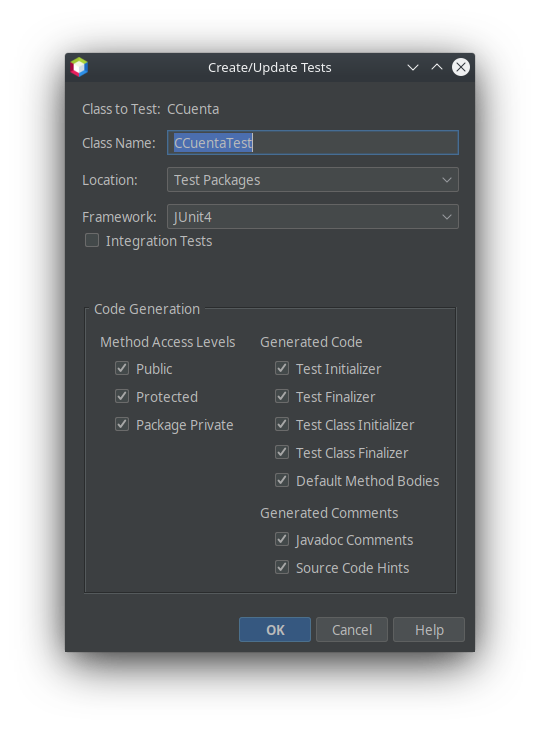

[toc]
# Introduction.

Software testing is an essential part of the development cycle. Creating and maintaining units can help us ensure that individual methods in our code work correctly. The development environment integrates Frameworks, which allow you to automate tests.

In the case of development environments for Java, such as NetBeans and Eclipse, we find the JUnit framework. JUnit is a test automation tool that allows us to quickly and easily create tests. The tool allows us to design test classes, for each class designed in our application. Once the test classes have been created, we establish the methods that we want to test, and for this we design test cases. The criteria for creating test cases can be very diverse, and will depend on what we want to test.

Once the test cases have been designed, we proceed to test the application. The automation tool, in this case Junit, will present us with a report with the results of the test. Depending on the results, we may or may not modify the code.

- Some unsurpassed tets:

  

- Some tests passed:

  

The most widespread development environments, which are used to implement Java applications, such as NetBeans or Eclipse, incorporate a plugin to work with Junit. It will help us to carry out unit tests of classes written in Java, within a test environment. It is a framework with very few classes that is easy to learn and use.

Once we have designed our application, and we have debugged it, we proceed to test it. In the case of the example, we have a class, named `Ccount`, where a series of methods have been defined.

The objective is going to be the design and execution of some test cases.

# Junit init

To start Junit, select the class to test in the project window, open the context menu and select  `Tools` > `Create/Update Tests`.

appears to us where we must indicate the name of the class. Since we are going to test the class `Ccount`,by convention it is advisable to call the test class `CcountTest`. This class is going to be inserted into a new package in our project, called `Test Packages` (test packages). It gives us a choice between `JUnit`, `TestNG` and `JUnit4`. They are the two versions of JUnit available in NetBeans 12.X. In our case, we choose `JUnit4`, uncheck the option `Integration Tests`. 

As can be seen in the form, JUnit will generate the methods that appear selected. In our case we are going to leave it as it is, although later they will be modified in the code.



When pressing the button `OK` we get a new kind of name `CcountTest`, which contains the methods that were selected in the previous form, with a prototype code. It is in that code that the programmer will create his test cases.


The design of the test cases requires that criteria be established that guarantee that the test has a high probability of finding some error not detected so far.

# Test cases

The previous step generates a series of methods that are tied to a series of annotations. We start by learning about initializers and finalizers:

- For classes: 

  - `setUpClass()` (`@BeforeClass`): There can only be one method with this marker, it is called once at the beginning of all tests. It is often used to initialize attributes.
  - `tearDown()` (`@AfterClass`): There can only be one method with this marker and it is called at the end of all tests.

- For each of the tests:

  - `setUp()` (`@Before`): It is executed before each test.
  - `tearDown()` (`@After`): It is executed after each test.

  They are used to initialize and terminate test conditions, such as object creation, variable initialization, etc. In some cases, it is not necessary to use these methods, but they are usually always included.

Next, we need to know the annotations:

- `@Ignore`: Methods marked with this annotation will not be executed..
- `@Test`: Represents a test that must be executed. 
- `@Test (timeout=X)` the test will be valid if it is executed before `X` milliseconds.

And finally, you need to know the assertions. The `assertXXX()` methods are used to do the tests. These methods allow you to check whether the output of the method being tested agrees with the expected values. The main ones are:

- `assertTrue()` evaluates a boolean expression. The test passes if the value of the expression is true.
- `assertFalse()` evaluates a boolean expression. The test passes if the value of the expression is false.
- `assertNull()` checks that the reference to an object is null.
- `assertNotNull()` checks that the reference to an object is not null.
- `assertSame()` compares two references and ensures that the referenced objects have the same memory address. The test passes if the two arguments are the same object or belong to the same object.
- `assertNotSame()` Compares two object references and ensures that they both point to different memory addresses. The test passes if the two supplied arguments are different objects or belong to different objects.
- `assertEquals()` It is used to check equality at the content level. The equal of primitive types is compared using “==”, the equal between objects is compared with the method `equals()`.The test passes if the values of the arguments are equal.
- `fails()` causes the test to fail immediately. Can be used when the test returns an error or when the method being tested is expected to call an exception.

At this point, we are ready to design the methods we need for the test cases.

```java
import org.junit.After;
import org.junit.AfterClass;
import org.junit.Before;
import org.junit.Test;
import static org.junit.Assert.*;
import org.junit.BeforeClass;

/**
 *
 * @author David Martínez (wwww.martinezpenya.es|iesmre.com)
 */
public class CCuentaTest {

    //Las variables que usaremos para hacer los tests, ojo! son static!.
    static CCuenta cuentaSinParmetros;
    static CCuenta cuentaDavid;
    static CCuenta cuentaPepe;
    static CCuenta cuentaSinSaldo;
    static CCuenta cuentaSaldoMil;

    //Aunque el constructor no es obligatorio, Junit lo añade, observa que no 
    //tiene ninguna anotación.
    public CCuentaTest() {
    }

    @BeforeClass
    public static void setUpClass() throws Exception {
        //Este método se ejecutará una sola vez antes de todos los tests
        //en nuestro caso imprimimos el comienzo del TEST.
        System.out.println("INICIO TEST");
    }

    @AfterClass
    public static void tearDownClass() throws Exception {
        //Este método se ejecutará una sola vez al terminar todos los tests
        //en nuestro caso no lo usamos.
    }

    @Before
    public void setUp() {
        //Este método se ejecutará al comienzo de cada Test
        //en nuestro caso imprimiremos el comentario de que comienza la prueba
        //y crearemos aquí los objetos que vamos a necesitar para hacer pruebas.
        System.out.print("Comienza la prueba ");
        cuentaSinParmetros = new CCuenta();
        cuentaDavid = new CCuenta("David", "1234", 50, 0.5);
        cuentaPepe = new CCuenta("Pepe", "5678", 200, 1);
    }

    @After
    public void tearDown() {
        //Este método se ejecutará al finalizar cada Test
        //en nuestro caso imprimiremos el comentario de que ha terminado la prueba
        //Añadimos la variable fin y el calculo respecto al comienzo para saber
        //los ms empleados en la prueba.
        System.out.println("Fin de la prueba\n");
    }

    //Comenzamos con los tests o pruebas.
    /**
     * Test of getNombre method, of class CCuenta.
     */
    @Test
    public void testGetNombre() {
        System.out.println("getNombre");
        //CCuenta instance = new CCuenta();
        //String expResult = "";
        //String result = instance.getNombre();
        //assertEquals(expResult, result);
        // TODO review the generated test code and remove the default call to fail.
        //fail("The test case is a prototype.");

        //Tal y como indica el TODO, debemos modificar el código y sustituirlo
        //por nuestros tests en este caso podemos definir dos casos de prueba:
        //nombre nulo
        assertNull(cuentaSinParmetros.getNombre());

        //nombre "David"
        assertEquals("David", cuentaDavid.getNombre());

        //nombre "Pepe"
        assertEquals("Pepe", cuentaPepe.getNombre());
    }

    /**
     * Test of setNombre method, of class CCuenta.
     */
    @Test
    public void testSetNombre() {
        System.out.println("setNombre");

        //Cambiamos el nombre a la cuenta David
        cuentaDavid.setNombre("David2");
        assertEquals("David2", cuentaDavid.getNombre());

        //Cambiamos el nombre a la cuenta sin parámetros
        cuentaSinParmetros.setNombre("Anonimo");
        assertEquals("Anonimo", cuentaSinParmetros.getNombre());
    }

    /**
     * Test of getCuenta method, of class CCuenta.
     */
    @Test
    public void testGetCuenta() {
        System.out.println("getCuenta");

        //cuenta nulo
        assertNull(cuentaSinParmetros.getCuenta());

        //cuenta "1234" David
        assertEquals("1234", cuentaDavid.getCuenta());

        //saldo 200 Pepe
        assertEquals("5678", cuentaPepe.getCuenta());
    }

    /**
     * Test of setCuenta method, of class CCuenta.
     */
    @Test
    public void testSetCuenta() {
        System.out.println("setCuenta");

        //Cambiamos la cuenta David
        cuentaDavid.setCuenta("0000");
        assertEquals("0000", cuentaDavid.getCuenta());

        //Cambiamos la cuenta sin parámetros
        cuentaSinParmetros.setCuenta("4321");
        assertEquals("4321", cuentaSinParmetros.getCuenta());
    }

    /**
     * Test of getSaldo method, of class CCuenta.
     */
    @Test
    public void testGetSaldo() {
        System.out.println("getSaldo");

        //cuenta cero
        assertEquals(0, cuentaSinParmetros.getSaldo(), 0);

        //saldo 50
        assertEquals(50, cuentaDavid.getSaldo(), 0);

        //nombre 200
        assertEquals(200, cuentaPepe.getSaldo(), 0);

        /*
         * Cuando desea comparar tipos de punto flotante (double o float),
         * necesita un parámetro adicional para evitar errores de redondeo.
         * La afirmación se evalúa como se indica a continuación:
         * 	Math.abs (esperado – real) <= delta
         * Por ejemplo:
         * 	afirmarEquals( unValorDoble, otroValorDoble, 0.001 )
         */
    }

    /**
     * Test of setSaldo method, of class CCuenta.
     */
    @Test
    public void testSetSaldo() {
        System.out.println("setSaldo");

        //Cambiamos el saldo a la cuenta David
        cuentaDavid.setSaldo(0);
        assertEquals(0, cuentaDavid.getSaldo(), 0);

        //Cambiamos el saldo a la cuenta sin parámetros
        cuentaSinParmetros.setSaldo(1000.0001);
        assertEquals(1000.0001, cuentaSinParmetros.getSaldo(), 0);
    }

    /**
     * Test of getInteres method, of class CCuenta.
     */
    @Test
    public void testGetInteres() {
        System.out.println("getInteres");

        //interes cero
        assertEquals(0, cuentaSinParmetros.getInteres(), 0);

        //interes 0.5
        assertEquals(0.5, cuentaDavid.getInteres(), 0);

        //interes 1
        assertEquals(1, cuentaPepe.getInteres(), 0);
    }

    /**
     * Test of setInteres method, of class CCuenta.
     */
    @Test
    public void testSetInteres() {
        System.out.println("setInteres");

        //Cambiamos el interes a la cuenta David
        cuentaDavid.setInteres(0);
        assertEquals(0, cuentaDavid.getInteres(), 0);

        //Cambiamos el interes a la cuenta sin parámetros
        cuentaSinParmetros.setInteres(10.01);
        assertEquals(10.01, cuentaSinParmetros.getInteres(), 0);
    }

    /**
     * Test of ingresar method, of class CCuenta.
     */
    @Test
    public void testIngresar() throws Exception {
        System.out.println("ingresar");

        //ingresamos 100 a la que estaba vacia
        cuentaSinParmetros.ingresar(100);
        assertEquals(100, cuentaSinParmetros.getSaldo(), 0);

        //ingresamos 0 a la que tenia 50
        cuentaDavid.ingresar(0);
        assertEquals(50, cuentaDavid.getSaldo(), 0);
    }

    //El caso de Ingresar es un poco especial, porque puede lanzar una excepción
    //cuando la cantidad es negativa, esos casos lo tratamos con una anotación 
    //especial donde identificas el tipo de excepcion esperada.
    @Test(expected = Exception.class)
    public void testIngresaExcepcion() throws Exception {
        System.out.println("Excepción ingresar");
        //intentamos ingresar una cantidad negativa
        cuentaPepe.ingresar(-200);
    }

    /**
     * Test of retirar method, of class CCuenta.
     */
    @Test
    public void testRetirar() throws Exception {
        System.out.println("retirar");

        //retiramos 0 a la que tenia 50
        cuentaDavid.retirar(0);
        assertEquals(50, cuentaDavid.getSaldo(), 0);

        //retiramos 50 a la que tenia 200
        cuentaPepe.retirar(50);
        assertEquals(150, cuentaPepe.getSaldo(), 0);
    }

    //Lo mismo para la excepción al intentar retirar una cantidad mayor que el saldo
    @Test(expected = Exception.class)
    public void testRetirarExcepcion() throws Exception {
        System.out.println("Excepción retirar");
        //intentamos retirar cuando no hay saldo
        cuentaSinParmetros.retirar(200);
    }
}
```

These methods try to test the methods of the class `Ccuenta`. To do this, having the project selected, we will access the context menu and press the option `Test`.

As can be seen, the test on the withdraw method has failed, but the rest of the tests on the methods have been successful. With this information, we must verify that the test case is correctly designed, in which case, what has been found is an error in the design of the method `withdraw`,and it must be corrected. The advantage of using automated tools is that regression is facilitated, since we have designed the test case for the method, so once the withdraw method has been recoded, we can retest all the methods automatically.

# Class `Ccuenta`

```java
/**
 *
 * @author David Martínez (wwww.martinezpenya.es|iesmre.com)
 */
public class CCuenta {

    // Propiedades de la Clase Cuenta
    private String nombre;
    private String cuenta;
    private double saldo;
    private double interes;

    // Constructor sin argumentos
    public CCuenta() {
    }

    // Constructor con parámetro para iniciar todas las propiedades de la clase
    public CCuenta(String nom, String cue, double sal, double tipo) {
        nombre = nom;
        cuenta = cue;
        saldo = sal;
        interes = tipo;
    }

    //getters & setters
    public String getNombre() {
        return nombre;
    }

    public void setNombre(String nombre) {
        this.nombre = nombre;
    }

    public String getCuenta() {
        return cuenta;
    }

    public void setCuenta(String cuenta) {
        this.cuenta = cuenta;
    }

    public double getSaldo() {
        return saldo;
    }

    public void setSaldo(double saldo) {
        this.saldo = saldo;
    }

    public double getInteres() {
        return interes;
    }

    public void setInteres(double interes) {
        this.interes = interes;
    }

    //Método para ingresar cantidades en la cuenta. Modifica el saldo.
    public void ingresar(double cantidad) throws Exception {
        if (cantidad < 0) {
            throw new Exception("No se puede ingresar una cantidad negativa");
        }
        saldo += cantidad;
    }

    // Método para retirar cantidades en la cuenta. Modifica el saldo.
    public void retirar(double cantidad) throws Exception {
        if (cantidad < 0) {
            throw new Exception("No se puede retirar una cantidad negativa");
        }
        if (getSaldo()< cantidad) {
            throw new Exception("No hay suficiente saldo");
        }
        saldo = cantidad;
    }
}
```

# Activities

## Junit_1

As we have right now the class `Ccuenta` i `CcuentaTest`, we have discovered a problem in the method`retirar`. Explain how tests are launched from Netbeans (where you see the test that is not satisfactory), justifies if the problem is in the Test or in the method `retirar`.Make the appropriate modifications (in the test or in the method `retirar`) so that the test is satisfactory, explaining step by step and with screenshots how to perform the tests and they are all satisfactory.

Send the memory in PDF to the corresponding task of AULES.

## Junit_2

Modify the test methods (tests) that you consider appropriate to ensure that for each of the tests the milliseconds used in the test are printed. You have to do it as efficiently as possible, and not repeat code in each of the tests.

Send the memory in PDF to the corresponding task of AULES.

# Information sources

- https://netbeans.apache.org/kb/docs/java/junit-intro.html
- https://www.discoduroderoer.es/como-hacer-una-aplicacion-de-prueba-con-junit/
