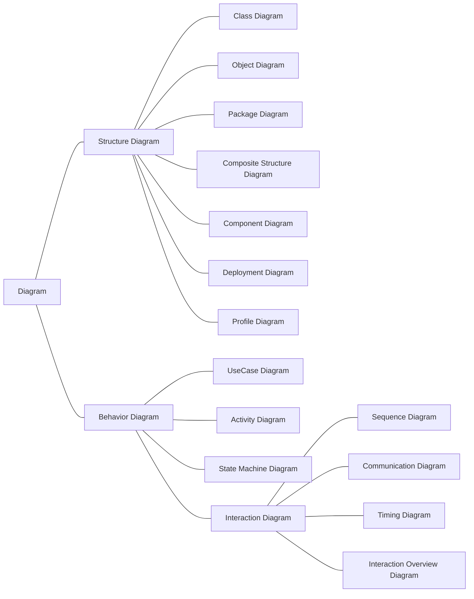
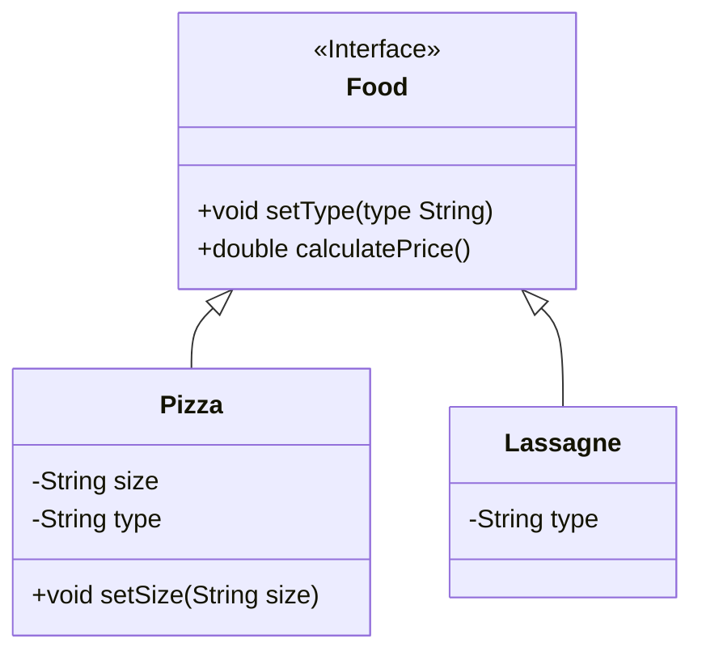

[toc]

# Introduction

A successful software company is one that consistently produces quality software that meets user needs. Modeling is the essential part of all the activities that lead to the production of quality software.

**UML** (Unified Modeling Language or Unified Modeling Language) is a set of tools that allows modeling, building and documenting the elements that make up an object-oriented software system. It has become the de facto standard of the industry, because it has been conceived by the authors of the three most used methods of object orientation: Grady Booch, Ivar Jacobson and Jim Rumbaugh, in fact the technical roots of UML are:

- OMT ‐ Object Modeling Technique (Rumbaugh et al.)
- Booch Method (G. Booch)
- OOSE ‐ Object‐Oriented Software Engineering (I. Jacobson)

> **UML** allows developers to visualize the product of their work in standardized schemes or diagrams called models (graphic or schematic representation of a reality, it serves to organize and clearly communicate the elements that involve a whole. Theoretical scheme of a system or of a complex reality that is elaborated to facilitate its understanding and the study of its behavior) that represent the system from different perspectives.

## Why is modeling useful?

- Because it allows the use of a common language that facilitates communication between the development team.
- With UML we can document all artifacts (information that is used or produced by a software development process. They can be artifacts, a model, a description or software) of a development process (requirements (conditions that a software project must meet). They are usually defined by the client They allow defining the objectives that a software project must meet), architecture, tests, versions,...) so that documentation is available that transcends the project.
- There are structures that transcend what can be represented in a programming language, such as those that refer to the architecture of the system (set of significant decisions about the organization of a software system, the selection of the structural elements from which it is composed the system, and the interfaces between them Along with their behavior, as specified by the collaborations between those elements, the composition of these structural and behavioral elements into progressively larger subsystems, and the architectural style that guides this organization, these elements and their interfaces, their collaborations and their composition), using these technologies we can even indicate which software modules we are going to develop and their relationships,or in which hardware nodes they will be executed when we work with distributed systems.
- Allows you to specify all the analysis, design and implementation decisions, building
  accurate, unambiguous and complete models.

In addition, UML can be connected to programming languages ​​through forward engineering (transformation of a model or into code through its translation into a specific programming language) and reverse engineering (transformation of code into a model through its translation from a specific or language). of p programming), as we shall see.

## Types of UML diagrams.

UML defines a system as a collection of models that describe its different perspectives. Models are implemented in a series of diagrams that are graphical representations of a collection of model elements, often drawn as a connected graph of arcs (relations) and vertices (other model elements).


An UML diagram is made up of four types of elements:

- **Structures**: These are the nodes of the graph and define the type of diagram.
- **Relationships**: These are the arcs of the graph that are established between the structural elements.
- **Notes**: They are represented as a box where we can write comments that help us understand some concept that we want to represent.
- **Groups**: They are used when we model large systems to facilitate their development by blocks.

and is classified an in:

- **Structural diagrams**: They represent the static view of the system. They specify classes and objects and how they are physically distributed in the system.

- **Behavior diagrams:** show the behavior of the system at execution time, both from the point of view of the complete system and of the instances or objects that make it up. Within this group are interaction diagrams.

The image shows all the diagrams organized according to their category. Those that belong to the newer UML 2.0 standard have been highlighted. A total of thirteen diagrams are described to model different aspects of a system, however it is not necessary to use all of them, it will depend on the type of application to be generated and the system, that is, a diagram should be generated only if necessary.

> 80% of applications can be modeled with 20% of UML diagrams. In the following link you have a document with the description of the UML diagrams.

> **Learn more**: Website with all versions (the last one that appears is 2.5) and UML diagrams: https://www.uml-diagrams.org/

### Structural diagrams.

* **Class diagrams**: Shows the elements of the abstract static model, and is made up of a set of classes and their relationships. It has a HIGH priority.
* **Object diagram**: Shows the elements of the static model at a specific time, usually in special cases of a class or communications diagram, and is made up of a set of objects and their relationships. It has a HIGH priority.
* **Component diagram**: They specify the logical organization of the implementation of an application, system or company, indicating its components, their interrelationships, interactions and their public interfaces and the dependencies between them. It has a MEDIUM priority.
* **Deployment diagrams**: They represent the configuration of the system at run time. The render nodes and their components appear. It exhibits the execution of the system architecture. It includes nodes, hardware or software operating environments, as well as the interfaces that connect them, that is, it shows how the components of a system are distributed among the computers that run them. It is used when we have distributed systems. It has a MEDIUM priority.
* **Integrated Structure Diagram (UML 2.0)**: Shows the internal structure of a classification (such as a class, component or typical case), and includes the points of interaction of this classification with other parts of the system. It has a LOW priority.
* **Package Diagram**: Shows how the elements of the model are organized into packages, as well as the dependencies between those packages. It is usually useful for the management of medium or large systems. It has a LOW priority.

### Behavior diagrams.

- **Use case diagrams**: They represent the actions to be carried out in the system from the users' point of view. It represents the actions, the users and the relationships between them. They serve to specify the functionality and behavior of a system through its
  interaction with users and/or other systems. It has a MEDIUM priority.
- **Machine state diagrams**: They describe the behavior of a system driven by events. It shows the states that an object or interaction can have, as well as the transitions between said states. It is also called a state diagram, state-transition diagram, or state-change diagram. It has a MEDIUM priority.
- **Activity diagram**: They show the order in which tasks are carried out within a system. It shows the high-level processes of the organization. It includes data flow, or a model of the complex logic within the system. It has a HIGH priority.

- **Interaction diagrams.**
  - **Sequence diagrams**: They represent the temporal ordering in the passing of messages. It models the logical sequence, over time, of messages between instances. It has a HIGH priority.
  - **Communication/collaboration diagrams (UML 2.0)**: They highlight the structural organization of the objects that pass messages. Provides the instances of the classes, their interrelationships, and the flow of messages between them. It commonly focuses on the structural organization of objects that
    receive and send messages. It has a LOW priority.
  - **Interaction diagram**: Shows a set of objects and their relationships along with the messages that are sent between them. It is a variant of the activity diagram that allows showing the flow of control within a system or organizational process. Each activity node within the diagram can represent another interaction diagram. It has a LOW priority.
  - **Time chart**: Shows the change in a state or a condition of an instance or a role over time. It is typically used to display the change in state of an object over time, in response to external events. It has a LOW priority.

## Tools for the elaboration of UML diagrams.

The simplest tool that can be used to generate diagrams is pencil and paper, however, today we can access CASE tools that greatly facilitate the development of UML diagrams. These tools usually have a WYSIWYG-like window environment (**W**hat **Y**ou **S**ee **I**s **W**hat **Y**ou **G**et), allow documentation of diagrams and integration with other development environments including automatic code generation and reverse engineering procedures.

We can find, among others, the following tools:

- **Rational Systems Developer from IBM**: Proprietary tool that allows the development of software projects based on the UML methodology. Originally developed by the creators of the UML, it has recently been taken over by IBM. It offers trial versions, and free software for
  the development of UML diagrams. Rational Systems Developer official page: http://www-01.ibm.com/software/rational/
- **Visual Paradigm for UML (VP-UML)**: Includes a version for non-commercial use that is freely distributed without further registration for a license file. It includes different modules to carry out UML development, design databases, carry out engineering activities reverse and design with Agile. It is compatible with Eclipse, Visual Studio .net, IntellijDEA, and NetBeans IDEs. Cross-platform, includes installers for Windows and Linux. Link to the official page of Visual Paradigm. http://www.visual-paradigm.com/
- **ArgoUML**: it is distributed under the Eclipse license. Supports UML 1.4 diagrams, and generates code for Java and C++. To be able to execute it, the java platform is needed. Supports forward and reverse engineering.

# Class diagrams

Within the structural diagrams, and of all in general, it is the most important because it represents the static elements of the system, its attributes and behaviors, and how they relate to each other. It contains the classes of the domain of the problem, and from this the classes that will later form the computer program that will solve the problem will be obtained.

In a class diagram we can find the following elements:

- Classes: let us remember that they are abstractions of the system domain that represent elements of the system through a series of characteristics, which we will call attributes, and their behavior, which will be methods. Attributes and methods will have a visibility that will determine who can access the attribute or method. For example, a class can represent a car, its attributes will be the displacement, the power and the speed, and it will have two methods, one to accelerate, which will increase the speed, and another to slow down, which will decrease it.
- Relations: in the diagram they represent real relations between the elements of the system to which the classes refer. They can be association, aggregation and inheritance. For example, if I have a person class, I can establish a lead relationship between person and car.
- Notes: They are represented as a box where we can write comments that help us understand some concept that we want to represent.
- Grouping elements: They are used when a large system has to be modeled, then the classes and their relationships are grouped into packages, which in turn are related to each other.

## Classes: Attributes, Methods and Visibility

Defines the characteristics of a specific object type. It encapsulates all the information of an object, and is made up of methods and attributes or fields. The UML is represented by a box with 3 sections:

- Superior: Name of the class.
- Intermediate: Class attributes.
- Bottom: Methods of the class.

```mermaid
classDiagram
    class ClassName{
   	attributes
   	...
   	methods()
   	(...)
    }
```

### Visibility

One of the following symbols is placed before the name of the class member (attribute or method):

| Symbol | Meaning |
| ---- | ------------------------- |
| + | Public |
| - | Private |
| # | Protected |
| ~    | Default (Package-private) |

### Other considerations

**Static elements:** Both attributes and static methods are represented <u>underlined</u>.

**Class types:** If the class is an **abstract** class or an **interface** (pure abstract class), it is indicated above the class name with `<<` `>>`.



## Relations between objects

It represents the *connections* between the different classes or objects of a program. They indicate how a class uses elements from other classes.

1. Inheritance
2. Association
   1. Aggregation
   2. Composition

### Inheritance

It is represented by a line with an arrow at the end of the superclass.


Indicates that a class can be of different class types: several subclasses *extend* a superclass.


### Association

It is represented by an open arrow.


Represents any type of association between two classes. For example, when a class uses methods from another class, or when there is a method that receives data types from another class.

In addition, in any type of association relationship, the cardinality of the relationship can be indicated to indicate the amount of participation between the two classes.

There are two more restrictive association types that specify the type of association relationship between two classes: aggregation and composition. Both represent relationships between objects but differ in their rigidity.


To explain the concept we are going to consider the following example: *A university has several departments, and each department has a number of professors. If the university closes, the departments cease to exist forever, but the professors in those departments will continue to exist. A University is a composition of Departments, and a Department is an aggregation of Professors. In addition, a Professor can work in more than one Department, but a Department can only belong to one University.*

### Aggregation


It is represented by a line with a diamond. It is a type of Association relationship, but more specific.

An aggregation occurs when a class is a collection or container of other classes, but does not depend on the existence of those other classes. If the class that contains the collection disappears, it does not affect the contained classes.

In the following example, the Department class is a container for Teacher classes:

```java
public class Department{
   private String departmentName;
   private ArrayList<Teacher> listTeachers;
 
   //The teachers already exist and I receive a list by parameter
   public Department(ArrayList<Teacher> listTeachers){
      this.listTeachers = listTeachers;
   }
}
```

Teachers do not disappear because the Department object disappears.

### Composition


It is represented by a line with a black diamond.

Class composition is an even stricter relation than aggregation. Occurs when a class contains references to another class, but the lifetime of the contained instances is tied to the lifetime of the containing instance. In other words, if the composite class disappears, so will the contained classes.

```java
public class Un.listadoDepartamentos = new ArrayList<iversity{
   private String universityName;
   private ArrayList<Department> listDepartments;
 
   public University(){
      this.listadoDepartamentos = new ArrayList<>();
   }
 
   public void newDepartment(String code, String DepartmentName){
      Department newDepartment = new Department(code, departmentname);
      listDepartments.add(newDepartment);
   }
}
```

If the University object disappears, the departments it owns also disappear. In addition, a department can only belong to a single University.

# Use case diagram

A use case diagram is a list of steps that define the interaction between an actor and the system itself. They must meet the following objectives:

- Indicate the functional requirements: how a program/system works.
- Provide a clear description of its use: how the user interacts with the system.
- Must be read clearly.
- Guidance in testing: tells us how it should work (requirements).
- Serves as a guide to create the documentation for the use of the program.

A use case diagram should show at a glance what can be done with a program from a user's point of view. Every thing the user does *is a use case*.


More detailed use case:


## Elements of a use case diagram

UML is a language, so we must use its concrete notation for each element:

- **Actors**: It is anything that interacts with the system, and is external to it. It is not necessarily a person, it can be a device or another system. They are represented by a *stick figure*.
- **Use cases**: They represent the operation that occurs after an actor's order. They are represented with an *ellipse*, and the textual description is written inside.
- **Relationships**: They relate the actors to the use cases, although in some cases they also allow some use cases to be related to others.
- A rectangle is used to represent the boundaries of the system, if necessary.


> To design a use case diagram, one begins by recognizing the actors and the use cases, in order to subsequently relate them.


## Relationships between use cases

The main relationships between use cases are those of inclusion and extension. They are often confused:

- **Inclusion**: An initial use case includes another secondary use case, when to carry out the initial use case it is *necessarily* necessary to carry out the secondary use case.


- **Extension**: One use case extends another, when it does something similar but extends the functionality. The idea is very similar to inheritance in programming.


# Reverse engineering

Reverse engineering is defined as the process of analyzing an application's code, documentation, and behavior to identify its actual components and their dependencies, and to extract and create an abstraction of system and design information. The system under study is not altered, but an additional knowledge of it is produced.

This process is **inverse** to the order of the stages when developing software, since the modeling is carried out first, to later be clear about what must be programmed.

Its particular case is reengineering, which is the process of extracting the source code from an executable file.

Reverse engineering can be of several types:

- **Reverse data engineering:** It is applied to some database code (application, SQL code, etc.) to obtain the relational models or to the relational model to obtain the entity-relationship diagram.
- **Logic or process reverse engineering:** When reverse engineering is applied to the code of a program to find out its logic (reengineering), or to any design document to obtain analysis or requirements documents.
- **Reverse engineering of user interfaces:** It is applied in order to maintain the internal logic of the program to obtain the models and specifications that served as the basis for its construction, in order to take them as a starting point in processes of forward engineering that allow modifying said interface.

There are different tools to obtain the class diagram from an already created source code. We can also create a diagram of a database from the sql code with which we have defined the database.

**PhpMyAdmin** and **MySQL WorkBench** allow you to reverse engineer a database. For Java there is the **ArgoUML** tool.

# Information sources

- [Wikipedia](https://es.wikipedia.org)
- [Uml Diagrams](https://www.uml-diagrams.org/)
- [Code&Coke (Fernando Valdeón)](http://entornos.codeandcoke.com/doku.php?id=start)
- Apuntes IES El Grao (Mª Isabel Barquilla?)
- [Apuntes IOC (Marcel García)](https://ioc.xtec.cat/materials/FP/Recursos/fp_dam_m05_/web/fp_dam_m05_htmlindex/index.html)
- [Apuntes José Luis Comesaña](https://www.sitiolibre.com/)
- [Apuntes IES Luis Vélez de Guevara 17-18 (José Antonio Muñoz Jiménez)](http://jamj2000.github.io/slides/2017/09/05/entornosdesarrollo/)
