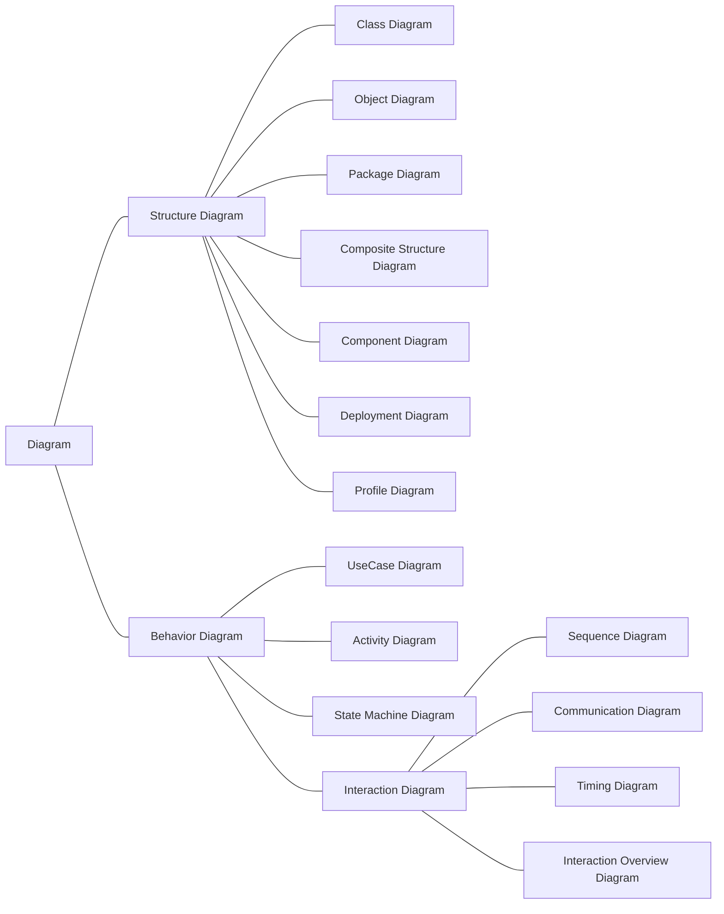
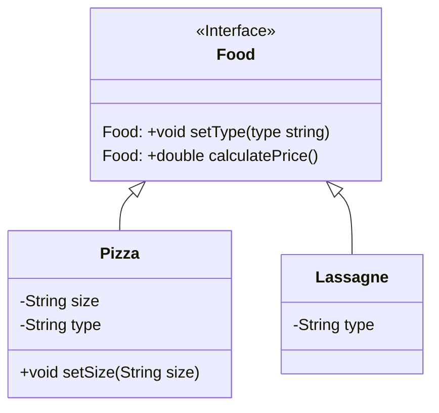
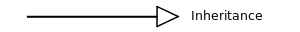
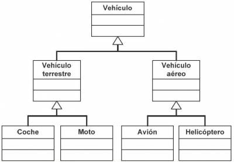
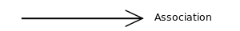
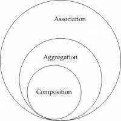
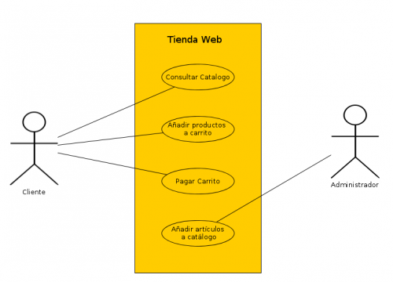
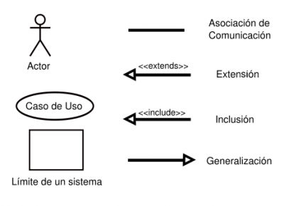
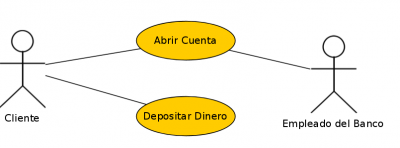
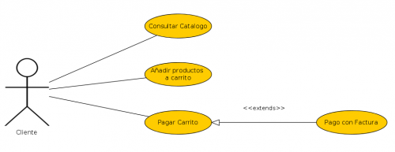

[toc]

# Introducción

Una empresa de software con éxito es aquella que produce de manera consistente software de calidad que satisface las necesidades de los usuarios. El modelado es la parte esencial de todas las actividades que conducen a la producción de software de calidad.

**UML** (Unified Modeling Language o Lenguaje Unificado de Modelado) es un conjunto de herramientas que permite modelar, construir y documentar los elementos que forman un sistema software orientado a objetos. Se ha convertido en el estándar de facto de la industria, debido a que ha sido concebido por los autores de los tres métodos más usados de orientación a objetos: Grady Booch, Ivar Jacobson y Jim Rumbaugh, de hecho las raíces técnicas de UML son:

- OMT ‐ Object Modeling Technique (Rumbaugh et al.)
- Método‐Booch (G. Booch)
- OOSE ‐ Object‐Oriented Software Engineering (I. Jacobson)

> UML permite a los desarrolladores y desarrolladoras visualizar el producto de su trabajo en esquemas o diagramas estandarizados denominados modelos (representación gráfica o esquemática de una realidad, sirve para organizar y comunicar de forma clara los elementos que involucran un todo. Esquema teórico de un sistema o de una realidad compleja que se elabora para facilitar su comprensión y el estudio de su comportamiento)  que representan el sistema desde diferentes perspectivas.

## ¿Porqué es útil modelar?

- Porque permite utilizar un lenguaje común que facilita la comunicación entre el equipo de desarrollo.
- Con UML podemos documentar todos los artefactos (información que es utilizada o producida mediante un proceso de desarrollo de software. Pueden ser artefactos un modelo, una descripción o un software) de un proceso de desarrollo (requisitos (condiciones que debe cumplir un proyecto software. Suelen venir definidos por el cliente. Permiten definir los objetivos que debe cumplir un proyecto software), arquitectura, pruebas, versiones,...) por lo que se dispone de documentación que trasciende al proyecto.
- Hay estructuras que trascienden lo representable en un lenguaje de programación, como las que hacen referencia a la arquitectura del sistema (conjunto de decisiones significativas acerca de la organización de un sistema software, la selección de los elementos estructurales a partir de los cuales se compone el sistema, y las interfaces entre ellos. Junto con su comportamiento, tal y como se especifica en las colaboraciones entre esos elementos, la composición de estos elementos estructurales y de comportamiento en subsistemas progresivamente mayores y el estilo arquitectónico que guía esta organización, estos elementos y sus interfaces, sus colaboraciones y su composición),  utilizando estas tecnologías podemos incluso indicar qué módulos de software vamos a desarrollar y sus relaciones, o en qué nodos hardware se ejecutarán cuando trabajamos con sistemas distribuidos. 
- Permite especificar todas las decisiones de análisis, diseño e implementación, construyéndose
  modelos precisos, no ambiguos y completos.

Además UML puede conectarse a lenguajes de programación mediante ingeniería directa (transformación de un modelo o en código a través de su traducción a un determinado lenguaje de programación) e inversa (transformación del código en un modelo a través de su traducción desde un determinado o lenguaje de p programación), como veremos.

## Tipos de diagramas UML.

UML define un sistema como una colección de modelos que describen sus diferentes perspectivas. Los modelo se implementan en una serie de diagramas que son representaciones gráficas de una colección de elementos de modelado, a menudo dibujado como un grafo conexo de arcos (relaciones)  y vértices (otros elementos del modelo).


Un diagrama UML se compone de cuatro tipos de elementos:

- **Estructuras**: Son los nodos del grafo y definen el tipo de diagrama.
- **Relaciones**: Son los arcos del grafo que se establecen entre los elementos estructurales.
- **Notas**: Se representan como un cuadro donde podemos escribir comentarios que nos ayuden a entender algún concepto que queramos representar.
- **Agrupaciones**: Se utilizan cuando modelamos sistemas grandes para facilitar su desarrolllo por bloquess.

y se clasifica an en:

- **Diagramas estructurales**: Representan la visión estática a del sistema a. Especifican clases y objetos y como se distribuyen físicamente en el sistema.

- **Diagramas de comportamiento:** muestran la conducta en tiempo de ejecución del sistema, tanto desde el punto de vista del sistema completo como de las instancias u objetos que lo integran. Dentro de este grupo están los diagramas de interacción.

En la imagen aparecen todos los diagramas organizados según su categoría. Se han destacado aquellos que pertenecen al estándar UML 2.0, más novedosos. En total se describen trece diagramas para modelar diferentes aspectos de un sistema, sin embargo no es necesario usarlos todos, dependerá del tipo de aplicación a generar y del sistema, es decir, se debe generar un diagrama sólo si es necesario.

> Un 80% de las aplicaciones se pueden modelar con el 20% de los diagramas UML. En el siguiente enlace tienes un documento con la descripción de los diagramas UML.

> **Saber más**: Sitio web con todas las versiones (la última que aparece es la 2.5) y diagramas de UML: https://www.uml-diagrams.org/

### Diagramas estructurales.

* **Diagramas de clases**: Muestra los elementos del modelo estático abstracto, y está formado por un conjunto de clases y sus relaciones. Tiene una prioridad ALTA.
* **Diagrama de objetos**: Muestra los elementos del modelo estático en un momento concreto, habitualmente en casos especiales de un diagrama de clases o de comunicaciones, y está formado por un conjunto de objetos y sus relaciones. Tiene una prioridad ALTA.
* **Diagrama de componentes**: Especifican la organización lógica de la implementación de una aplicación, sistema o empresa, indicando sus componentes, sus interrelaciones, interacciones y sus interfaces públicas y las dependencias entre ellos. Tiene una prioridad MEDIA.
* **Diagramas de despliegue**: Representan la configuración del sistema en tiempo de ejecución. Aparecen los nodos de procesamiento y sus componentes. Exhibe la ejecución de la arquitectura del sistema. Incluye nodos, ambientes operativos sea de hardware o software, así como las interfaces que las conectan, es decir, muestra como los componentes de un sistema se distribuyen entre los ordenadores que los ejecutan. Se utiliza cuando tenemos sistemas distribuidos. Tiene una prioridad MEDIA.
* **Diagrama integrado de estructura (UML 2.0)**: Muestra la estructura interna de una clasificación (tales como una clase, componente o caso típico), e incluye los puntos de interacción de esta clasificación con otras partes del sistema. Tiene una prioridad BAJA.
* **Diagrama de paquetes**: Exhibe cómo los elementos del modelo se organizan en paquetes, así como las dependencias entre esos paquetes. Suele ser útil para la gestión de sistemas de mediano o gran tamaño. Tiene una prioridad BAJA.

### Diagramas de comportamiento.

- **Diagramas de casos de uso**: Representan las acciones a realizar en el sistema desde el punto de vista de los usuarios. En él se representan las acciones, los usuarios y las relaciones entre ellos. Sirven para especificar la funcionalidad y el comportamiento de un sistema mediante su
  interacción con los usuarios y/u otros sistemas. Tiene una prioridad MEDIA.
- **Diagramas de estado de la máquina**: Describen el comportamiento de un sistema dirigido por eventos. En él aparecen los estados que pueden tener un objeto o interacción, así como las transiciones entre dichos estados. Se lo denomina también diagrama de estado, diagrama de estados y transiciones o diagrama de cambio de estados. Tiene una prioridad MEDIA.
- **Diagrama de actividades**: Muestran el orden en el que se van realizando tareas dentro de un sistema. En él aparecen los procesos de alto nivel de la organización. Incluye flujo de datos, o un modelo de la lógica compleja dentro del sistema. Tiene una prioridad ALTA.

- **Diagramas de interacción.**
  - **Diagramas de secuencia**: Representan la ordenación temporal en el paso de mensajes. Modela la secuencia lógica, a través del tiempo, de los mensajes entre las instancias. Tiene una prioridad ALTA.
  - **Diagramas de comunicación/colaboración (UML 2.0)**: Resaltan la organización estructural de los objetos que se pasan mensajes. Ofrece las instancias de las clases, sus interrelaciones, y el flujo de mensajes entre ellas. Comúnmente enfoca la organización estructural de los objetos que
    reciben y envían mensajes. Tiene una prioridad BAJA.
  - **Diagrama de interacción**: Muestra un conjunto de objetos y sus relaciones junto con los mensajes que se envían entre ellos. Es una variante del diagrama de actividad que permite mostrar el flujo de control dentro de un sistema o proceso organizativo. Cada nodo de actividad dentro del diagrama puede representar otro diagrama de interacción. Tiene una prioridad BAJA.
  - **Diagrama de tiempos**: Muestra el cambio en un estado o una condición de una instancia o un rol a través del tiempo. Se usa normalmente para exhibir el cambio en el estado de un objeto en el tiempo, en respuesta a eventos externos. Tiene una prioridad BAJA.

## Herramientas para la elaboración de diagramas UML.

La herramienta más simple que se puede utilizar para generar diagramas es lápiz y papel, hoy día, sin embargo, podemos acceder a herramientas CASE que facilitan en gran manera el desarrollo de los diagramas UML. Estas herramientas suelen contar con un entorno de ventanas tipo WYSIWYG (**W**hat **Y**ou **S**ee **I**s **W**hat **Y**ou **G**et), permiten documentar los diagramas e integrarse con otros entornos de desarrollo incluyendo la generación automática de código y procedimientos de ingeniería inversa.

Podemos encontrar, entre otras, las siguientes herramientas:

- **Rational Systems Developer de IBM**: Herramienta propietaria que permite el desarrollo de proyectos software basados en la metodología UML. Desarrollada en origen por los creadores de UML ha sido recientemente absorbida por IBM. Ofrece versiones de prueba, y software libre para
  el desarrollo de diagramas UML. Página oficial de Rational Systems Developer: http://www-01.ibm.com/software/rational/
- **Visual Paradigm for UML (VP‐UML)**: Incluye una versión para uso no comercial que se distribuye libremente sin más que registrarse para obtener un archivo de licencia. Incluye diferentes módulos para realizar desarrollo UML, diseñar bases de datos, realizar actividades de ingeniería
  inversa y diseñar con Agile. Es compatible con los IDE de Eclipse, Visual Studio .net, IntellijDEA y NetBeans. Multiplataforma, incluye instaladores para Windows y Linux. Enlace a la página oficial de Visual Paradigm. http://www.visual-paradigm.com/
- **ArgoUML**: se distribuye bajo licencia Eclipse. Soporta los diagramas de UML 1.4, y genera código para java y C++. Para poder ejecutarlo se necesita la plataforma java. Admite ingeniería directa e inversa.

# Diagramas de clase

Dentro de los diagramas estructurales, y de todos en general, es el más importante porque representa los elementos estáticos del sistema, sus atributos y comportamientos, y como se relacionan entre ellos. Contiene las clases del dominio del problema, y a partir de éste se obtendrán las clases que formarán después el programa informático que dará solución al problema. 

En un diagrama de clases podemos encontrar los siguientes elementos:

- Clases: recordemos que son abstracciones del dominio del sistema que representan elementos del mismo mediante una serie de características, que llamaremos atributos, y su comportamiento, que serán métodos. Los atributos y métodos tendrán una visibilidad que determinará quien puede acceder al atributo o método. Por ejemplo una clase puede representar a un coche, sus atributos serán la cilindrada, la potencia y la velocidad, y tendrá dos métodos, uno para acelerar, que subirá la velocidad, y otro para frenar que la bajará.
- Relaciones: en el diagrama representan relaciones reales entre los elementos del sistema a los que hacen referencia las clases. Pueden ser de asociación, agregación y herencia. Por ejemplo si tengo una clase persona, puedo establecer una relación conduce entre persona y coche.
- Notas: Se representan como un cuadro donde podemos escribir comentarios que nos ayuden a entender algún concepto que queramos representar.
- Elementos de agrupación: Se utilizan cuando hay que modelar un sistema grande, entonces las clases y sus relaciones se agrupan en paquetes, que a su vez se relacionan entre sí.

## Clases: Atributos, Métodos y Visibilidad

Define las características de un tipo de objeto concreto. Encapsula toda la información de un objeto, y está compuesta de métodos y atributos o  campos. El UML se representa por una caja con 3 secciones: 

-  Superior: Nombre de la clase.
-  Intermedio: Atributos de la clase.
-  Inferior: Métodos de la clase.

```mermaid
classDiagram
    class NombreDeLaClase{
    	atributos
    	...
    	metodos()
    	(...)
    }
```

### Visibilidad

Se coloca alguno de los siguientes símbolos delante del nombre del miembro de la clase (atributo o método):

| Simbolo    | Significado                   |
| ---- | ------------------------- |
| +    | Público                   |
| -    | Privado                   |
| #    | Protegido                 |
| ~    | Default (Package-private) |

### Otras consideraciones

**Elementos estáticos:** Tanto los atributos, como los métodos estáticos se representan subrayados.

**Tipos de clase:** Si la clase es una clase **abstracta** o una **interfaz** (clase abstracta pura), se indica sobre el nombre de la clase con `<<` `>>`.



## Relaciones entre objetos

Representa las *conexiones* que hay entre las distintas clases u objetos de un programa. Indican de qué forma una clase usa elementos de otras clases.

1.  Herencia
2.  Asociación
   1.  Agregación
   2.  Composición

#### Herencia

Se representa por una línea con una flecha en el extremo de la superclase.



Indica que una clase puede ser de distintos tipos de clase: varias subclases *extienden* de una superclase.



#### Asociación

Se representa por una flecha abierta. 



Representa cualquier tipo de asociación entre dos clases. Por ejemplo,  cuando una clase usa métodos de otra clase, o cuando hay un método que  recibe tipos de datos de otra clase.

Además, en cualquier tipo de relación de asociación se puede indicar la  cardinalidad de la relación para indicar la cantidad de participación  entre las dos clases.

Hay dos tipos de asociación mas restrictivos que concretan el tipo de  relación de asociación entre dos clases: la agregación y la composición. Ambas representan relaciones entre objetos pero se diferencian en su  rigidez.



Para explicar el concepto vamos a plantear el siguiente ejemplo: *Una universidad posee varios departamentos, y cada departamento  tiene un numero de profesores. Si la universidad cierra, los  departamentos dejan de existir para siempre, pero los profesores de esos departamentos seguirán existiendo. Una Universidad es una composición de Departamentos, y un Departamento  es una agregación de Profesores. Además un Profesor puede trabajar en  más de un Departamento, pero un Departamento solo puede pertenecer a una Universidad.*

#### Agregación


Se representa por una línea con un rombo. Es un tipo de relación de Asociación, pero más específica.

Una agregación se da cuando una clase es una colección o un contenedor  de otras clases, pero no depende de la existencia de esas otras clases.  Si la clase que contiene a la colección desaparecen, no afecta a las  clases contenidas.

En el siguiente ejemplo, la clase Departamento es un contenedor de clases Profesor:

```java
public class Departamento{
   private String nombreDepartamento;
   private ArrayList<Profesor> listadoProfesores;
 
   //Los profesores ya existen y recibo un listado por parámetro
   public Departamento(ArrayList<Profesor> listadoProfesores){
      this.listadoProfesores = listadoProfesores;
   }
}
```

Los Profesores no desaparecen porque desaparezca el objeto Departamento.

#### Composición


Se representa por una línea con un rombo negro.

La composición de clases es una relación aun más estricta que la  agregación. Se da cuando una clase contiene referencias a otra clase,  pero la vida de las instancias contenidas está ligada a la vida de la  instancia contenedora. O sea, si la clase compuesta desaparece también  lo harán las clase contenidas.

```java
public class Universidad{
   private String nombreUniversidad;
   private ArrayList<Departamento> listadoDepartamentos;
 
   public Universidad(){
      this.listadoDepartamentos = new ArrayList<>();
   }
 
   public void nuevoDepartamento(String codigo, String nombreDepartamento){
      Departamento nuevoDepartamento = new Departamento(codigo, nombreDepartamento);
      listadoDepartamentos.add(nuevoDepartamento);
   }
}
```

Si desaparece el objeto Universidad desaparecen también los  departamentos que posee. Además un departamento solo puede pertenecer a  una sola Universidad.

# Diagrama de casos de uso

Un diagrama de casos de uso es una lista de pasos que definen la  interacción entre un actor y el sistema propiamente dicho. Deben cumplir los siguientes objetivos:

-  Indicar los requisitos funcionales: cómo funciona un programa/sistema.
-  Proporcionar una descripción clara de su uso: cómo el usuario interactúa con el sistema.
-  Se debe leer con claridad.
-  Orientar en la realización de pruebas: nos dice cómo debe funcionar (requisitos).
-  Sirve de guía para crear la documentación de uso del programa.

Un diagrama de casos de uso debe mostrar a simple vista, qué se puede  hacer con un programa desde el punto de vista de un usuario. Cada cosa  que el usuario hace, *es un caso de uso*.



Caso de uso más detallado:


## Elementos de un diagrama de casos de uso

UML es un lenguaje, por lo que debemos usar su notación concreta para cada elemento:

-  **Actores**: Es  cualquier cosa que interactúa con el sistema, y es externo a él. No es  necesariamente una persona, puede ser un dispositivo u otro sistema. Se  representan mediante un *monigote*.
-  **Casos de uso**: Representan el funcionamiento que se produce tras la orden de un actor. Se representan con una *elipse*, y dentro se escribe la descripción textual.
-  **Relaciones**:  Relacionan a los actores con los casos de uso, aunque en algunos casos  también permiten relacionar unos casos de uso con otros.
-  Un rectángulo se usa para representar los límites del sistema, si es necesario.



> Para diseñar un diagrama de casos de uso se comienza por  reconocer los actores y los casos de uso, para posteriormente  relacionarlos.



## Relaciones entre casos de uso

Las principales relaciones entre casos de uso son las de inclusión y extensión. Muchas veces se suelen confundir:

-  **Inclusión**: Un caso de uso inicial incluye a otro caso de uso secundaria, cuando para realizar el caso de uso inicial se debe *obligatoriamente* realizar el caso de uso secundario.


-  **Extensión**: Un caso  de uso extiende de otro, cuando hace algo similar pero amplía la  funcionalidad. La idea es muy similar a la de herencia en programación. 



# Ingeniería inversa

La ingeniería inversa se define como el proceso de analizar código, documentación y comportamiento de una aplicación para identificar sus componentes actuales y sus dependencias y para extraer y crear una abstracción del sistema e información del diseño. El sistema en estudio no es alterado, sino que se produce un conocimiento adicional del mismo.

Este proceso es **inverso** al orden de las etapas a la  hora de desarrollar software, ya que primero se realiza el modelado,  para posteriormente tener claro qué se debe programar.

Tiene como caso particular la reingeniería que es el proceso de extraer el código fuente de un archivo ejecutable.

La ingeniería inversa puede ser de varios tipos:

- **Ingeniería inversa de datos:** Se aplica sobre algún código de bases datos (aplicación, código SQL etc.) para obtener los modelos relacionales o sobre el modelo relacional para obtener el diagrama entidad‐relación.
- **Ingeniería inversa de lógica o de proceso:** Cuando la ingeniería inversa se aplica sobre el código de un programa para averiguar su lógica (reingeniería), o sobre cualquier documento de diseño para obtener documentos de análisis o de requisitos.
- **Ingeniería inversa de interfaces de usuario:** Se aplica con objeto de mantener la lógica interna del programa para obtener los modelos y especificaciones que sirvieron de base para la construcción de la misma, con objeto de tomarlas como punto de partida en procesos de ingeniería directa que permitan modificar dicha interfaz.

Existen distintas herramientas para obtener el diagrama de clases a  partir de un código fuente ya creado. También podemos crear un diagrama  de una bbdd a partir del código sql con el que hemos definido la base de datos.

**PhpMyAdmin** y **MySQL WorkBench** permiten realizar ingeniería inversa a  partir de una base de datos. Para Java existe la herramienta **ArgoUML**.

# Fuentes de información

- [Wikipedia](https://es.wikipedia.org)
- [Code&Coke (Fernando Valdeón)](http://entornos.codeandcoke.com/doku.php?id=start)
- Apuntes IES El Grao (Mª Isabel Barquilla?)
- [Apuntes IOC (Marcel García)](https://ioc.xtec.cat/materials/FP/Recursos/fp_dam_m05_/web/fp_dam_m05_htmlindex/index.html)
- [Apuntes José Luis Comesaña](https://www.sitiolibre.com/)
- [Apuntes IES Luis Vélez de Guevara 17-18 (José Antonio Muñoz Jiménez)](http://jamj2000.github.io/slides/2017/09/05/entornosdesarrollo/)
